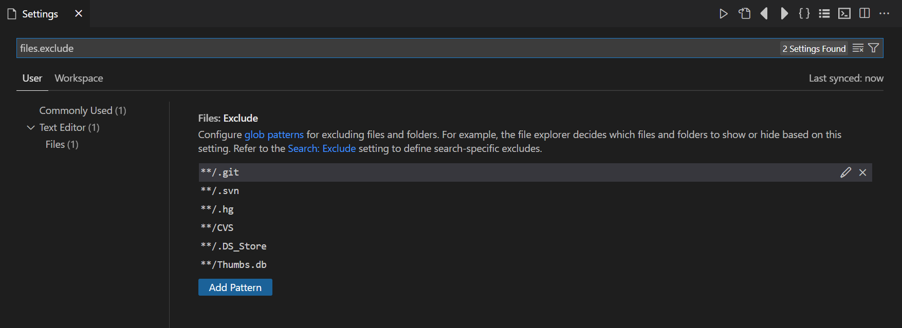
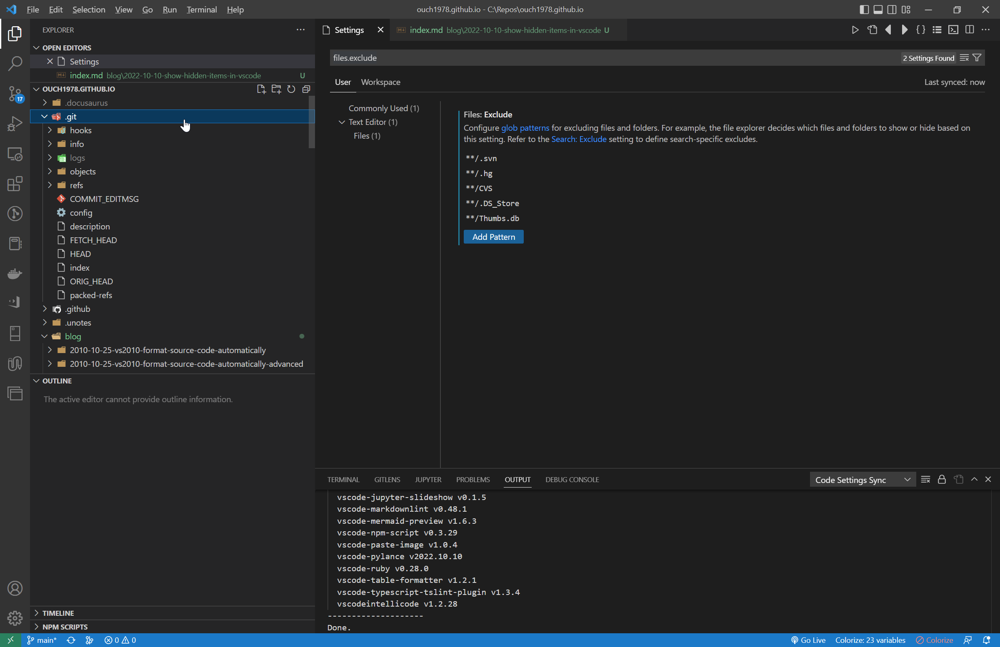
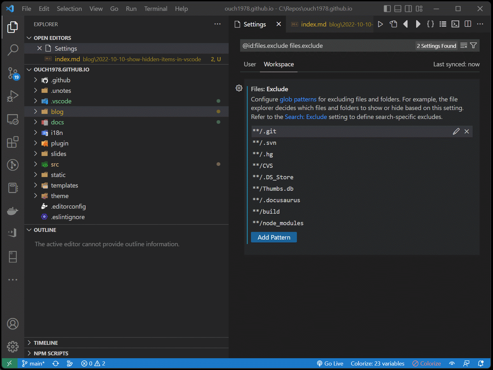

## 前言

VSCode 預設不會顯示某些特定的資料夾和檔案，例如 .git 資料夾、 .svn 資料夾等等。

以一個 IDE 來講，不顯示這些資料夾都是很合情合理的，但是作為一個文字編輯器來看的話，這些資料夾不顯示的話就怪怪的了。

所以這篇就來分享一下讓 VSCode 顯示預設隱藏的資料夾或檔案的方法。

<!--truncate-->

## 修改排除檔案清單

按下 <kbd>Ctrl</kbd> + <kbd>,</kbd> 開啟設定頁。

接著在搜尋框中輸入 `files.exclude`，就會出現排除的檔案清單：

然後把我們想要顯示的項目從清單裡刪除。

例如我希望 .git 資料夾不要被隱藏，就按下 `**/.git` 項目右邊的 `X` 號。

如此一來， .git 資料夾就會顯示出來了。

就這麼簡單。

## 透過擴充套件動態調整顯示/隱藏特定資料夾和檔案

如果我們希望能透過 UI 開關是否顯示隱藏資料夾或是檔案呢?

例如有時候我就是不想看到 node_modules、build 和 .docusaurus 資料夾，有時候又想看到它。

那 [Toggle Excluded Files](https://marketplace.visualstudio.com/items?itemName=amodio.toggle-excluded-files "Toggle Excluded Files") 這個擴充套件就很適合我們。

它用起來的效果像下圖這樣：

是不是很方便啊?

以上。

## 參考資料

- [Show hidden files in VSCode](https://linuxpip.org/vscode-show-hidden-files/ "Show hidden files in VSCode")
