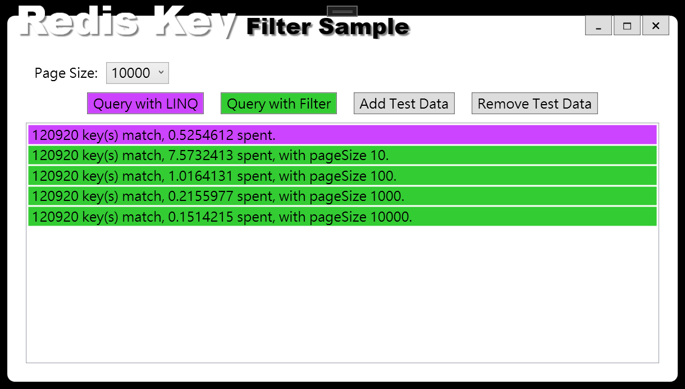

## 前言

還記得很久很久之前，曾經有一個同事來問我：為什麼我只是一句去查 Redis Key 的語法，程式都沒改過，但是卻越跑越慢?

一看他的程式碼，發現原來他用 LINQ 來過濾 Redis 的 Key...

有經驗的朋友應該看到這邊就知道發生了什麼事。

<!--truncate-->

## 需求

當初只是很單純的要實作一個透過 Redis 中的 Key 來判斷資料是否存在的簡單功能。

如果使用 Redis 存放 Session Key 的話應該也會使用到類似的功能。

## 有問題的程式碼

程式碼很簡單，就只有短短幾行：

```csharp title="MainWindow.xaml.cs"
   var keys = _server.Keys()
         .Where(x => Regex.IsMatch(x, "Test_By_Ouch_*"))
         .ToList();
```

我們可以先來看看原本的寫法和修改過後寫法的效能比較：



讀取接近十二萬筆的 Key 時，使用原來的程式碼大約會花上 0.52 秒的時間。

但是如果改用 Filter 的作法，則可以縮短到 0.15 秒以內完成，效能差到三倍以上

我之前測出來的結果，還曾經差到十五倍以上。

## 問題在哪兒?

簡單的說，原本的寫法會把所有的 Key 一次撈回本機，再透過 LINQ 進行過濾。

當資料量變大，變慢的情況就會越明顯。

## 正確的姿勢

其實 StackExchange.Redis 的 IServer.Keys API 原本就內建 Key filter 的功能。

我們只要簡單的把程式改成下面這樣：

```csharp title="MainWindow.xaml.cs"
   var keys = _server.Keys(pattern: "Test_By_Ouch_*", pageSize: pageSize)
         .ToList();
```

就可以比原來的寫法效能好三倍以上。

因為它會直接在 Server 上就進行篩選，而不是把全部的 Key 都撈下來才進行篩選。

這邊需要再特別注意的是 page size 參數，因為 Keys API 實際上會透過 Key Scan 來尋找符合條件的 Key。

Page size 的預設值是 10，在資料筆數越多的情況下，使用預設值就會讓整個查詢變得更慢。

至於 Page size 有沒有什麼最佳的設定值呢?

作者說：

> 不要使用 Key Scan!!
> 不要使用 Key Scan!!
> 不要使用 Key Scan!!

(很重要，所以要說三次)

除非你很清楚的知道使用 Key Scan 對 Server 的影響，不然這種寫法還是儘量避開為妙。

## 後記

當初，問我的同事一再強調，這個功能本來都是好的，但是不知道為什麼就越來越慢了。

我只能說，`用對的方法做事比把事情做對還重要`。(雖然我也常常犯蠢啦~~)

再來，即便 LINQ 已經不是什麼新玩意兒了，不過對於新手來說，還是很容易踩到雷(我以前也曾經踩得嫑嫑的啊~~)。

之後再來整理一篇使用 LINQ 時該注意的事項跟大家分享。

最後一樣附上範例的程式碼，歡迎有興趣的同學自行取用：

[](https://github.com/Ouch1978/RedisKeyFilterSample "Redis Key 搜尋範例")
