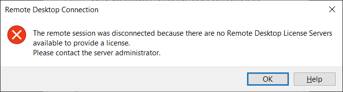
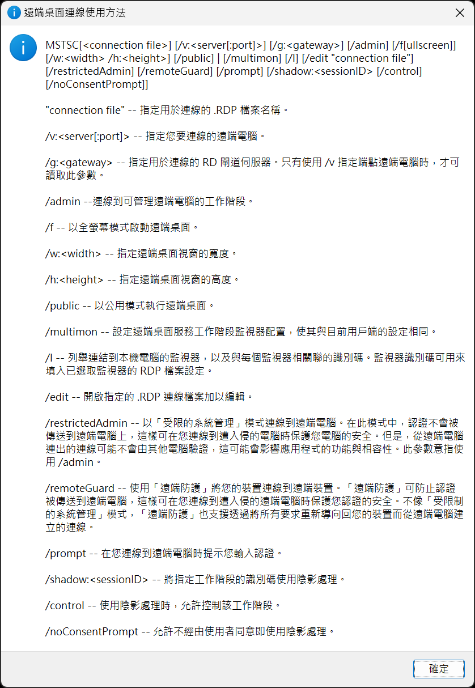
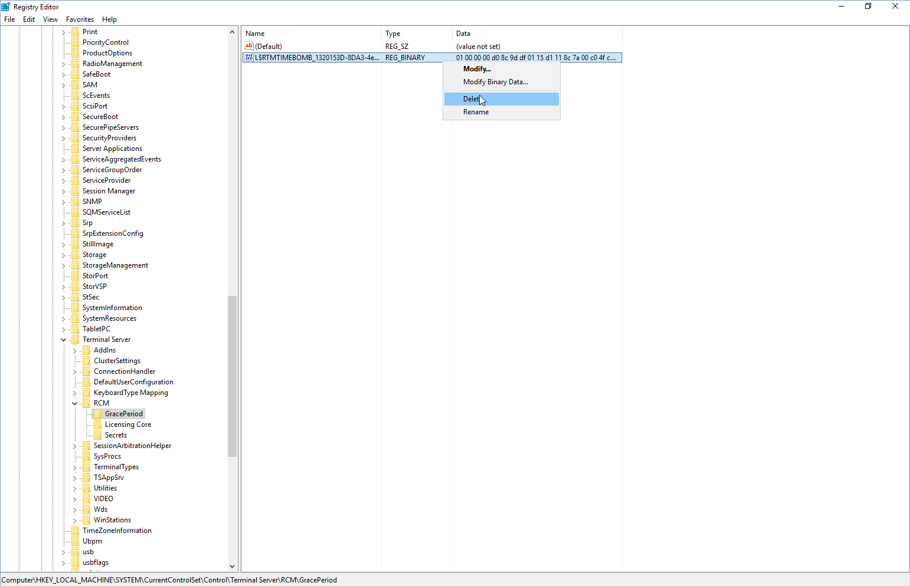
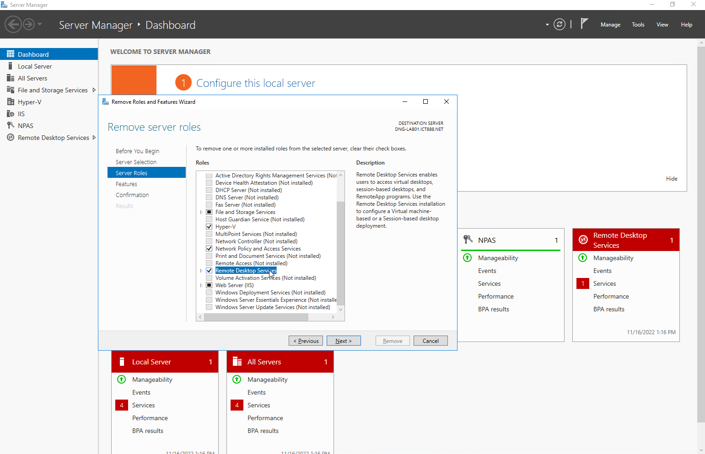

## 前言

最近要透過遠端桌面連線到某一台 Windows Server 時，突然出現下面的錯誤訊息：



然後就再也無法從我的電腦連進去了。

不過，很神奇的是，有位同事說他沒遇到問題，還是可以從他的電腦遠端連線到同一台 Server...

<!--truncate-->

## 原因

會發生這個問題的原因，簡單的說，是因為 Server 上安裝了遠端桌面連線服務功能，而且沒有指定給它使用的授權伺服器。

遠端桌面連線服務預設會提供 120 天的寬限期，等寬限期到期之後又還沒指定授權伺服器給它的話，它就會封鎖非 Local Admin 帳號並且使用 Console 模式的遠端連線。

而我同事還可以連上遠端 Server，就是因為他用的工具是 Remote Desktop Organizer，而且他勾選了 `Connect To Console` 這個選項。

## 因應措施

### 使用 Local Admin 帳號搭配 Console 模式連線到遠端 Server

前面有提到，非 Local Admin 帳號並且使用 Console 模式的遠端連線會被封鎖，所以我們只要用  Local Admin 帳號搭配 Console 模式來連到遠端 Server 就好啦!!

如果也是習慣使用 Remote Desktop Organizer 管理遠端桌面連線的話，只需要勾選 `Connect To Console` 這個選項即可。

不過，如果習慣直接使用 Windows 內建的 MSTSC 的話，也可以在命令提示字元輸入 `mstsc /help` 這個指令的話，就可以看到遠端桌面連線的參數說明如下：



所以我們只要用下面的指令就可以用 Console 模式登入到遠端 Server：

```shell
mstsc /v:{遠端 Server IP} /admin
```

### 刪除/重置授權伺服器的寬限期

只需要在遠端 Server 上使用登錄編輯程式，將 `HKEY_LOCAL_MACHINE\SYSTEM\CurrentControlSet\Control\Terminal Server\RCM\GracePeriod` 裡面的登錄機碼刪除，然後`重新開機`即可。



:::warning 注意事項
1. 經過實測，也可以直接把 GracePeriod 整個機碼刪除。
2. 在對 GracePeriod 機碼進行操作的時候有可能出現權限不足的錯誤，只需要把它的擁有者改成 Local Administrators 群組並且授與寫入權限就可以解決。
:::

## 正確的解決之道

要一勞永逸的解決這個問題的話，有兩種方法：

1. 設定遠端桌面連線授權伺服器： 如果有購買遠端桌面連線授權伺服器的話，當然就直接把它設定上去就好啦!!

   設定的方法可以參考 [這篇文章](https://techdirectarchive.com/2021/10/24/how-to-fix-the-issue-the-remote-session-was-disconnected-because-there-are-no-remote-desktop-license-servers-available-to-provide-a-license/ "How to fix the issue “The remote session was disconnected because there are no Remote Desktop License Servers available to provide a license”")

2. 移除遠端桌面連線服務： 如果沒有購買遠端桌面連線授權伺服器，又不是非得要使用遠端桌面連線服務的功能的話，也可以考慮把相關功能移除即可。

   

   除了使用 UI 之外，也可以透過 PowerShell 下指令來移除，指令如下：

   ```powershell
   Uninstall-WindowsFeature -name Remote-Desktop-Services -includemanagementtools -confirm
   ```

:::warning 注意事項
我分別透過伺服器管理員 UI 和 PowerShell 去移除遠端桌面連線服務，但是都在重新開機之後就失敗了，不知道裡面到底是有什麼巫術。
只能說，除非你有授權伺服器可以用，不然如果沒必要的話，還是別裝這個服務來整自己啊!!
:::
