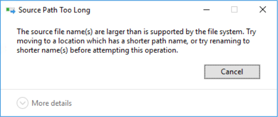
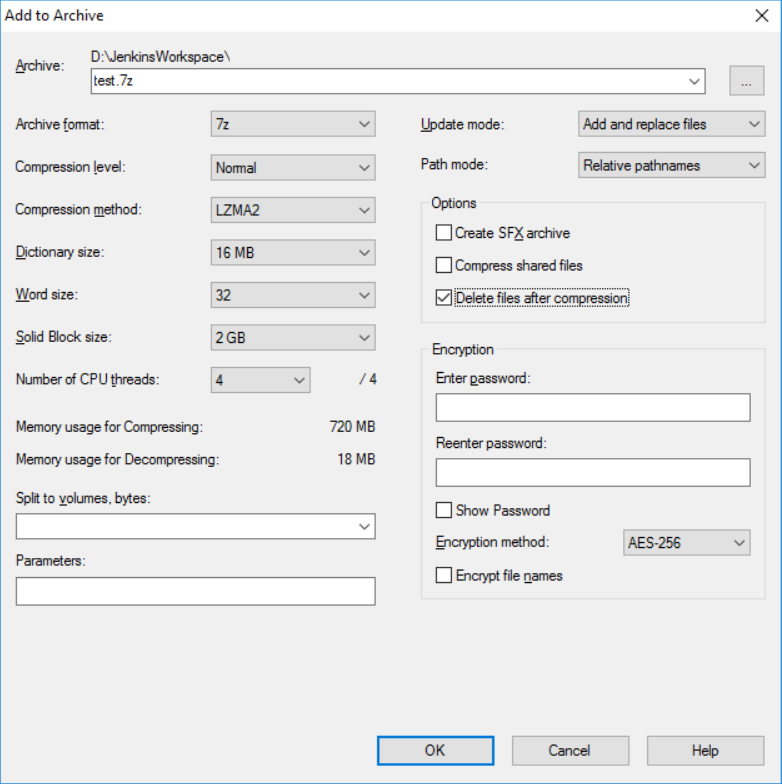

## 前言

今天在整理 Jenkins 的某個 Workspace 資料夾時，遇到了一個神奇的狀況：

當我要刪除 node_modules 資料夾的時候，跳出了這個錯誤訊息：

就算我用 <kbd>Ctrl</kbd> + <kbd>Del</kbd> 也沒辦法把整個資料夾刪除。

<!--truncate-->

## 因應措施

救助了谷哥大神之後，找到一個很神奇的解法 -- 透過壓縮工具的`壓縮後刪除檔案`功能就可以解決。

我半信半疑的試了之後，發現所言不假，還真的行得通。

以 7-Zip 為例，只需要勾選 Options 裡面的 `Delete files after compression` 選項，然後進行壓縮，就可以讓它在壓縮完畢之後刪除掉整個資料夾，如下圖：

比起慢慢縮短檔名或是修改登錄檔、透過 npm 的 rimraf 套件來刪除...等等方法，這個方法的確是快又有效。

另外，據說直接透過 7-Zip 的 GUI 來刪除也行得通，不過我還沒試過就是了。

## 參考資料

* [Troubleshooting File Path too Long Error Code Problem Issue](https://www.techinpost.com/file-path-too-long/ "Troubleshooting File Path too Long Error Code Problem Issue")

* [[Fix] Source Path Too Long while deleting files](https://www.linglom.com/it-support/fix-source-path-too-long-while-deleting-files/ "[Fix] Source Path Too Long while deleting files")

* [Solving the "source path too long" NTFS issue](https://coderwall.com/p/alhoww/solving-the-source-path-too-long-ntfs-issue 'Solving the "source path too long" NTFS issue')
