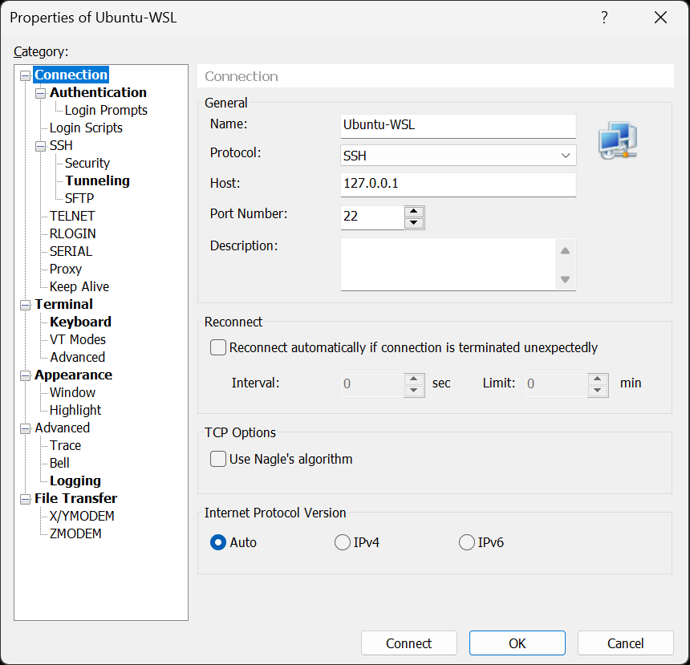
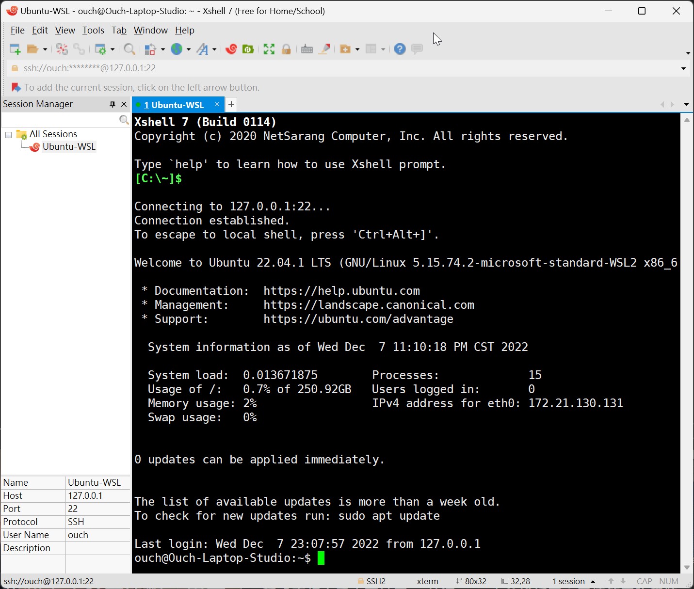

## 前言

Windows Subsystem for Linux (WSL) 下的 Ubuntu 原本就有內建 SSH 服務，但是預設是關閉的，所以無法從外部連進去。

這篇文章就來分享怎麼設定 SSH 服務，讓它支援從外部透過 SSH 遠端連線進去操作。

<!--truncate-->

## 啟用 SSH 服務

我們可以透過這個指令來察看 SSH 服務的狀態：

```sh
service ssh status
```

WSL 下的 Ubuntu 預設是關閉的，所以我們應該會看到 `* sshd is not running` 這個訊息。

接下來我們可以透過下面這個指令來開啟 SSH 服務：

```sh
service ssh start
```

如果沒有意外的話，它應該會因為沒有現成的 SSH Key 存在，所以會出現 `sshd: no hostkeys available -- exiting.` 這個錯誤訊息。

既然沒有 SSH Key，那就用下面的指令來產一組吧：

```sh
ssh-keygen -A
```

產完 SSH Key 之後，再次輸入 `service ssh start` 開啟 SSH 服務，服務應該就可以正常被啟用了。

不過，如果這時候直接透過 SSH Client 去連的話，會發現無法使用帳號密碼登入。

原來透過帳號密碼登入的功能預設又是被關掉的，所以我們得要再調整 SSH 的設定來啟用它。

## 調整 SSH 服務的設定

接著我們可以輸入下面的指令來編輯 SSH 服務的設定檔：

```sh
nano /etc/ssh/sshd_config
```

依照不同的需求調整設定檔的內容：

```yml title="/etc/ssh/sshd_config"
# 允許使用 Root 帳號進行登入
PermitRootLogin yes

# 允許使用公鑰進行登入
PubkeyAuthentication yes

# 允許使用帳號密碼進行登入
PasswordAuthentication yes
```

:::warning 注意
允許使用 Root 帳號進行登入會有一定的風險，開啟前請詳閱 [公開說明書](https://askubuntu.com/questions/16178/why-is-it-bad-to-log-in-as-root "Why is it bad to log in as root?")
:::

調整完設定之後，請使用下面的指令重新啟動 SSH 服務，讓設定生效。

```sh
service ssh restart
```

## 透過 SSH Client 登入

重啟服務之後，就可以用自己順手的 SSH Client 登入看看啦!!

這邊以 XsHell 7 為例，建立一個新的 Session，IP 用預設的 127.0.0.1，Port 維持預設的 22：



輸入完帳號密碼之後按下 Connect 鈕，噹噹~~  搞定!!



## 後記

其實本文中關於 SSH 服務的設定調整並不只限定只能用在 WSL 下的 Ubuntu，一般的 Ubuntu 也是適用的喔!!

如果有發現無法從遠端透過 SSH Public Key 登入的話，通常也是因為沒有啟用的關係，調整一下設定再重啟 SSH 服務就可以囉!!

以上!!
