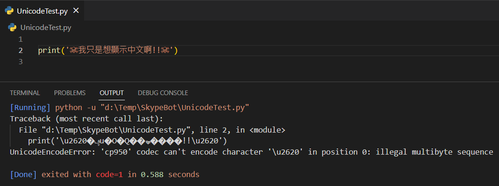
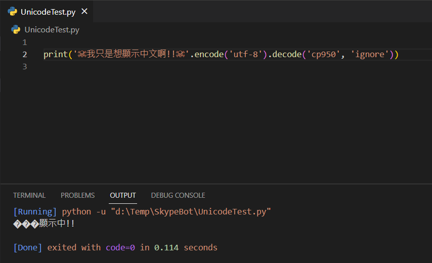
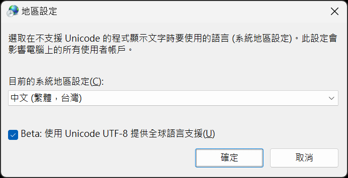
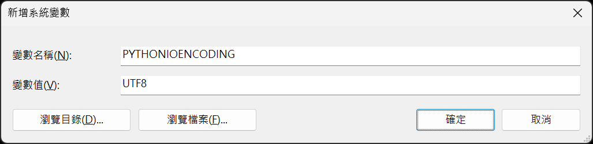
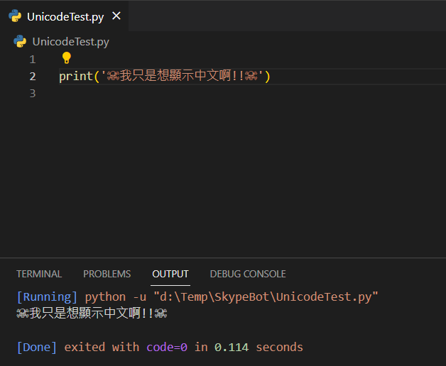

## 前言

在使用 VSCode 撰寫 Python 抓取 Skype 對話群組的時候，發現當群組名稱有中文時會噴 UnicodeEncodeError: 'cp950' codec can't encode 這個錯誤訊息。

就算在程式中調整了編碼，顯示出來的也還是亂碼...

<!--truncate-->

## 症狀

程式就以下短短一行：

```python title="UnicodeTest.py"
print('☠我只是想顯示中文啊!!☠')
```

一開始什麼都不作的執行結果如下：


在網路上找到有人說可以在程式中指定編碼：

```python title="UnicodeTest.py"
print('☠我只是想顯示中文啊!!☠').encode("utf-8").decode("cp950", "ignore")
```

指定編碼之後的執行結果如下：


## 解法

開啟 Windows 11 的`設定` -> `時間與語言` -> `系統管理語言設定` -> `變更系統地區設定`。



勾選之後要需要重新啟動，重新啟動之後到`設定` -> `系統` -> `系統內容` -> `環境變數`。

在系統變數中新增一組名稱為 `PYTHONIOENCODING` 的系統變數，值為 `UTF8`。



新增完畢之後，重新開啟 VSCode，再執行原來的程式，就可以正常的顯示中文了!!


