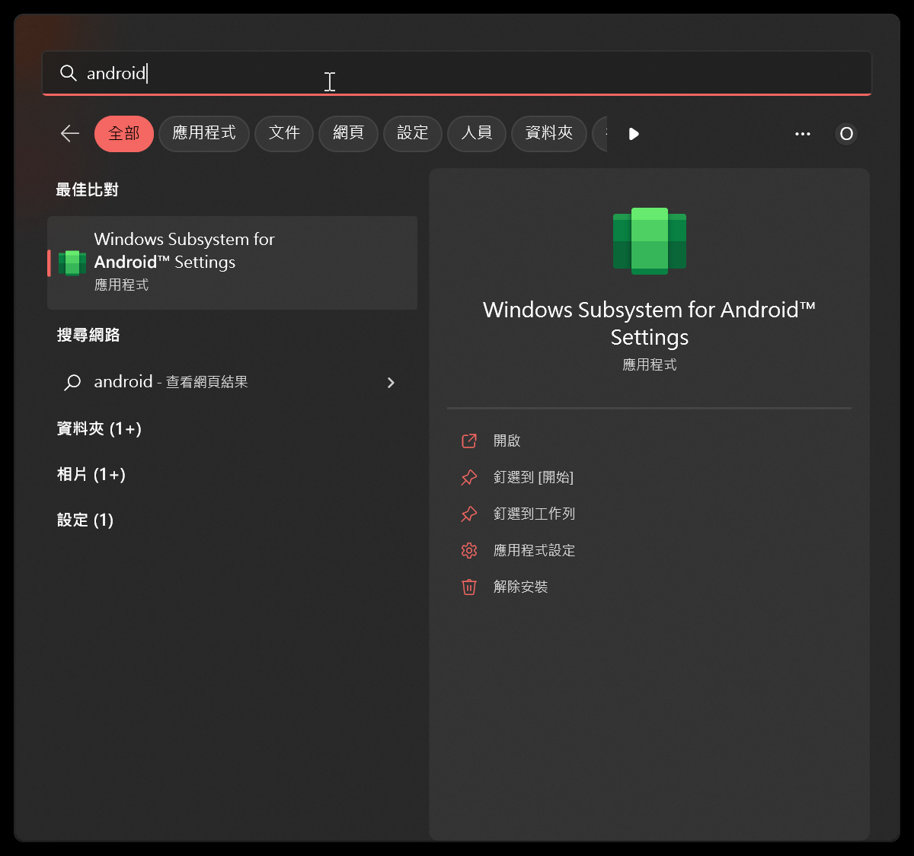
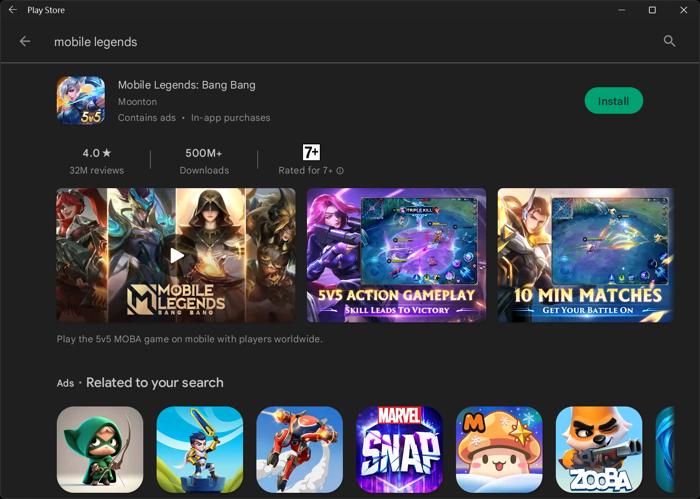
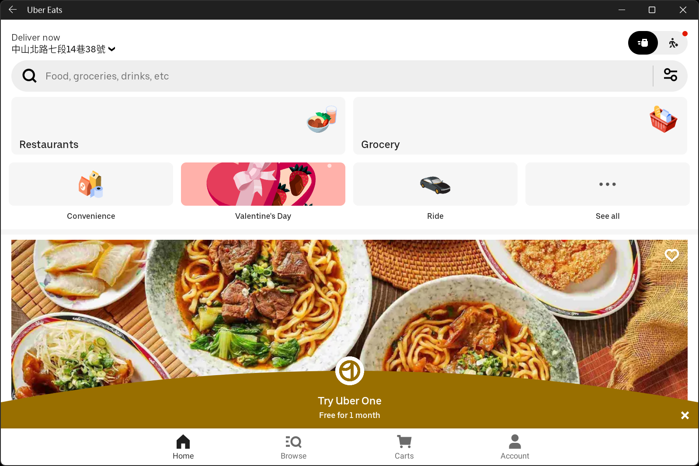
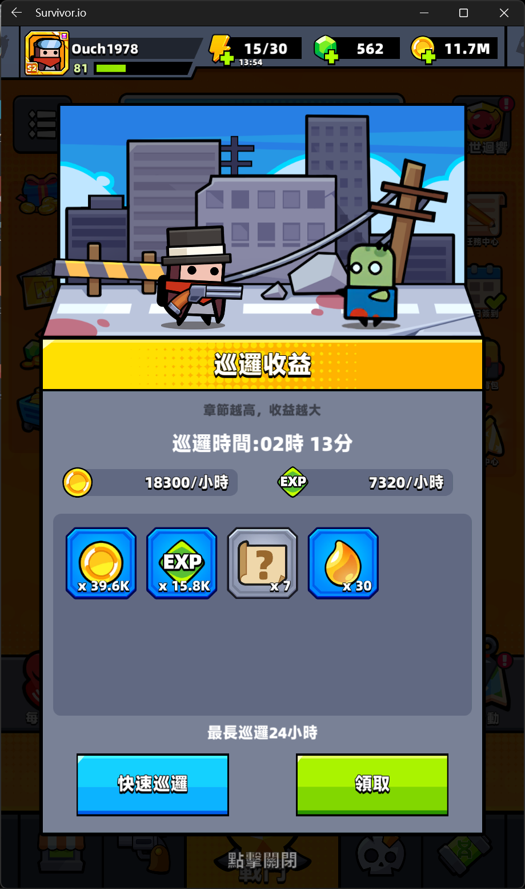
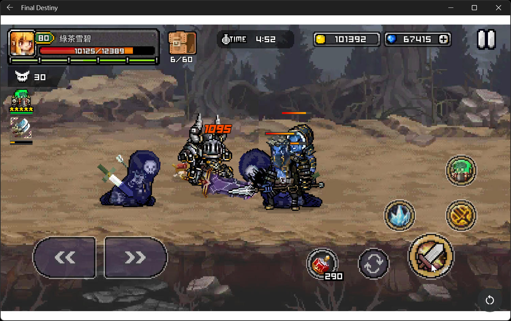

## 前言

早在 Windows 11 正式推出之前，微軟就多次在各種不同的場合放話說 Windows 11 會支援 Android App。

總算，在 2022 年的 3 月推出了正式版；然而，都已經過了快一年了，台灣的使用者還是看得到吃不到。

這篇就來分享一個我最近找到的懶人包，可以超超超超超快速的搞定 Windows Subsystem for Android，而且連 Play Store 都幫你裝好了。

<!--truncate-->


## 免責聲明

:::warning 警告
"使用非官方管道安裝 Windows Subsystem for Android 有好有壞，後果請自行負責。"<br/>
服用前請在心中默念三次。
:::

## 環境準備

雖然說是懶人包，但是有些步驟和先決條件還是得先搞定的：

* Microsoft Store： 22110.1402.6.0 以上版本。

* 記憶體： 8 GB 以上。

* 啟用`虛擬機器平台`：可以透過 `設定` -> `應用程式` -> `更多 Windows 功能` 把它打開。

* 啟用`開發人員模式`：可以在 `設定` -> `穩私權與安全性` -> `開發人員專用` 裡面把它打開。

## 安裝方法

直接到下面的連結下載安裝包(可以依照不同平台和是否 root 連行選擇)。

[安裝包列表](https://ahaan.co.uk/article/top_stories/google-play-store-windows-11-install#downloads "安裝包列表")

解壓縮安裝包之後，以`系統管理員權限`透過 PowerShell 切換到解壓後的資料夾下執行下列指令即可：

```powershell title="略過執行原則檢查"
Set-ExecutionPolicy -Scope Process -ExecutionPolicy Bypass
```

```powershell title="進行安裝"
.\Install.ps1
```

安裝成功之後，可以在開始功能表裡面找到 Windows Subsystem for Android Settings 和 Play Store。



點開 Play Store 完成登入之後，就可以透過它來安裝 App 囉!!



## 實測

我自己實測了下面幾個 App：

1. Play Store： 可以正常使用，也可以直接透過它安裝 App。

2. Uber Eats： 可以正常使用。
   

3. 噠噠特攻： 可以正常打開，也可以玩。
   

4. Final Destiny : 可以正常打開，也可以玩。
   

5. Random Dice : Defense : 跑到 logging into server 之後會閃退或是卡住。

6. Random Dice : Wars : 跑到 logging into server 之後會閃退或是卡住。

## 版本更新

如果要更新 Windows Subsystem for Android 到更新的版本或是降版的話，也只需要下載安裝包，比照安裝的步驟執行 Install.ps1 即可。

目前我自己測試升版和降版的結果，已經存在的 App 和資料都不會不見喔!!

## 後記

經過實測，在我的 Surface Laptop Studio 上跑噠噠特攻的時候，會有些微影音不同步的狀況，不過操作起來算是順暢的。

Windows Subsystem for Android Settings 裡面的 GPU used for apps for Android 好像也不用特別去切成實體顯卡，用預設值就蠻順的。

看起來目前對某些 App 的相容性還是不夠高，如果之後完全相容了，市場上的安卓模擬器可能就只剩下例如巨集、一鍵多開、鍵位模擬等特殊功能可以拿出來打了。

## 參考資料

* [The Easy Way to Get The Google Play Store Working on Windows 11](https://ahaan.co.uk/article/top_stories/google-play-store-windows-11-install "The Easy Way to Get The Google Play Store Working on Windows 11")