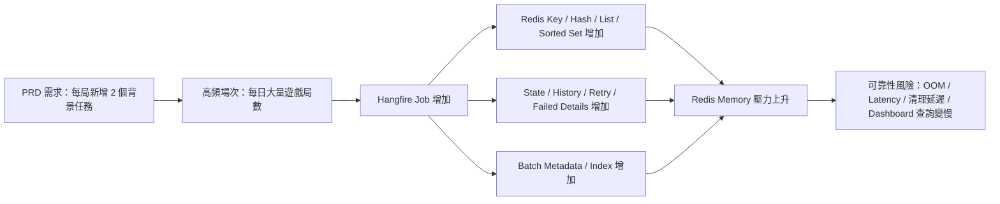

## 前言

之前有一個專案，需要在每一局遊戲中新增兩個 Background Job，從原本一局有 5 個 Background Job 變成 7 個。

乍看之下，這件事真的很容易被當成小改動。

不就是多兩個 Background Job 嗎？

結果上到 UAT 之後，Redis 的記憶體使用量直接暴增三倍，差點把 Redis 的記憶體吃到見底。

這件事情最有價值的地方，不是我們最後找到了哪幾個 Redis Key 變大，而是它提醒了我們一件很容易被忽略的事：

> 在高頻系統裡，每一個 Background Job 都不是免費的。

Background Job 不單單只是「排程執行」這麼簡單的一件事而已。

它背後還包含 Job metadata、serialized arguments、state history、retry、failed details、Batch metadata、TTL 保留，以及後續清理成本。

這些成本如果沒有在需求設計階段就被看見，那它最後可能就會在上線之後對 Redis 帶來極大的壓力，並且對系統的穩定度帶來極高的風險。

<!--truncate-->

## 緣起：只是新增兩個 Job 啊

話說，在 2025 年春節之前，我們正在趕著讓新專案上線；而這個專案主要的功能，是要幫會員自動下單。

因為可以下單的時間剛好位於每場遊戲的開始與結束時間範圍裡，所以我們很自然地想到：既然原本就已經有一套用 Hangfire 的 Background Job 控制遊戲狀態的機制，那這次新增的自動下單流程，也可以沿用同樣的設計。

因為每一局裡面有兩個可以自動下單的時間點，於是，我們就在每局遊戲裡新增兩個 Background Job。

從開發角度看，這個設計很直覺，也沒有什麼特別奇怪的地方。

在測試環境裡，功能也都正常。

但上到 UAT 後，問題就出現了。

Redis 的記憶體使用量竟然暴增了三倍，幾乎快把 Redis 的記憶體吃光。

一開始，我們很直覺地以為是 Hangfire 的歷史資料保存太久，導致 Redis 被舊資料塞滿。所以就先把 Hangfire 的 Job 與 State 的 TTL，從原本的 16 天縮短到 3 天。

本來以為這樣應該可以快速把歷史資料清掉，但是改善的程度微乎其微。

深入鑽研到每個 Job 的 Redis Key 之後才發現，問題沒有那麼單純。

真正的問題不是 Redis 壞掉，也不是 Hangfire 本身設定錯誤，而是 Hangfire 在 Redis 裡為每一個 Job 建立與保留的資料結構會吃的記憶體，遠比我們原本想像得更多；而 Job 本身攜帶的參數，在序列化之後，也比我們想像得更佔空間。

接下來，我就用這次分析的經驗，從 Redis Key 與容量的角度，整理一下 Hangfire 在 Redis 中會產生哪些 Key、這些 Key 的資料型別與用途，以及為什麼只是新增兩個 Job，最後卻有可能讓 Redis 記憶體暴增三倍。

## 被低估的 Background Job 成本

這次事件最重要的收穫，不是發現某一個 Redis key 特別大，而是讓我們重新意識到：

> 在高頻遊戲場景下，每新增一個 Background Job，都不是一個獨立的小功能，而是一個會被「場次數 × 保留時間 × 狀態歷史 × 失敗重試 × Batch metadata」放大的系統成本。

對產品負責人（PRD Owner）來說，「每局新增兩個任務」看起來可能只是多兩個流程節點。

但對系統來說，它代表的是：

- 每局多兩份 Job metadata
- 每局多兩份 serialized arguments
- 每局多兩份 state / history
- 每局多兩個可能 retry / failed / succeeded 的生命週期
- 如果使用 Batch，還會額外增加 Batch metadata 與狀態索引
- 如果 TTL 設得太長，這些資料會在 Redis 裡累積好幾天，甚至更久

所以，在評估這類需求時，不應該只問「開發需要多久的時間?」。

從架構師的角度來看，還要問：

> 這個需求會不會隨著場次、會員、訂單或交易數被放大？

如果答案是會，那就不能只用功能開發的角度來看它，而要把它放進容量、保留策略、失敗處理、可觀測性與清理機制裡一起評估。



## 架構師和產品負責人在設計這類需求時應該先問的問題

如果一個需求會依照「每局」、「每單」、「每會員」、「每交易」去新增 Background Job，那就不應該只從單一角色的角度來看。

產品負責人會關心的是：這個需求是不是必要、什麼情境要做、成功與失敗時的產品行為是什麼。

架構師要關心的是：這個需求會怎麼被流量放大、會產生多少資料、失敗時怎麼補償、資料要保留多久，以及這些成本會不會反過來影響系統可靠性。

兩邊看的角度不同，但目標其實是一樣的：

> 在需求進入開發之前，先把會被放大的成本與風險看出來。

這不是要阻止需求，而是要避免開發完成、上線之後，才發現容量、可靠性或維運成本比預期高很多。

### 產品負責人應該先問的問題

產品負責人不一定需要知道 Hangfire 在 Redis 裡會建立哪些 Key，但需要知道這個需求會在什麼情境下被觸發、會不會大量發生，以及失敗時對使用者或業務流程的影響。

| 問題 | 為什麼重要 |
| --- | --- |
| 這個 Job 是每局都要產生，還是只在特定條件下產生？ | 決定資料量是否會被場次數線性放大 |
| 這個流程是否一定要非同步執行？ | 有些流程可以同步完成，有些才真的需要 Background Job |
| 使用者或業務方是否需要知道這個 Job 的執行結果？ | 決定是否需要狀態查詢、通知、補償或人工介入 |
| Job 失敗時，業務上可以接受什麼結果？ | 決定 retry、補償、告警與人工處理策略 |
| 這個需求是否有 SLA / RTO / RPO？ | 決定可靠性要求與技術設計成本 |
| 是否需要保留完整執行紀錄？需要保留在哪裡、保留多久？ | 影響 Hangfire Redis、Log、Audit Table 或其他儲存成本 |
| 這個需求未來是否可能擴大到更多遊戲、更多會員或更多交易？ | 決定目前設計是不是只適合短期需求，還是需要預留成長空間 |

從產品角度看，這些問題的重點不是技術細節，而是要先釐清需求的「觸發頻率」、「失敗後果」和「業務可接受範圍」。

如果這些問題沒有先講清楚，後面架構師就很難判斷到底該做輕量設計、完整補償機制，還是需要更嚴格的可靠性設計。

### 架構師應該先問的問題

架構師要補上的，是需求被系統執行後會產生的真實成本。

也就是說，不只是問「這個功能做不做得到」，而是要問「它一天會發生幾次、每次會留下多少資料、失敗時會放大多少，以及這些資料要在系統裡活多久」。

| 問題 | 為什麼重要 |
| --- | --- |
| Job 是否真的需要獨立存在？ | 有些流程可以合併、內聚，或改成事件內部處理 |
| 每日預估會新增多少 Job？尖峰每分鐘會新增多少？ | 用來估容量、吞吐量與告警門檻 |
| Job 參數是否只傳 ID？ | 傳 DTO 會讓 Redis 成本不受控 |
| Hangfire 的全域 Job expiration 與 Batch expiration 設定是否符合這個需求的量級？ | Hangfire 通常不是針對單一 Job 設定 Redis 保存時間，而是透過整體 storage / expiration 策略影響資料保留量 |
| Job 是否需要 Batch 管理？ | Batch 會帶來額外 metadata、state 與 index |
| Job 失敗時是否需要完整 stack trace 留在 Hangfire state？ | 例外細節可能比正常參數更大 |
| retry 次數與補償策略是否明確？ | 避免失敗資料、重試排程與狀態歷史無限制膨脹 |
| Hangfire 預設會把 failed Job 的 exception 寫回 Redis，這個保留時間是否符合排查需求？ | 避免大量 failed Job 的 exception details 長時間累積在 Redis |
| 是否需要為這類 Job 建立專屬監控指標？ | 例如 Job 建立量、失敗率、平均 payload 大小、Redis memory growth rate |

從架構角度看，這些問題的重點是把需求轉成容量模型與可靠性設計。

如果一個需求會被高頻觸發，那它就不只是功能設計，而是資料成長模型、失敗處理模型和維運模型。

### 兩個角色要對齊的不是答案，而是成本邊界

產品負責人和架構師不需要看同一種細節。

產品負責人不一定需要知道 `hangfire:job:{id}:history` 裡面長什麼樣子；架構師也不應該只用「Redis 會變大」來否定需求。

真正需要對齊的是幾個成本邊界：

- 這個需求一天最多可能產生多少 Job？
- 這些 Job 成功、失敗、重試時分別要保留多久？
- 哪些資料需要留在 Hangfire，哪些資料應該移到 Log / APM / Audit Table？
- 失敗時是自動補償、人工處理，還是可以接受 eventual consistency？
- 當 Redis memory growth rate 超過預期時，誰要收到告警，誰要決定處理策略？

這些問題如果能在需求設計階段先想清楚，後面要做架構設計、容量估算、告警設定或維運交接時，就不會每次都變成臨時補洞。

這也是我後來越來越在意 PRD Owner 和架構師協作方式的原因。

好的 PRD Owner 不只是把功能寫清楚，也應該能看出需求背後可能被放大的產品成本。

好的架構師也不只是把系統做出來，而是要能把這些成本翻譯成產品可以理解、也能一起做決策的風險邊界。

## Hangfire 在 Redis 中常見的 Key 與資料結構

以我們使用的 Hangfire.Pro.Redis 2.8.3 版為例，Hangfire 在 Redis 中會使用多種 Key 來保存 Job、Queue、State、Server 等資訊。常見的 Key 與資料結構如下：

針對每個 Key 的資料結構與作用，簡單說明如下：

| Key 範例                          | Redis 結構   | 作用                     | 備註                                                       |
| ------------------------------- | ---------- | ---------------------- | -------------------------------------------------------- |
| `hangfire:job:{id}`             | Hash       | 單一 Job 的詳細資料           | 包含 `Method`、`Type`、`ParameterTypes`、`Arguments`、建立時間與狀態等 |
| `hangfire:recurring-job:{id}`   | Hash       | 定期任務的 metadata         | 包含 Cron、方法參考與參數                                          |
| `hangfire:queue:{queueName}`    | List       | 儲存待處理 Job id           | 隊列長度與 enqueued jobs 數量成正比                                |
| `hangfire:processing`           | Sorted Set | 正在執行中的 Job id          | 通常以時間相關 score 排序；實際語意以版本與實作為準                                      |
| `hangfire:failed`               | Sorted Set | 失敗 Job 的索引             | 常見大型 key；通常保存 Job id 與時間相關 score，不等於完整失敗明細                                       |
| `hangfire:deleted`              | List       | 刪除 Job 的標記             | 保留已刪除 Job id 作後續清理                                       |
| `hangfire:queues`               | Set        | 所有 queue 名稱            | 只是索引，容量很小                                                |
| `hangfire:recurring-jobs`       | Sorted Set | 定期任務索引                 | 以識別碼排序、快速查找                                              |
| `hangfire:retries`              | Sorted Set | 需重試 Job 的清單            | 用於 retry 排程與延遲處理                                         |
| `hangfire:servers`              | Set        | 已註冊 server id          | 追蹤所有 active server                                       |
| `hangfire:succeeded`            | List       | 成功完成的 Job id           | 主要用於成功 Job 的索引、統計或清理；實際用途以版本與 storage 實作為準                                   |
| `hangfire:stats`                | Hash       | 系統統計資料                 | 保存各種計數值與指標                                               |
| `hangfire:batch:{id}`           | Hash       | 單一 Batch 的 metadata    | 例如建立時間、描述等基本資訊                                           |
| `hangfire:batch:{id}:state`     | Hash       | Batch 目前狀態             | 保存當前狀態名稱、時間與摘要                                           |
| `hangfire:batch:{id}:states`    | List       | Batch 狀態歷史             | 保存狀態變更紀錄                                                 |
| `hangfire:batch:{id}:pending`   | Sorted Set | Batch 中等待或尚未完成的 Job 索引 | 依 Hangfire Pro Redis 實作維護                                |
| `hangfire:batch:{id}:succeeded` | Sorted Set | Batch 中已成功完成的 Job 索引   | 依完成狀態維護                                                  |
| `hangfire:batch:{id}:finished`  | Sorted Set | Batch 中已結束的 Job 索引     | 追蹤已結束 Job                                                |

### 容易佔用大量記憶體的 Key 們

從我們這次看到的案例來看，真正需要優先檢查的通常不是 queue list 本身，而是每個 `job` 的 hash，以及該 job 的 state / history。

- Job Hash (`hangfire:job:{id}`)

  `hangfire:job:{id}` 這個 hash 裡面，會保存這個 Job 要執行什麼方法、類型是什麼、參數型別有哪些，以及實際傳進去的參數內容。

  幾個比較值得注意的欄位如下：

  - `Method` / `Type`：表示這個 Job 要呼叫的類別與方法。這些欄位與 `ParameterTypes` 合起來，描述了要呼叫的目標方法與參數型別。
  - `ParameterTypes`：以陣列形式保存每個參數的完整型別名稱，通常包含 namespace、assembly 與版本資訊。這些字串本身就會佔用空間；若參數型別很多或型別名稱很長，佔用會更高。
  - `Arguments`：實際參數序列化後的字串，通常是 JSON。這個欄位的大小直接取決於傳入的參數內容，從幾十 bytes 到數 KB 都有可能。

  以我們看到的狀況來說，簡單 Job 只帶一個或兩個 ID / 整數時，通常會比傳入完整 DTO 小很多；如果帶入複雜 DTO，包含多個欄位、長字串或集合，就很容易讓 `Arguments` 明顯放大。實際大小應以 Redis `MEMORY USAGE` 或欄位長度檢查為準。

- Current State


  在我們觀察到的資料中，Hangfire 會在 `hangfire:job:{id}:state` 相關資料中保存目前狀態欄位，例如 `State`、`Checked`、`FailedAt`、`ExceptionType`、`ExceptionMessage` 與 `ExceptionDetails`。實際欄位會依狀態與版本有所不同。

  這裡比較麻煩的是失敗狀態。

  當 Job 失敗時，Hangfire 會保存失敗狀態需要的錯誤資訊。`ExceptionMessage` 與 `ExceptionDetails` 本身就可能變得很大。如果同一類錯誤大量發生，Redis 裡累積的就不只是 Job 狀態，還會包含大量失敗資訊。

- History


  `hangfire:job:{id}:history` 的 list 會保存狀態事件的紀錄。不同狀態會有不同內容，失敗相關紀錄可能包含 `ExceptionType`、`ExceptionMessage` 或 `ExceptionDetails` 這類資訊。

  如果 Job 有多次 retry 或狀態變更，history list 的元素就會累積。正常情況下可能還好，但如果 Job 不斷失敗、重試、再失敗，這些歷史資料就會變成額外的記憶體壓力。

- Batch


  以我們環境看到的 Batch 資料來說，Batch 自己也會有 metadata、state 與狀態歷史，例如 `hangfire:batch:{id}`、`hangfire:batch:{id}:state`、`hangfire:batch:{id}:states`。

  Batch 本身的 state 資料不一定是最大宗，但如果 Batch 數量多、底下 Job 多，或狀態變更頻繁，相關的 state、states 與 sorted set index 也會跟著累積。

  另外，Batch 相關資料的保存時間也要和 Job expiration 一起看。否則很容易只調整了 Job 的保留策略，卻忽略 Batch metadata 或相關索引是否仍然累積。


## 記憶體用量計算範例：新增 Job 前後的記憶體用量對照

先用一個簡化過的例子來看。

假設原本每局遊戲有 5 個 Job，每個 Job hash 佔 1 KB，每個 Job 的狀態歷史佔 2 KB：

- 5 個 Job hash：5 × 1 KB = 5 KB
- 5 個 Job state history：5 × 2 KB = 10 KB
- 合計：15 KB / 局

後來新增 2 個參數較多的 Job，總 Job 數變成 7 個。假設這兩個新 Job 的 hash 各佔 2 KB：

- 5 個舊 Job hash：5 × 1 KB = 5 KB
- 2 個新 Job hash：2 × 2 KB = 4 KB
- 7 個 Job state history：7 × 2 KB = 14 KB
- 合計：23 KB / 局

這樣算起來，單局 Redis 佔用從大約 15 KB 增加到 23 KB，大約是 1.5 倍。

但實際上，我們看到的是三倍。

原因就在於，真實世界不會只照這個簡化模型成長。裡面還包含：

- Batch metadata
- Batch 相關索引
- TTL 保留時間
- 歷史資料累積
- retry / failed state
- sorted set index 成長
- exception message / stack trace 膨脹

也就是說，新增兩個複雜 Job 的直接成本，只是第一層。真正讓 Redis 記憶體膨脹的，是資料保留時間、失敗狀態、Batch metadata 與狀態索引一起疊上去之後的結果。

如果要把這件事一般化，一個 Background Job 在 Redis 裡的成本可以先粗略拆成：

```text
單筆 Job 成本 =
Job Hash
+ Current State
+ History List
+ Queue / State-related Index
+ Batch 相關資料分攤成本
```

放到高頻場景裡，整體成本則可以估成：

```text
Redis 使用量 ≒
每局 Job 數
× 每日場次數
× 單筆 Job 平均大小
× 保留天數
× 狀態膨脹係數
```

這裡最容易被低估的不是公式本身，而是每個因子都可能被流量與保留時間放大。

- `每局 Job 數`：需求每加一個流程節點，就可能多一個 Job。
- `每日場次數`：高頻遊戲不是一天幾十筆，而可能是數千到數十萬筆。
- `單筆 Job 平均大小`：如果 arguments 傳 DTO，而不是 ID，會快速放大。
- `保留天數`：TTL 從 3 天變 16 天，不只是多 13 天，而是整體資料保留量接近 5 倍。
- `狀態膨脹係數`：失敗、retry、exception details、Batch 相關 state / index 都可能放大資料量。

這也是為什麼「只是多兩個 Job」最後看起來會一點都不小。

## 記憶體用量暴增的原因：Job 參數序列化

接下來看最容易被忽略的一塊：Job 參數。

Hangfire 的 `Arguments` 欄位通常會使用 JSON 進行序列化，而且 Hangfire 同時也會在 `ParameterTypes` 中保留參數型別描述。

這裡有幾個很容易讓大小飆升的因素。

### 1. 傳入完整物件，而不是 ID

這是最常見，也最容易踩到的點。

如果 Job 參數裡直接傳整個 DTO，例如使用者資料、訂單物件，或包含多個關聯清單的物件，那 Hangfire 就會把整個物件圖序列化成 JSON。

屬性越多、巢狀越深、字串越長，序列化後的內容就越大。

比較安全的作法是：

> Job 參數只傳必要的 ID，真正需要的資料等 Job 執行時再去資料庫或快取查。

這樣做的好處不只是省 Redis 記憶體，也比較容易避免把某個時間點的完整資料快照長時間留在 Job 裡，造成後續資料判讀或除錯上的困難。

### 2. 傳入大型字串或二進位資料

如果把幾 KB 的文字欄位，或 base64 編碼的二進位內容，直接塞進 Job arguments，那 Job hash 就會直接被放大。

這種資料如果真的需要被 Job 使用，通常比較適合先放到外部儲存，例如資料庫、物件儲存，或另一個有明確生命週期的儲存位置。

Job 裡只需要傳 reference，例如 URI、資料 ID 或外部儲存 key。

### 3. 參數型別名稱與 serialization metadata

`ParameterTypes` 裡會記錄參數型別資訊，通常會包含 namespace、type、assembly 等資訊。實際格式會依 Hangfire 序列化設定與版本而不同。

這些字串單看不大，但在大量 Job、複雜泛型、或參數型別很多的情況下，就會累積成可觀的容量。

尤其是當很多 Job 傳入不同型別，但實際內容只是幾個 ID 或簡單值時，這些型別資訊就會變成一種隱性成本。

### 4. 例外與狀態描述

如果 Job 經常失敗，而且 Hangfire state / history 裡保留大量 exception message 或 details，單筆 state / history 的大小就可能明顯增加。

這也是為什麼有時候 Redis 記憶體成長，不一定只來自正常 Job 參數太大，也可能和 failed Job 數量與錯誤資訊大小有關。

### 5. JSON 序列化本身的冗餘

JSON 的好處是可讀性高，除錯方便。

但它的缺點也很明顯：欄位名稱會重複出現，格式是明文，也沒有壓縮。

所以如果把大量資料直接塞進 Job arguments，JSON 的體積很快就會放大。

這不是說一定要改成二元序列化，而是要先回到最根本的問題：

> 這些資料真的應該被塞進 Job arguments 裡嗎？

大多數時候，答案其實是否定的。

## 從可靠性工程角度治理 Background Job

這次事件也讓我們重新整理 Background Job 的治理方式。

Background Job 的可靠性，不只是「Job 有沒有成功執行」而已。

更完整一點看，它應該包含整個 Job lifecycle 是否可觀測、可控、可清理。

### 1. Job 建立量要可量測

我認為，所謂的量測指的是至少要能回答下面這些問題：

- 每分鐘新增多少 Job？
- 每小時新增多少 Job？
- 每日新增多少 Job？
- 哪一類 Job 數量最多？
- 哪一類 Job 的 arguments 最大？
- Job failed 之後處理的機制是什麼？ 要自動 Retry 嗎？ Retry 幾次？

如果這些問題都答不出來，代表 Background Job 已經變成黑盒子。

這時候即使系統目前還能正常運作，也很難在容量壓力出現前提早預警。

### 2. Job 保留策略要先理解 Hangfire 的限制

這裡要特別講清楚一件事：Hangfire 並不是讓我們很自由地針對「每一種 Job」或「每一筆 Job」設定不同的 Redis 保存時間。

以我們使用 Hangfire.Pro.Redis 的情境來看，比較實際能控制的是整體 Job expiration、Batch expiration，以及系統如何使用 Job、Batch、Retry 和 Failed state。也就是說，這裡的重點不是「幫每一種 Job 都設不同 TTL」，而是：

> 在設計需求時，要先知道目前 Hangfire storage 的保留策略會套用到哪些資料，以及這個保留時間放到高頻場景裡是否合理。

如果今天新增的是低頻管理任務，保存幾天可能不是問題。

但如果新增的是每局、每單、每會員都會產生的高頻 Job，同樣的保存時間就會被放大成很可觀的 Redis memory footprint。

所以比較務實的檢查方式會是：

| 檢查項目 | 要確認什麼 |
| --- | --- |
| 全域 Job expiration 設定 | 目前 Job 成功、失敗、刪除後大約會保留多久 |
| Batch expiration 設定 | Batch metadata、state、states 與相關 index 是否會比預期保留更久 |
| 高頻 Job 是否真的需要進 Hangfire | 有些高頻流程可能更適合事件流、內部狀態機或合併處理 |
| 成功 Job 是否需要保留完整資訊 | 如果只是統計或追蹤，可能不該依賴 Hangfire storage 作長期查詢 |
| Failed Job 的保存量是否可接受 | Failed state 會包含 exception 資訊，失敗率一高就會快速放大 |

也就是說，這裡真正要治理的不是「單一 Job TTL」，而是 Hangfire storage 的整體資料保留行為。

如果保留策略沒有先算過，高頻 Job 只要數量一放大，Redis 記憶體壓力就會跟著放大。

### 3. 失敗資料要可控

失敗資訊很重要，但不應該無限制累積在 Redis。

需要控制的項目包含：

- Exception message 長度
- Stack trace 保存策略
- Retry 次數
- Failed Job 與其 state / history 的保留行為
- 應用程式本身是否已將足夠的錯誤脈絡寫到 ELK / APM，而不是只依賴 Hangfire Dashboard 查看錯誤

尤其是高頻 Job，如果同一類錯誤在短時間內大量發生，錯誤訊息與 exception details 可能會比正常 Job arguments 更快推高 Redis 記憶體使用量。

### 4. 要清楚區分「Hangfire 預設會寫入 Redis 的資料」和「我們額外塞進去的資料」

這一點要避免講得太誇張。

在預設情況下，Hangfire 不會主動把所有診斷資料都塞進 Redis。它主要保存的是 Job 執行所需的資料、狀態、歷史，以及 failed Job 相關的 exception 資訊。

也就是說，真正需要注意的不是「Redis 會保存所有診斷資料」，而是這兩件事：

1. failed Job 的 exception 本來就會寫回 Hangfire storage。
2. 我們自己傳進 Job arguments 的資料，也會被序列化後保存在 Redis。

所以 Redis 記憶體壓力通常不是來自什麼神祕資料，而是來自這些很正常、也很合理的資料：

| 資料類型 | 為什麼會在 Redis 裡 |
| --- | --- |
| Job arguments | Hangfire 需要知道執行 Job 時要帶哪些參數 |
| ParameterTypes | Hangfire 需要知道方法參數型別 |
| Current state | Hangfire 需要知道 Job 目前狀態 |
| State history | Hangfire 需要追蹤 Job 狀態變化 |
| Failed exception | Job 失敗後，Hangfire 會保存錯誤資訊，方便 Dashboard 與排查使用 |
| Batch metadata / index | 使用 Batch 時，Hangfire 需要維護 Batch 狀態與索引 |

這些資料本身都合理。

問題在於，當 Job 數量很高、arguments 很大、failed Job 很多，或 Batch metadata 累積太多時，合理的資料也會變成不合理的記憶體壓力。

因此，比較精準的說法不是「不要讓 Redis 承擔所有診斷資料」，而是：

> 不要把 Hangfire Redis 當成長期查詢、完整診斷或大型 payload 的保存位置。

Hangfire storage 應該保存 Job lifecycle 必要的資料；真正長期分析用的資訊，例如完整業務追蹤、趨勢統計、跨系統查詢與長期 audit，應該放在更適合的地方。

比較合理的分工會像這樣：

| 資料類型 | 建議保存位置 |
| --- | --- |
| Job 執行必要資料與狀態 | Hangfire Redis |
| Failed Job 的必要 exception 資訊 | Hangfire Redis，但要注意保留時間與失敗量 |
| 詳細應用程式 log / trace | ELK / APM / Log system |
| 業務追蹤 ID 與 audit record | SQL Server / Audit Table |
| 大型 payload | DB / Object Storage / Blob Storage / 明確生命週期的外部儲存 |
| 趨勢統計 | Grafana / ELK / Prometheus |

這樣講會比較精準：Redis 裡的資料大多不是多餘的；真正要避免的是把過大的 arguments、過長的保留時間、過高的失敗率和高頻 Job 疊在一起，最後讓 Hangfire storage 變成容量瓶頸。

這通常不會立刻壞掉。

但等到它真的壞掉的時候，通常就不會只是單一 Job 壞掉，而是整個背景任務系統的可靠性一起被拖下去。

## 設計 Hangfire Job 的實務建議

整理成比較實務一點的原則，大概會是這幾條。

- 盡量只在 Job 中傳 `ID` 或輕量參數，避免傳整個大型 DTO。
- 如果必須讓 Job 使用大型資料，先存外部，例如資料庫、物件儲存，或另一個有明確生命週期的儲存位置，只在 Job 參數中傳 URI、資料 ID 或 key。
- 檢查 Hangfire 的整體 Job expiration 與 Batch expiration 設定：重點不是單一 Job 能不能個別設定 TTL，而是目前全域保存策略放到高頻 Job 場景裡是否合理。
- 避免在 Job 參數或自訂狀態資料中放入不必要的大型內容；Hangfire 預設會保存的 failed exception 則應透過失敗率、保留策略與外部 log 來一起治理。
- 如果確實需要傳較複雜的資料，優先考慮只保留必要欄位或改傳 reference；不要第一時間就用壓縮或自訂序列化硬解，因為那會增加反序列化兼容性與除錯成本。
- 對高頻 Job 建立基本指標，例如每日新增 Job 數、抽樣 Job hash 大小、失敗 Job 數、retry 次數、Redis memory growth rate。

這幾件事不一定需要一次全部做到，但至少要先知道自己目前缺哪一塊。

不知道，才是最危險的。

## 記憶體用量排查小技巧

最後整理幾個實務排查時可以用的方向。

1. 在 Redis 中觀察 key 分佈，找出佔用最多記憶體的 keys。可以使用 `redis-cli --bigkeys` 或 memprof 類工具。
2. 列出某個 queue 或 server 的 Job id，檢視單一 `hangfire:job:{id}` 的 hash 欄位，特別是 `Arguments`、`ParameterTypes`、`Method` 與 `Type`。
3. 比較簡單 Job 與複雜 Job 的 `Arguments` 長度，確認是否為參數內容差異導致大小差距。可以使用 `HGET` 取得該欄位並輸出長度。
4. 如果懷疑 Batch 相關資料累積，檢查 Batch metadata、Batch 相關索引與其保留行為。
5. 針對 failed / retries / processing 等 sorted set，確認是否有異常累積或清理延遲。
6. 將 Redis memory growth rate 與每日 Job 建立量對齊，確認記憶體成長是否與新需求、新 Job 類型或錯誤率上升相關。

這些檢查不一定能一次找到答案，但可以幫助我們把問題從「Redis 怎麼突然變大」拆成比較具體的幾個方向：

- 是 Job 數量變多？
- 是單筆 Job 變大？
- 是失敗資料變多？
- 是 Hangfire storage 的保留時間太久？
- 是 Batch metadata 或相關索引累積？

問題能被拆開，才有機會被解掉。

## 結論

從 Redis 的角度來看 Hangfire，單一 Background Job 不只是一個短暫的工作描述。

它在 Redis 中會拆成多個資料結構，例如 Job hash、state history、queue id、state index 與 Batch 相關資料。

其中 `Method` / `Type`、`ParameterTypes` 與 `Arguments`，也就是 Job 的序列化參數，是影響記憶體消耗的主要來源。

只要傳入複雜物件、長字串，或讓 failed state / history 累積大量錯誤資訊，就可能把單筆 Job 相關資料的記憶體消耗量放大。

這次事件最重要的提醒是：問題不在 Hangfire 本身，也不在 Redis 本身，而是我們在需求設計階段低估了 Background Job 的生命週期成本。

在高頻系統裡，一個看似很小的需求變更，只要會隨著場次、會員、訂單或交易數放大，就不應該只用開發工時來評估。

它同時也需要被放進容量估算、Hangfire storage 保留策略、失敗處理、可觀測性與清理機制中一起設計。

Background Job 不是免費的。

每一個 Job 都會留下資料、狀態、歷史與失敗成本。

這些成本如果沒有在設計階段就被看見，最後就會在上到 PRD 環境之後，輕則透過 Dashboard 讓你看見，嚴重一點點的話就是透過 Warning 讓你看到，最慘的就是整個系統直接死給你看啦。

希望大家都不會走到最慘的那步。
