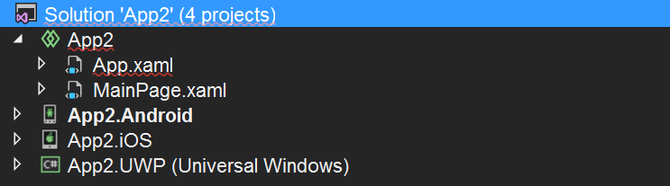

## 前言

微軟在 .NET 6 中推出了 MAUI 的正式版，這系列會持續跟大家分享 MAUI 開發相關的文章。

而這篇就先簡單的跟大家分享 MAUI 的身世。

:::warning 注意
因為我比較喜歡考古的關係，對想直接看懶人包的朋友來說可能會覺得廢話太多，如果想看懶人包版的朋友可以直接跳到 [MAUI 的今生](#maui-的今生) 的部份。
:::

## MAUI 的前世

簡單的說，其實 MAUI 的前世就是 Xamarin.Forms。

不過，接下來我想要先分享一些故事。

### 從 Write Once, Run Anywhere 說起

跨平台這件事，一直是所有開發者和科技大廠的夢想之一。

在很久很久以前，還擁有 Java 的昇陽電腦公司為了展現 Java 跨平台的特性，就先開始喊出了 "Write Once, Run Anywhere" 這個口號。

在理想中，Java 編寫的程式應該要可以在各種有裝好 JVM (Java Virtual Machine) 的機器上面執行，無論是電腦、手機還是其它裝置，更不用管是哪種作業系統。

但是現實總是殘酷的，因為 JVM 在各種不同的平台上實作的方式各有差異，導致程式在不同平台上執行的結果也有所不同。

所以事實是，之後工程師們把當初的 "Write Once, Run Anywhere" 這個口號改成了 "Write Once, Debug Everywhere"。

但是這個血淋淋的例子並無法澆熄工程師們和各大科技廠的熱情，所以各種跨平台的解決方案和框架還是如雨後春筍般的一直冒出來。

除了 Xamarin.Forms 之外，[Iconic](https://ionicframework.com/ "Iconic") 、 [Cordova](https://cordova.apache.org/ "Cordova") 、 [Flutter](https://flutter.dev/ "Flutter") 和 [React Native](https://reactnative.dev/ "React Native") 也都是近年來跨平台開發的熱門選項。

### XAML、 WPF 與 SilverLight

微軟在 2005 年的時候推出了 .NET Framework 3.0，其中一項重大的革新就是 WPF (Windows Presentation Framework) 的誕生。

和 WinForm 不同的是，WPF 使用 XAML (Extensible Application Markup Language) 作為 UI 設計語言。

XAML 本身就支援向量和 DirectX，而且比 WinForm 更容易作到 UI 和邏輯的分離，用它來實作動畫和自訂控制項的方面更是有讓 WinForm 完全看不到車尾燈的天壤之別。

在我的工程師生涯中，第一個接觸到的微軟跨平台解決方案，應該就算是 [SilverLight](https://www.microsoft.com/silverlight/ "SilverLight") 了吧。

它是在 WPF 推出不久後，衍生出來的一個叫作 WPF/E 的產品 (E 就是 Everywhere)，目的就是要透過瀏覽器，在不同的平台上執行同一套程式。

然後 WPF/E 在 2006 年正式更名為 SilverLight。

古早前的 Netflix 就是使用 SilverLight 來當作它的串流平台的喔!!

除了 Web 之外，SilverLigt for Windows Phone 也是當年 Windows Phone App 的開發框架之一，所以 SilverLight 還真的是橫跨了 PC 以及 Windows Phone 兩個平台。

不過，隨著 HTML 5 的興起以及瀏覽器禁用第三方播放器， SilverLight 和它最大的對手 Flash 在 2011 年之後就被宣告了死刑。

而 SilverLight for Windows Phone 後來也被 WinRT 取代，斷了它的一線生機，然後它就死掉了。

隨後，微軟也在 2021 年 10 月 12 日停止對它的支援。

### XAML 的多重 UI 框架宇宙

雖然 SilverLight 陣亡了，但是 XAML 並沒有。

從 WPF 到之後的 Windows Phone 8 App、 Windows Store App 、 UWP 、 Xamarin.Forms 、 WinUI 3 以及今天的主角 -- MAUI，都可以使用 XAML 作為 UI 的開發語言。

大概就像下圖這樣...

### Xamarin.Forms

在介紹 Xamarin.Forms 之前，先來說說 Xamarin。

Xamarin 一開始最主打的產品是 Xamarin.Mac，它是一套可以讓開發者用 C# 撰寫 iOS 應用程式，並且上架到 Apple Store 的工具。

後來它連 Android 的開發也包了，並且能作為 Visual Studio 的外掛，讓開發者直接使用 Visual Studio 開發 Android 和 iOS 應用程式。

約莫在 2014 年間，Xamarin 正式推出了 3.0 版，裡面最大的亮點就是 Xamarin.Forms。

Xamarin.Forms 主打的就是可以讓你用 XAML 設計一次 UI，然後就能讓它在 Android 、 iOS 以及 Windows Phone 上面執行。

在此之前，Xamarin 都還是以作為一個 Visual Studio 外掛的方式提供服務的。

一直到 2016 年，微軟收購了 Xamarin，直接把 Xamarin 的原始碼開放，並且把它直接併入 Visual Studio 中，在安裝 Visual Studio 的時候就能一併安裝 Xamarin。

之後的 Xamarin.Forms 除了支援 Android 和 iOS 這兩個固定班底之外，每隔一兩年就會隨著微軟主打的平台或是框架修改它的專案樣版。

### XAML Standard

畢竟 Xamarin 一開始就不是微軟親生的，Xamarin.Forms 的控制項和微軟親生的 WPF 、 UWP 等等框架就有著不小的差異。

撇開非親生的 Xamrin 不說，微軟還是有一堆親生的兒子得靠 XAML 來設計門面。

雖然都是 XAML，但是它在每個不同平台或框架上的 NameSpace 卻不盡相同；想當然爾，在功能上也會有所差異。

因此微軟在 2017 年發起了一個名為 XAML Standard 的專案，想要為 XAML 建立一套共用的標準，以及一個通用語言。

關於 XAML Standard，有興趣的朋友不妨也讀讀我先前寫的部落格文章 - [透過 Xamarin.Forms 來玩玩傳說中的 XAML Standard (preview) 吧！！](/blog/2018/01/08/xaml-standard-preview-in-xamarin-forms "透過 Xamarin.Forms 來玩玩傳說中的 XAML Standard (preview) 吧！！") 一文。

至於 XAML Standard 後來發展得如何了呢?

根據 [XAML Standard GitHub Repo](https://github.com/microsoft/xaml-standard "XAML Standard GitHub Repo") 在 2018 年 10 月的官方說法如下：

> **原則**
>
> - 不同的平台具備不同的特性和功能。為了達到最佳的使用者體驗，開發者必需建立符合平台及各種裝置的原生特性及功能的原生應用程式。
>
> - Windows 10 XAML 和 WPF 針對 Windows 的原生體驗進行了優化，並且專注於公開 Windows 平臺的完整和獨特功能。藉由 Windows 10 XAML 與 WPF 的能力，開發者們得以駕馭 Windows 平台的完整和獨特功能。包括對滑鼠、鍵盤與觸控提供豐富且高水準的使用者體驗。
>
> - 我們將繼續優化 Xamarin.Forms 作為原生移動開發的抽象層，並優化 Windows 10 XAML 和 WPF 的 Windows 原生體驗。XAML Standard 是一項協調工作，旨在找到可以在 Microsoft 的 XAML UI 系統之間共用的概念和標記語言的折衷，以便更輕鬆地使用 XAML，而不管目標平臺如何。

然後，它又死掉了...(我怎麼說又呢!?)

## MAUI 的今生

### MAUI 是什麼? 可以吃嗎?

MAUI 是 `.NET Multi-platform App UI` 這幾個字的縮寫。

都說是跨平台了，所以可以一魚多吃 (Write Once, Run Anywhere 的概念)。

### 支援的平台

MAUI 支援的平台如下：

- Android - 5.0 (API 21) 以上的版本。
- iOS - 10 以上的版本。
- macOS - 10.15 以上的版本(透過 Mac Catalyst)。
- Windows 10 - Build 1809 以上的版本。
- Windows 11
- Tizen - 由三星維護，可參考 [Tizen.NET](https://github.com/Samsung/Tizen.NET "Tizen.NET")
- Linux - 由第三方社群維護，目前還在開發中，可參考 [.NET Multi-platform App UI (MAUI) for Linux](https://github.com/jsuarezruiz/maui-linux ".NET Multi-platform App UI (MAUI) for Linux")

### 開發工具

微軟在 Visual Studio 2022 17.3 中正式以 MAUI 取代原來的 Xamarin.Forms。

只需要在 Visual Studio Installer 中選取 `NET Multi-platform App UI development` workload 安裝，就會出現 MAUI 專案樣版。

### 與 Xamarin.Forms 在專案結構上的差異

先前的 Xamarin.Forms 除了共用的專案之外，還會為每個平台 (Android、 iOS) 各建立一個專案，如果再加上 UWP、Win 8.1、WP 8.1 就會有六個專案。

而 MAUI 則精簡成只剩一個專案，各平台專屬的程式碼以子資料夾的方式各別存放在 Platforms 資料夾下。

### 與 Xamarin.Forms 在編輯使用者介面的差異

不像 Visual Studio 2017 之前的 Xamarin.Forms 有 Previewer 可以提供所視即所得的 UI 編輯摸式，目前要預覽 MAUI 的 XAML 刻出來的畫面只能透過熱重載 (Hot Reload) 功能來實現。

就連用 Blend for Visual Studio 編輯 MAUI 的 XAML 檔也[沒有提供即時預覽](https://github.com/dotnet/maui/discussions/153 "What about Blend for Visual Studio Support MAUI")的功能。

目前[也有一些人](https://techcommunity.microsoft.com/t5/app-development/is-there-a-visual-editor-for-maui/m-p/2997712 "https://techcommunity.microsoft.com/t5/app-development/is-there-a-visual-editor-for-maui/m-p/2997712")跟我一樣崩潰中，希望微軟能早點讓視覺化編輯的功能復活。

另一件有趣的事是： Blend for Visual Studio 裡面也不包含 MAUI 的專案樣版，所以不能透過它來建立 MAUI 專案。

### 其它限制

目前 MAUI 雖然已經釋出正式版了，不過還有一些功能得要等到 .NET 7 才會提供，例如：

- 地圖控制項(可以暫時使用 Xamarin.Forms 的地圖控制項作為替代方案)
- 雙螢幕支援
- 提升啟動速度
- 降低程式容量

## 後記

對了，其實我在 XAML Standard 的部份故意賣了一個關子，讓我們來看看說好的 TextBlock 在 MAUI 裡能不能用：

好啦~ 雖然我的期待又落空了一次，不過我還是會繼續跟大家分享關於 MAUI 開發的相關知識的。

這才是真愛啊!! 對吧!?
