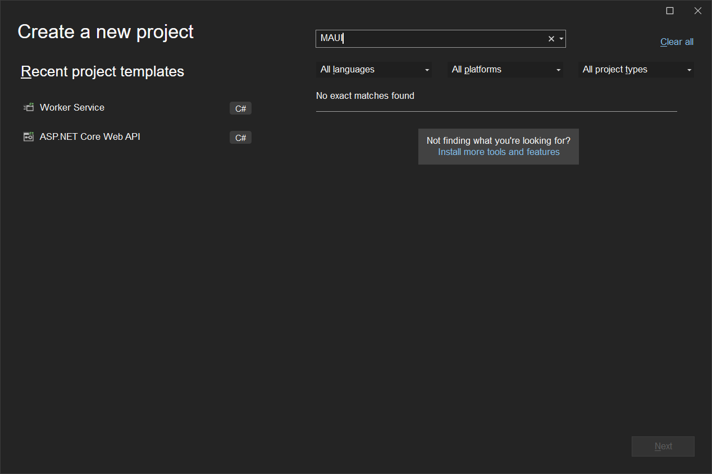
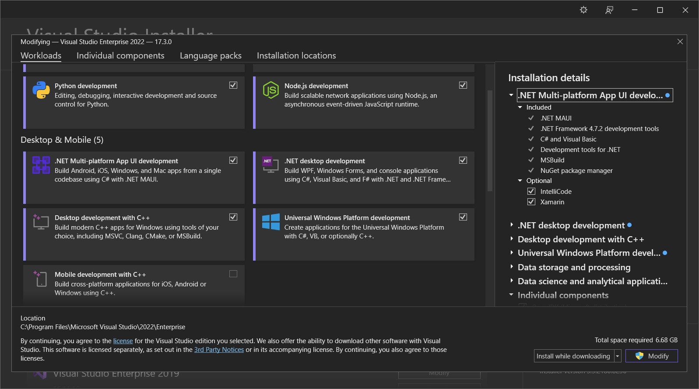
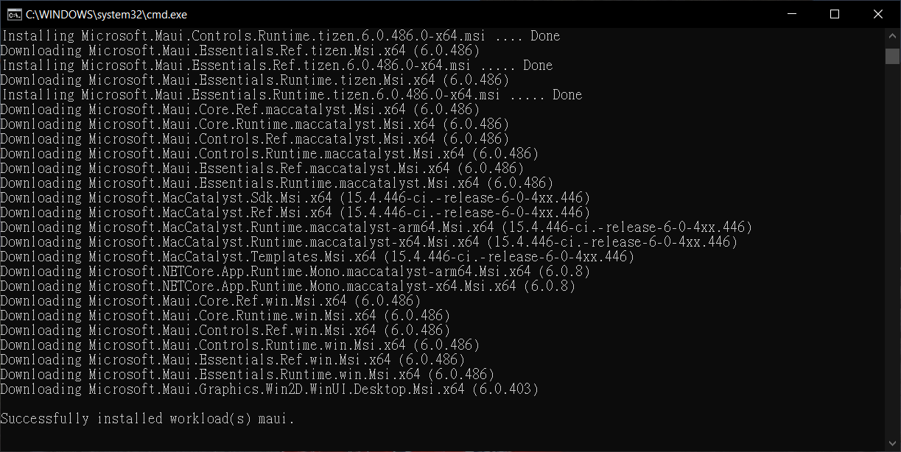
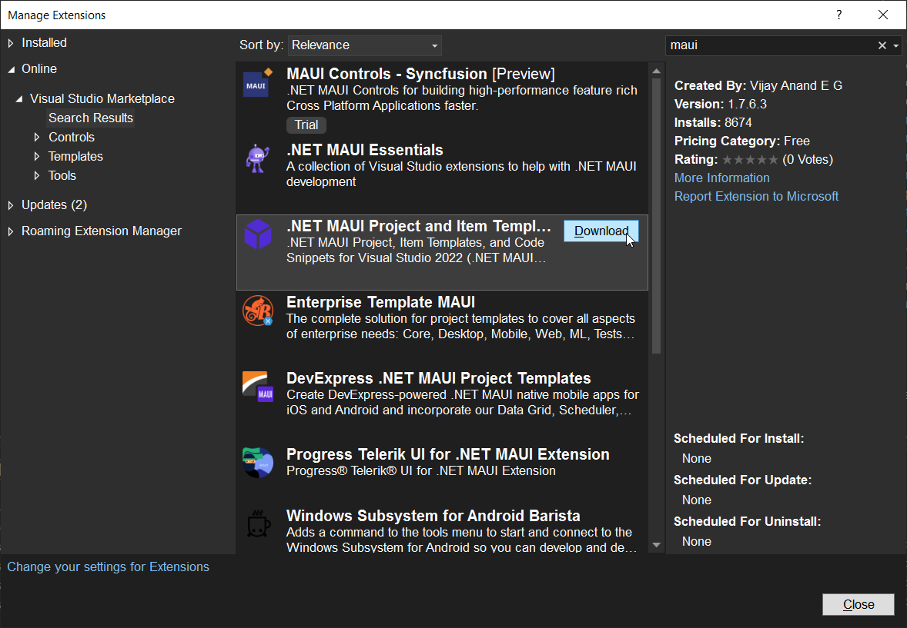
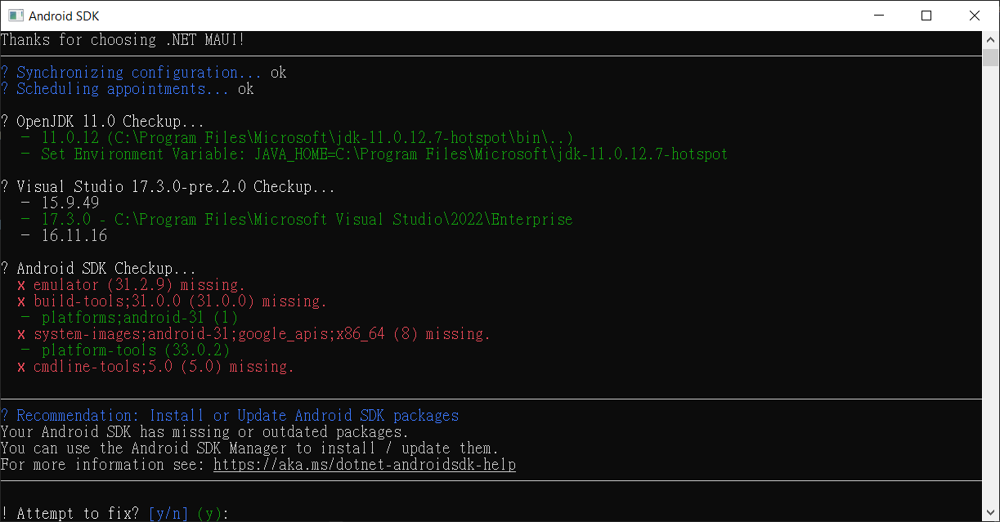

## 前言

最近想開始著手把之前寫的 Windows Phone App 轉到其它平台，想說來用期待以久的 MAUI 進行開發。

不料，當我在 Visual Studio 中想要建立 MAUI 專案時，卻發現怎樣都找不到 MAUI 專案樣版。



上網爬了一下文，發現其他人有相同問題的都是因為安裝過 Visual Studio 的 Beta 版。

不過，這就神奇了，我並沒有安裝過 Beta 版啊!!!!~~~

只能繼續爬文找解法、死馬當活馬醫了。

以下就是我嘗百草的過程。

## 我的搶救 MAUI 專案樣版之路

### 透過 Visual Studio Installer 進行修復

通常遇到 Visual Studio 相關的問題，第一步當然是先嘗試透過 Visual Studio Installer 進行修復啦!!

不過很不幸的，等它跑了快半個小時之後，看起來還是沒任何起色。



### 透過 DotNET CLI 安裝 MAUI Workload

接著我試了在命令提示字元中輸入下列指令來安裝 MAUI 的 workload：

```shell
dotnet workload install maui
```

在漫長的等待之後...



再打開 Visual Studio 2022...

嗯，還是沒有。

### 安裝 .NET MAUI Project and Item Template



看起來這個好像很有機會，不過...還是失敗。

關鍵 Error Log 如下：

```
8/15/2022 10:29:11 PM - Package 'Microsoft.Windows.SDK.BuildTools_10.0.22621.1,version=1.0.0.0' failed to install. System.> AggregateException: One or more errors occurred. ---> System.IO.IOException: The process cannot access the file 'C:\Program Files (x86) \Microsoft Visual Studio\Shared\NuGetPackages\microsoft.windows.sdk.buildtools\10.0.22621.1\bin\10.0.22621.0\x64\ComparePackage.exe'  because it is being used by another process.
   at Microsoft.VisualStudio.Setup.Installer.NuGetPackageInstaller.<>c__DisplayClass5_0.<<ExtractNupkg>b__0>d.MoveNext()
   --- End of inner exception stack trace ---
   at System.Threading.Tasks.Task.ThrowIfExceptional(Boolean includeTaskCanceledExceptions)
   at System.Threading.Tasks.Task.Wait(Int32 millisecondsTimeout, CancellationToken cancellationToken)
   at Microsoft.VisualStudio.Setup.Installer.NuGetPackageInstaller.ExtractNupkg(ILogger logger, NupkgLoggerAdapter loggerAdapter, String installerFile, String targetPath, NuGetPackage nuGetPackage)
   at Microsoft.VisualStudio.Setup.Installer.NuGetPackageInstaller.InstallCoreInternal(String localPath, String installDir, InstallablePackage pkg)
   at Microsoft.VisualStudio.Setup.Installer.FileInstaller.<>c__DisplayClass7_0.<InstallCore>b__0()
   at Microsoft.VisualStudio.Setup.Installer.FileInstaller.DoAction(Func`1 action)
   at Microsoft.VisualStudio.Setup.Installer.FileInstaller.InstallCore(String localPath, String installDir, InstallablePackage pkg)
   at Microsoft.VisualStudio.Setup.Installer.InstallerBase.InstallHelper(InstallData installData)
---> (Inner Exception #0) System.IO.IOException: The process cannot access the file 'C:\Program Files (x86)\Microsoft Visual Studio\Shared\NuGetPackages\microsoft.windows.sdk.buildtools\10.0.22621.1\bin\10.0.22621.0\x64\ComparePackage.exe' because it is being used by another process.
   at Microsoft.VisualStudio.Setup.Installer.NuGetPackageInstaller.<>c__DisplayClass5_0.<<ExtractNupkg>b__0>d.MoveNext()<---
```

### 透過 MAUI Check 進行檢查

在命令提示字元中輸入下列指令來安裝 Redth.Net.Maui.Check：

```shell
dotnet tool install -g Redth.Net.Maui.Check
```

然後執行它

```shell
maui-check
```


