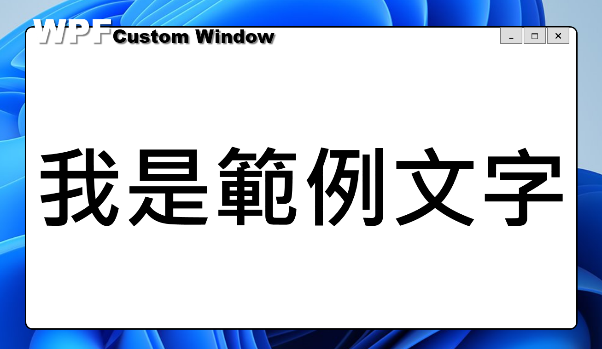
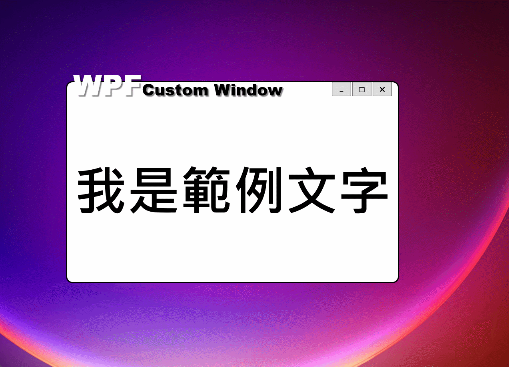
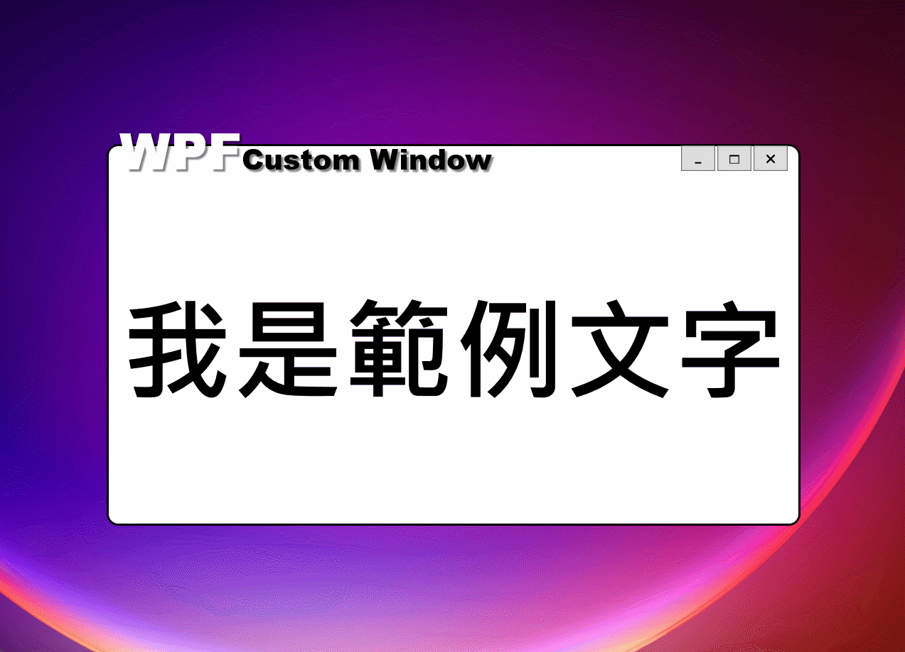

## 前言

平常我在寫 POC 的時候，除了使用 LinqPad 之外，如果是比較需要有個 UI 來呈現結果的話，都會選用 WPF 作為開發的框架。

一來繼續保持 XAML 的手感，二來用它來處理一些資料繫結或是 UI 執行緒方面的工作相對的輕鬆。

最近把一個我已經使用好幾年的一個專案樣版轉到了 .NET 6，就順便來分享一下。

## 這個樣版已經實作的功能

這個樣版具備以下功能和特色：

1. 背景透明、不規則視窗。
   

2. 可以拖拉移動、縮放視窗。
   

   

3. 已實作縮小、放大/還原、關閉按鈕。(這個部份我就不附圖了。)

基本上我只拿來它作一些小 POC，所以在上面幾個功能上並沒有下太多的功夫，能動就好。

有興趣的朋友也不妨自己把它改得更完善。

## 原始碼在哪?

本文的範例原始碼連結如下，請自行取用：

