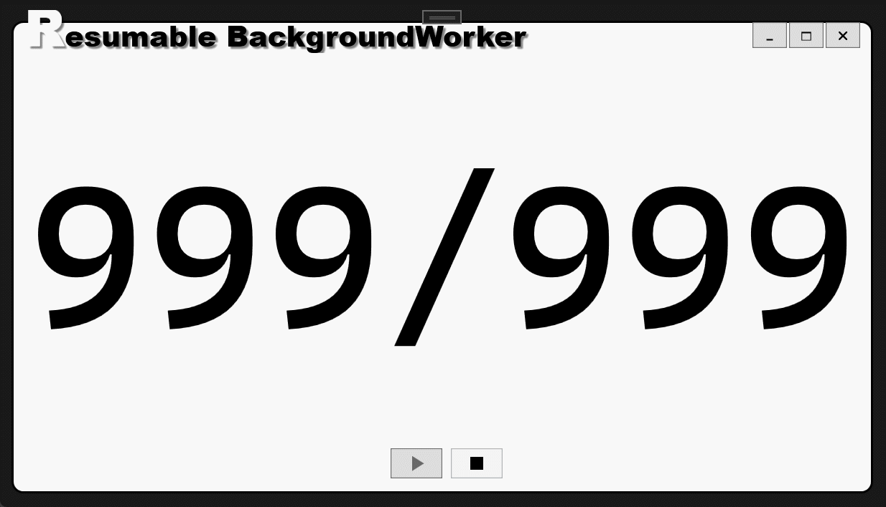

## 前言

原生的 Background Worker 是不支援暫停和繼續功能的，不過我們可以動一些手腳，讓它支援暫停和繼續。

## 有圖有真相

直接看範例比較有 fu，來看看實際操作的樣子：



## 原理

雖然 Background Worker 本身並沒提供暫停和繼續的方法。

不過，我們還是可以透過 [ManualResetEvent](https://docs.microsoft.com/en-us/dotnet/api/system.threading.manualresetevent?view=net-6.0 "ManualResetEvent") 這個類別來對執行緒動一些手腳，讓 Background Worker 可以被手動暫停或繼續。

簡單的說，ManualResetEvent 本身具備兩種狀態，分別為`已受信(signaled)`和`未受信(non-signaled)`。

這個狀態可以透過建構子來指定，也可以透過它的 [Set()](https://docs.microsoft.com/en-us/dotnet/api/system.threading.eventwaithandle.set?view=net-6.0#system-threading-eventwaithandle-set "ManualResetEvent.Set()") 方法來將狀態切為已受信(signaled)或是透過 [Reset()](https://docs.microsoft.com/en-us/dotnet/api/system.threading.eventwaithandle.reset?view=net-6.0#system-threading-eventwaithandle-reset "ManualResetEvent.Reset()") 方法來切成未受信(non-signaled)。

當它的狀態是未受信(non-signaled)時，可以透過 [WaitOne()](https://docs.microsoft.com/en-us/dotnet/api/system.threading.waithandle.waitone?view=net-6.0#system-threading-waithandle-waitone "ManualResetEvent.WaitOne()") 方法來阻塞執行緒，直到它的狀態切成已受信(signaled)為止。

## 程式碼

重點在 Code-behind 的部份，所以可以看看 Code-behind 的部份就好：

```csharp title="MainWindow.xaml.cs"
using System.ComponentModel;
using System.Threading;
using System.Windows;

namespace ResumableBackgroundWorker
{
    public partial class MainWindow : Window
    {
        private readonly BackgroundWorker _myWorker = new BackgroundWorker
        {
            WorkerReportsProgress = true,
            WorkerSupportsCancellation = true
        };


        // 透過 ManualResetEvent 來手動封鎖或是釋放執行緖。
        // 並且透過建構子讓它在被建立起來的時候處於已受信 (signaled) 狀態。
        // highlight-next-line
        private readonly ManualResetEvent _manualReset = new ManualResetEvent(true);

        private readonly int _totalCount = 999;

        public MainWindow()
        {
            this.SourceInitialized += new System.EventHandler(MainWindow_SourceInitialized);

            _myWorker.DoWork += _myWorker_DoWork;
            _myWorker.ProgressChanged += _myWorker_ProgressChanged;
            _myWorker.RunWorkerCompleted += _myWorker_RunWorkerCompleted;
        }

        private void _myWorker_DoWork(object? sender, DoWorkEventArgs e)
        {
            for (var i = 0; i < _totalCount; ++i)
            {
                if (_myWorker.CancellationPending)
                {
                    e.Cancel = true;
                    return;
                }


                //當 ManualResetEvent 的狀態為未受信 (non-signaled) 狀態時會阻塞執行緒。
                // highlight-next-line
                _manualReset.WaitOne();

                Thread.Sleep(1);

                _myWorker.ReportProgress(i + 1);

            }
        }

        private void _myWorker_ProgressChanged(object? sender, ProgressChangedEventArgs e)
        {
            txtMessage.Text = $"{e.ProgressPercentage.ToString().PadLeft(_totalCount.ToString().Length)}/{_totalCount}";
        }

        private void _myWorker_RunWorkerCompleted(object? sender, RunWorkerCompletedEventArgs e)
        {
            btnStop.IsEnabled = false;
        }

        private void tglPauseResume_Checked(object sender, RoutedEventArgs e)
        {
            if (_myWorker.IsBusy == false)
            {
                _myWorker.RunWorkerAsync();
            }
            else
            {
                //將 ManualResetEvent 的狀態切換為已受信 (signaled) 狀態，讓它在呼叫 WaitOne() 方法時讓執行緒繼續執行。
                // highlight-next-line
                _manualReset.Set();
            }
        }

        private void tglPauseResume_Unchecked(object sender, RoutedEventArgs e)
        {
            //將 ManualResetEvent 的狀態切換為未受信 (non-signaled) 狀態，讓它在呼叫 WaitOne() 方法時阻擋執行緒繼續執行。
            // highlight-next-line
            _manualReset.Reset();
        }

        private void btnStop_Click(object sender, RoutedEventArgs e)
        {
            _myWorker.CancelAsync();
        }
    }
}
```

## 原始碼在哪?

本文的完整範例原始碼連結如下，請自行取用：

[](https://github.com/Ouch1978/wpf-resumable-background-worker "WPF resumable background worker")
