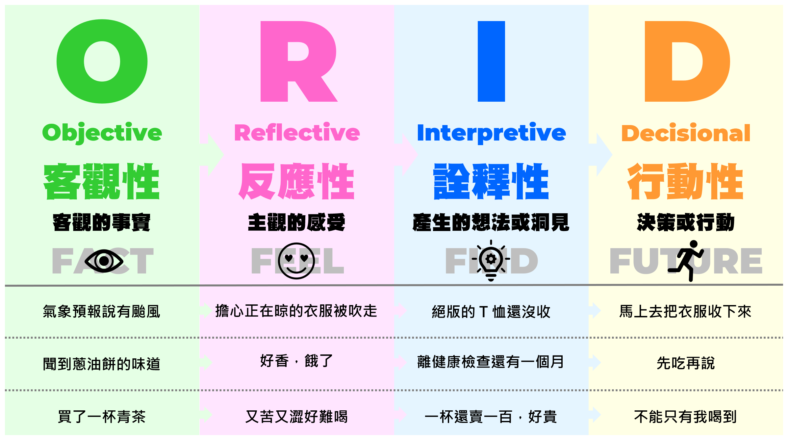

## 前言

焦點討論法 - ORID 是團隊進行 Retro 或是個人進行反思時一個很常被拿來使用的工具，也是我接觸引導的第一門課程。

這篇文章就用一張圖來讓大家對 ORID 有最初步的認識。

## 一張圖介紹 ORID

## 生活中的實際案例

我發現，其實在生活中我們也常常不自覺的使用了焦點討論法，或是用這個思路去思考一件事。

舉例來說，我可能會這樣問問題：

### Objective - 客觀性

你中午吃了什麼呢?

裡面有什麼?

多少錢?

### Reflective - 反應性

你覺得口味如何?

你覺得吃完之後大約是幾分飽?

### Inspective - 詮釋性

你覺得 C/P 值怎樣?

你會不會推薦那家店給別人?

### Decisional - 決定性

那你下次還會再買嗎?

你會推薦給我嗎?

## 一個我一定要分享的故事

話說，我昨天在搭捷運的時候坐著滑手機，而坐在我對面的一對男女開始吵了起來。

下面是我依稀還記得的對話內容和我的 ORID 模式切換(括弧裡的內容是我的 O.S. 和模式切換)：

男：「大哥哥跟你講，在車上不要滑手機。」(`O`)

男：「我就是因為沒有滑手機，所以每個月賺十幾萬。你好好唸書，不要跟他們一樣。」(`O`)

(咦!?尛...是在講我嗎? `R -> I`)

女：「我不是在玩，我是在練習作文。」(`O`)

男：「我是在教你，你要玩手機可以，但是不應該撞到人。」(`O`)

(喔~原來是這樣啊! `I`)

女：「我撞到你是我不對，我可以跟你道歉。但是你憑什麼管我，憑什麼把車上其他人都拿來講?」(`O`)

(對啊!!說得真好!! `I`)

男：「我高興啊! 我是在教你!!你撞到我就是不對!!」(`O`)

(說尛啦!! `R`)

女：「你這樣兇一個十六歲的女生就對嗎?」(`O`)

男：「我是在教你耶!!」(`O`)

(聽不下去了 `R`)

當我想把這畫面錄下來，舉起手機的時候(`I -> D`)，被對面的男子發現了，他馬上制止我錄影，不過他還是沒停止他的炮火，繼續對女學生說教。

車子又開了幾站，兩人終於都安靜了下來，而我又回到了 `I` 的階段。

(我剛剛應該要錄音的 `I`)

(我是不是應該說些什麼? `I`)

(我如果跟他說：「你說的真好，我想錄下來每天聽，好讓我每個月都能賺十幾萬。」，不知道會怎樣? `I`)

後來女學生下車了，男子也跟著下車，然後我才發現，我居然坐過站了...

(嗯...下次要記得先下車 `D`)

## 後記

引導是 Scrum Master 和敏捷教練必備的技能之一，也是一門很深的學問。

因為人會不自覺的在不同模式之間切換，就像我上面的例子，我自己也會在不同的模式之間來回切換。

一個好的引導者，可以不露痕跡的讓參與者聚焦在同一個層面進行討論，把進度超前或落後的參與者拉回來，而不會覺得不被尊重。

除此之外，如果能好好運用 ORID 的技巧，也可以避免很多不必要的紛爭。

舉例來說，依照「男人來自火星，女人來自金星」的論點，女性通常會停留在 O 和 R 的層面比較久。

而男性通常會想快點跳到 I 和 D 的階段，所以女性容易覺得並沒有真正被男性同理，因而在溝通的過程中發生爭吵。

如果雙方都能運用 ORID 的技巧，觀察對方現在在哪個層面，使用和對方同個層面的角度去同理和應對，就可以讓溝通更順暢。

當然，講都很會，但是現實往往都是在事後才想到：對吼!!我怎麼沒想到!?

畢竟這篇文章應該也還只是班門弄斧的程度而已。

:::tip 小提示
如果想要直接體驗引導的威力，或是想親自操作 ORID 的話，可以考慮參加 [ICA Taiwan 的課程](https://sites.google.com/site/icataiw/courses-and-activities "ICA Taiwan 的課程") ，親身體驗更原汁原味的 ORID 喔!!
:::

## 推薦文章

如果對 ORID 想要有更深入的了解的話，我個人推薦還可以看下面這幾篇文章：

* [【焦點討論法】：是一套溝通工具，把對話歸類為四個不同層次的溝通方式，幫助對話，了解彼此觀點](https://titansoft.com/en/agile_skills/ORID "【焦點討論法】：是一套溝通工具，把對話歸類為四個不同層次的溝通方式，幫助對話，了解彼此觀點")

* [敏捷大班～Retrospective 方法～學問 ORID](https://ithelp.ithome.com.tw/articles/10220399 "敏捷大班～Retrospective 方法～學問 ORID")

* [ORID 焦點討論法](https://changyuhao625.github.io/softskill/2019/07/18/orid-facilitator/ "ORID 焦點討論法")

