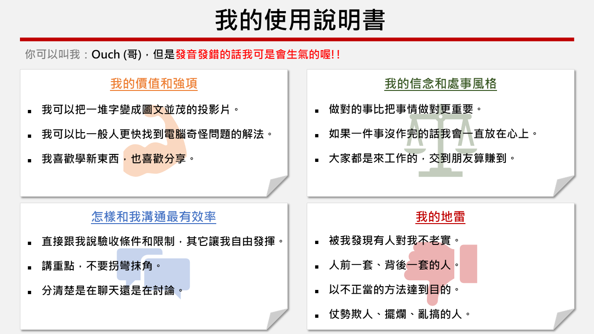
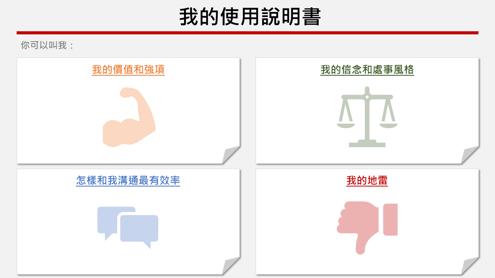

## 前言

在團隊建立的過程中，讓團隊的成員了解彼此的喜惡是讓整個團隊能走得長久的要素之一。

畢竟團隊的成員都是獨立的個體，各自有各自的處事風格和習慣，難免在共事的時候會有意見不合甚至是產生衝突的可能。

如果在團隊建立的過程中，有一個活動來讓所有成員了解彼此喜歡的溝通方式、千萬不能觸碰的雷區，就能降低日後衝突發生的機會。

所以這邊就來跟大家分享一個我覺得還不錯的小活動-我的使用說明書。

## 活動道具

1. A4 紙數張，可以先將格式套印好再發給每個成員一人一張。

2. 完成品的樣版一張。

3. 彩色筆，一人一支(以書寫之後看得清楚的顏色為佳)。

4. 計時器。

5. 輕柔的音樂。

## 範例

以我個人為例，填寫完畢的範例如下：

### 空白樣版

把這張印出來讓大家填寫就行啦!~

## 活動進行方式

1. 主持人針對活動目的進行說明。(約三分鐘)

2. 主持人針對活動進行方式進行說明。(約三分鐘)

3. 主持人示範講解自己的使用說明書。(約五分鐘)

4. 讓團隊成員填寫自己的使用說明書。(約十到十五分鐘)

5. 由團隊成員輪流說明自己的使用說明書。(每人約五分鐘)

## 使用說明書撰寫注意事項

1. 每個項目都必需填寫，字體以拿在胸前時其他人都看得清楚為基準。

2. 每個項目至少填寫兩點，至多五點，每點儘量不要超過十五個字。

3. 項目可以依照團隊狀況調整。

## 附註

這個小活動並不限只能進行一次，因為人會變，團隊的成員也可能有所變動。

可以定期或不定期舉行，也可以把團隊成員的使用說明書拍下來或是影印下來，放在大家都容易看到的地方。

也有人是直接把自己的使用說明書貼在座位前面，當有其他人踩到自己的雷的時候唸給對方聽，或是請對方唸出來(咦!?)。

另外，除了用在團隊裡之外，也可以用在和家人之間的溝通喔!!

## PowerPoint 原始檔

最後附上 PowerPoint 原始檔，有需要的話請自行取用。

