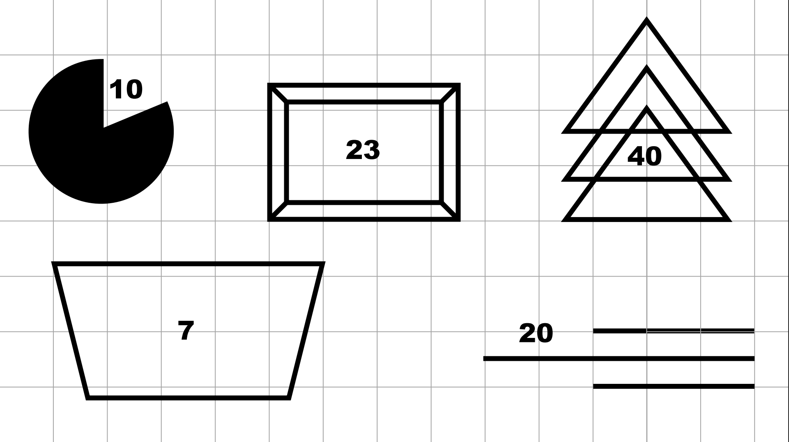

## 前言

不論有沒有在跑敏捷，在開發的過程中，需求應該永遠都會是最重要的產出之一，畢竟沒有明確的界定產出的標準，就很難產出符合預期的成果。

相信大家應該也都有過下面的經驗：

1. 需求明明有寫，產出就是漏東漏西。

2. 東西都作到一半、甚至都作完了，才發現需求少寫了一些東西。

3. 需求有看沒有懂。

這個小遊戲的目的，就是要讓團隊體驗一下撰寫需求的難處，以及找出一份好的需求的基本條件是什麼。

## 使用道具

1. 空白 A4 紙一包。

2. 彩色筆。

3. 計時器。

4. 桌子數張。

5. 大白板及白板筆。

## 角色介紹

1. 利害關係人(Stakeholder)：負責提出需求並且負責驗收(決定計分標準)的角色，在開發過程中只能和產品負責人對話，只有一人擔任。

2. 產品負責人(Product Owner)：負責從 Stakeholder 那邊收集需求，並且將需求文件化的角色，可以和利害關係人對話，人數不限。

3. 開發者(Developer)：負責進行開發(依照產品負責人撰寫的需求畫出成品)，人數不限。

4. Scrum Master/Agile Coach：負責整個活動的主持、規則說明以及控場，還有主持整個活動的回顧會議。

## 流程與規則

遊戲共進行三輪，每輪時間分配與規則如下：

0. 第一輪開始之前

   * 所有成員進行分組，每組至少三人，且每組至少必需包含一位產品負責人，其他組員擔任開發者的角色。

   * 每組選定一張桌子作為開發基地，每張桌子上請先放好十張左右的白紙，並提供每個人至少一隻彩色筆。

1. 戰略討論 - 兩分鐘。
  
   * 每組可以決定是否調整產品負責人與開發者的人數比例，該輪進入實作時間後就不能再調整人數。

   * 產品負責人和開發者可以討論要怎樣才能得到高分。

   * 利害關係人可以利用這段時間思考每個圖形的分數及計分標準。

2. 實作 - 五分鐘。

   * 進入實作時間之後，產品負責人就可以到利害關係人旁邊看題目、寫需求、以及對利害關係人提問。

   * 利害關係人可以選擇性的回答產品負責人的問題。

   * 產品負責人只能以文字描述需求，不可以用圖畫或其它方式描述需求。

   * 產品負責人可以不限次數的在利害關係人和開發者之間來回。

   * 產品負責人在進入實作時間之後不能和其他組員進行交談、也不能進行開發。

   * 擔任開發者的組員可以交談，也可以對產品負責人進行提問。

   * 產品負責人只能以文字或是點頭搖頭的方式回答組員的問題，不能使用其它肢體語言回答問題。

   * 在第二輪和第三輪進行的時候，請讓產品負責人帶回一張印好空白格線的紙，讓團隊在上面進行開發。

3. 計分 - 每個團隊輪流，各一分鐘。

   * 計分過程中各組組員需停留在各自的開發基地。

   * 由利害關係人到各組依照各組完成度給分，Scrum Master/Agile Coach 可以在旁記錄各組分數。

4. 公佈該輪各組成績，並且繼續下一輪。

   * Scrum Master/Agile Coach 可以將各組分數記錄在白板上。

5. 三輪結束之後，統計總分，並且進行整體回顧會議，邀請所有成員參與每個迭代中觀察到的事物相關的討論。

## 題目參考

我自己使用的題目如下，提供給大家參考：

第一輪：

第一輪只是讓團隊暖身，所以題目很簡單。(咦?)

這邊也提供我在第一輪的計分標準讓大家參考：

1. 形狀對：五分。

2. 顏色對：三分。

3. 位置對：兩分。

第二輪：

第二輪刻意加入格線，引導團隊思考`共同語言`這件事。

其實我在第二輪的圖案背面都先寫上了各個圖形的分數，但是我刻意不主動說明有這件事，好為第三輪舖梗。

第三輪：

第三輪刻意加入了`價值點數`，也在需求上故意增加了難度(圖形刻意不畫在格線上)。

會這樣安排是為了引導團隊找到下列思考重點：

1. 一開始需求總是最不明確的。

2. 隨著迭代，使用的工具也會進步(出現格子輔助)，團隊也需要找出能精準描述需求的共同語言。

3. 團隊應該依照價值和難度尋找出 CP 值最高的方法來爭取高分。

## 題目太簡單嗎?

如果覺得題目太過簡單，可以加入其它條件，例如彩色的圖形、禁止開發團隊發問、不提供已經畫好格線的紙；而是提供尺... 等等。

## 後記

這個小遊戲是我參加某一年 Agile Summit 時玩到的，之後我也在公司的 Retro 中帶了這個小遊戲。

而這個小遊戲的關鍵其實在於`座標`這個共同語言，能越快摸索出這個重點的團隊通常就能得到高分。

需求描述得越精準，實作的人只要照著實作，產出的成品理應就不會和需求有多大的誤差。

使用大家都懂的語言、方法和工具來描述需求和進行溝通，也能大幅降低溝通的成本。

而根據 Scrum Guide，需求並不是產品負責人一個人的事，整個團隊都要有能力寫出好的需求，也要能最大化團隊的產出和價值。

Scrum Master 或是 Agile Coach 可以多利用這樣的活動培養團隊的默契，也讓團隊成員都能體驗不同角色的辛苦與難處。

最後，附上範例的 PDF 檔，裡面也包含了空白的格線圖，歡迎自行取用：

