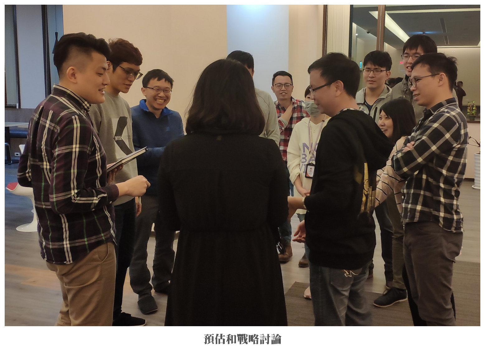
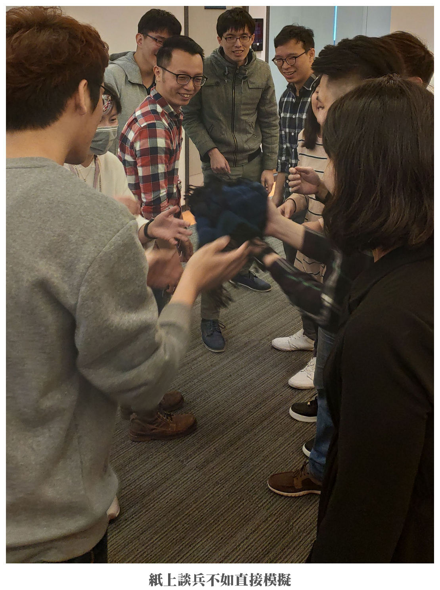
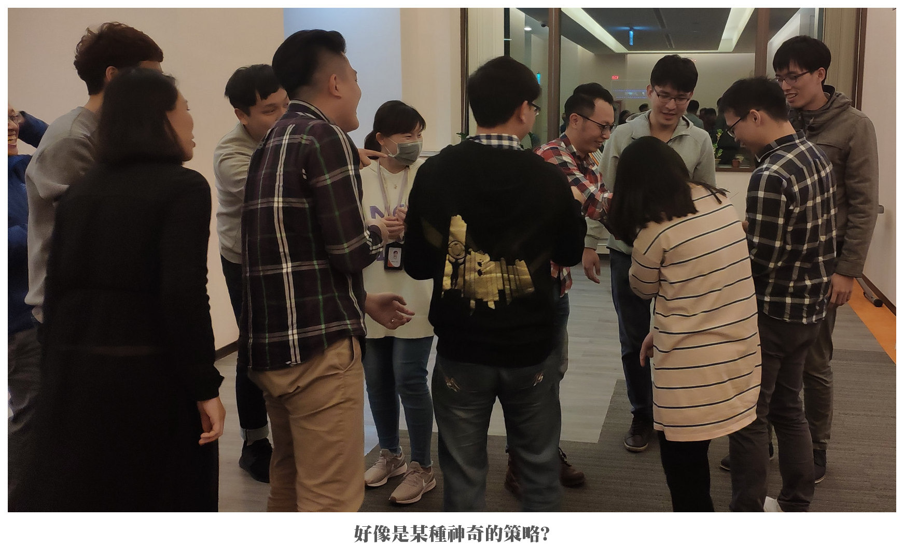
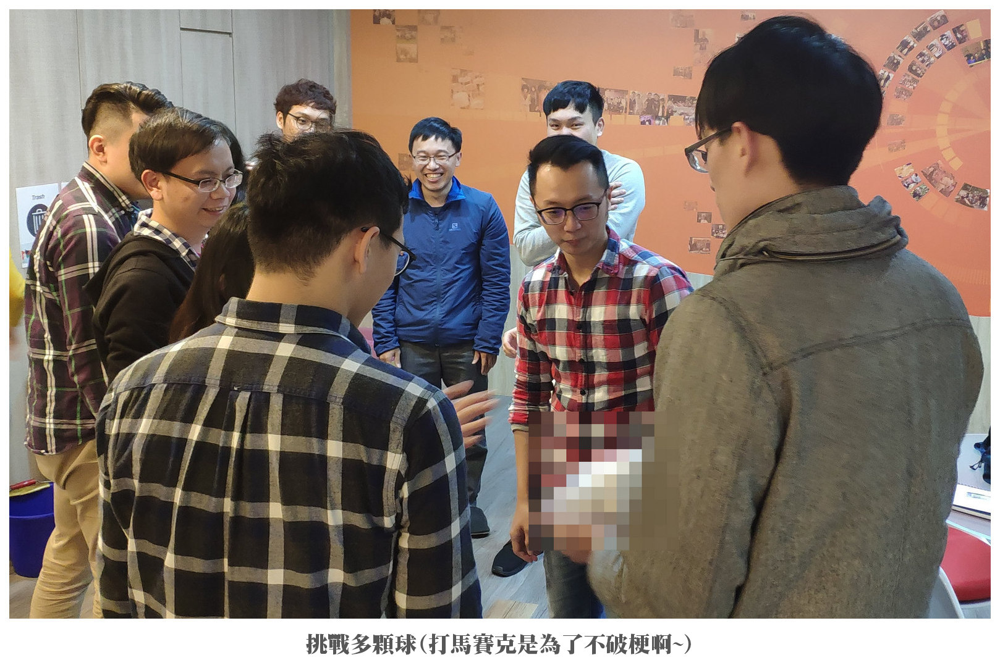

## 前言

傳球遊戲應該是敏捷小遊戲裡面數一數二經典的遊戲之一。

這邊就來分享一個我自己~~亂~~修改之後的版本，比較適合已經合作一段時間，彼此都已經互相熟悉的團隊。

這個版本只使用一顆球，跳過自我介紹的步驟，直接體會迭代的威力。

:::tip 名詞解釋
這邊所說的「丁字褲版」，指的是只包含最基本的功能骨架的可用版本，而不是每個人要穿著丁字褲進行遊戲喔!!
:::

## 使用道具

1. 碼錶。

2. 大白板及白板筆。

3. 一顆球(丁字褲版=直接拿廢紙揉成一顆球)。

## 角色介紹

1. Scrum Master/Agile Coach：負責整個活動的主持、規則說明以及控場，還有主持整個活動的回顧會議。

2. 團隊成員：負責參與整個活動(用力玩就對了)。

## 流程與規則

遊戲共進行五輪(理論上可以在半個小時之內進行完畢)，規則如下：

一開始由 Scrum Master/Agile Coach 說明規則：

1. 每輪遊戲由一個人開始把球傳給其他人，球得經過所有的人手上、最後回到同一個人的手上才停止計時。

2. 球不能直接傳給隔壁的人。

3. 球得要完全離開上一個人的手，停留在空中，然後到下一個人的手中。

4. 如果球掉到地上就從第一個人開始重新來過，時間照樣計算。

5. Scrum Master/Agile Coach 在白板計下每輪預估和實際花費的時間。

6. 每輪開始之前給團隊一分鐘的時間討論戰略並且預估會花費的時間，每輪結束後有一分鐘進行檢視和回顧。

7. 如果第五輪的成績大於兩秒的話，可以提示團隊應該有可以在兩秒之內完成的方法，看團隊要不要再挑戰第六輪。

8. 結束之後進行 Retro。

## 希望藉由這個活動讓團隊得到什麼?

1. 體驗迭代的威力。

2. 敏捷裡面的 Timebox：討論戰略和檢討的時間是受限制的。

3. 敏捷三本柱：

   * Inspect：每個回合檢視現況。

   * Adapt：依成績調整戰略。

   * Transparency：大白板上有每輪的成績、檢討的時候是公開透明的。

4. 自組織(團隊自主性)：團隊是自己想出改善的方法，而且自動自發進行改善的。

## Retro 時可以參考的 ORID

Objective:

* 有沒有人可以說說剛剛有哪些事讓你印象深刻?

* 討論策略的時候是誰出來主持的?

* 有哪些意見被提出來?

* 什麼意見被採用? 結果為何?

* 哪個回合成績最好? 該回合的策略是什麼?

Reflective:

* 有沒有人可以分享一下現在的心情?

* 有沒有人可以說說剛剛的心情轉折?

* 剛剛有發生什麼特別有趣的事?

Inspective:

* 成績最差的回合有哪些問題讓速度快不起來?

* 最好的那個回合的策略改善了什麼問題?

* 團隊是怎麼凝聚出共識的?

* 預估和實際的結果為什麼會有落差? 落差又是怎麼被消滅的?

* 這個遊戲的瓶頸是什麼? 瓶頸是怎麼被消滅的?

* 有沒有人可以分享一下從這個活動裡面學到什麼?

* 這個活動有沒有讓你聯想到工作裡的哪個環節或情境? 為什麼?

* 如果再玩一輪的話，成績會更好或更差嗎? 為什麼?

Decisional:

* 從這個遊戲裡可以帶回什麼來改善我們的工作流程?

* 我們的工作流程有沒有什麼瓶頸? 該如何打破?

* 我們的工作裡有什麼好的流程，應該繼續保持? 還能不能更好?

## 後記

這個活動是我之前為了讓團隊體驗迭代的進行在網路上找到的，但是因為團隊成員都已經合作了好一段時間了，所以我就省略了破冰的流程。

後來也挑戰了多顆球的版本，而且，團隊花不到兩秒就傳完一輪了。

怎麼辦到的? 不告訴你!~

## 精采花絮

## 參考資料

* [Agile Ball Point Game – 從拋球遊戲中體會敏捷精神](https://agilebistro.com/ball-point-game/ "Agile Ball Point Game – 從拋球遊戲中體會敏捷精神")

* [敏捷拋球遊戲：單顆球版](https://agilebistro.com/one-ball-game/ "敏捷拋球遊戲：單顆球版")

* [敏捷傳球遊戲](https://kojenchieh.pixnet.net/blog/post/387612539 "敏捷傳球遊戲")
