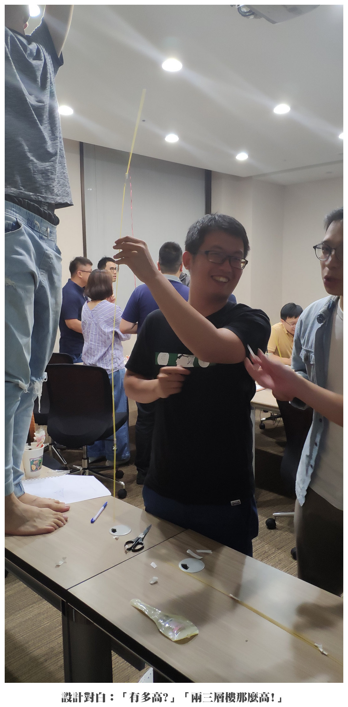
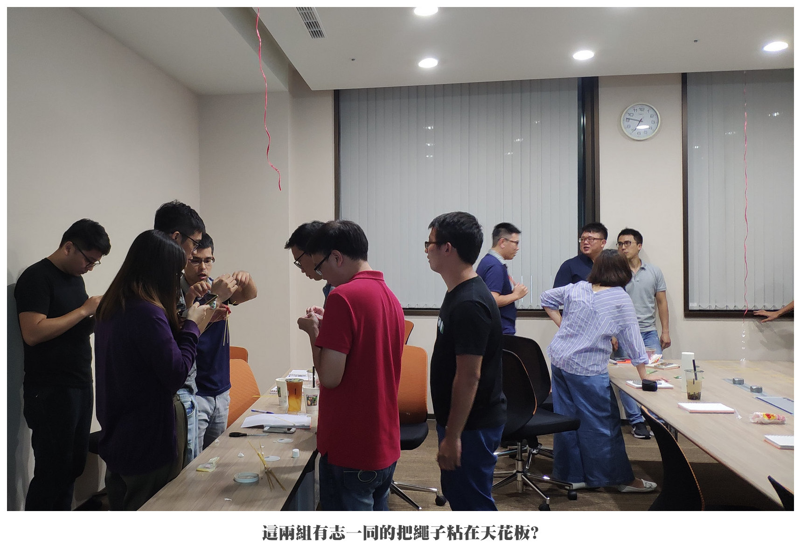
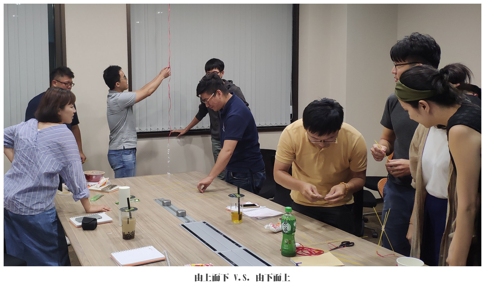
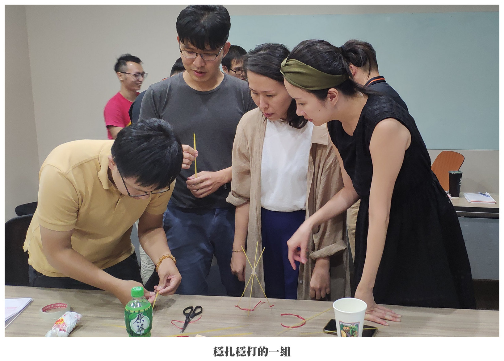
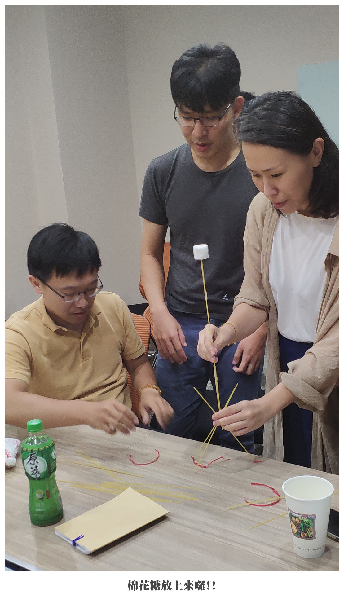

## 前言

棉花糖挑戰是我第一次帶給團隊的敏捷小遊戲。

當時主要是為了讓團隊體驗不同的 Retrospective 進行方式。

對團隊來說，算是一種很新鮮的體驗，對我來說也是一種很新鮮的嘗試，而且效果也很不錯。

團隊成員在活動後的 Retrospective 環節也更願意發表意見了。

## 希望藉由這個活動讓團隊得到什麼?

1. 體驗迭代的威力。

2. Timebox：整個活動的時間是受限制的。

3. 讓不同的成員體驗扮演 Scrum Master 的角色。

4. 改變團隊以往總是圍繞著 Good/Bad/Improve/Other 的 Retrospective 進行方式，擴大參與感。

### 道具

1. 計時器一個。

2. 捲尺一個。

3. 剪刀數把。

4. 白板和白板筆。(非必要)

每組各會得到下列道具：

* 義大利麵 20 根。

* 尼龍繩 90 公分。

* 膠帶 90 公分。

* 棉花糖一顆。

道具會由我事先裝在一個手提袋裡，待每組選出 Scrum Master 之後由 Scrum Master 來向我領取。

:::tip 給 Scrum Master 的挑戰之一
我事先會「不小心」在每個袋子裡隨機漏掉某樣道具，預期 Scrum Master 應該要為團隊解決這個問題。
:::

## 規則與流程

1. 由我簡單介紹一下棉花糖挑戰這個遊戲和目的。

2. 由我說明分組的規則：

   * 每組有五個成員，其中一人擔任 Scrum Master，其餘擔任開發者。

   * Scrum Master 負責在 18 分鐘裡引導團隊進行規畫會議和回顧(次數不限)，並且協助團隊排除開發時遇到的障礙，但是不能參與開發。

   * 團隊成員負責開發。

3. 說明棉花糖挑戰的規則：

   * 時間限制： 18 分鐘。

   * 每組會得到下列道具： 義大利麵 20 根、尼龍繩 90 公分、膠帶 90 公分、棉花糖一顆。

   * 每組得在 18 分鐘之內，利用義大利麵築起一座塔，棉花糖必需在塔的頂部，並且不需依靠外力站穩，從塔的底部到棉花糖的高度作為判斷標準，最高組獲勝。

   * 義大利麵可以折斷，但是棉花糖不可以被破壞。

4. 分好組之後，由每組的 Scrum Master 來跟我領取道具袋。

5. 各組就定位而且沒問題之後，開始進行遊戲，計時十八分鐘。

6. 時間結束之後由我到各組丈量塔的高度，並且記錄下來，然後公佈各組成績。

7. 進行活動的 Retro。

:::tip 給 Scrum Master 的挑戰之二
記得前面的道具有剪刀嗎? 沒剪刀的話膠帶可能還有辦法弄斷，可是尼龍繩... 嘿嘿~~
:::

## 關於棉花糖挑戰

在 2006 年的時候， Peter Skillman 在 TED 2006 發表了由他設計的一個挑戰，稱為棉花糖挑戰。要由四人一隊的隊伍，在有限的時間裡，使用義大利麵、綿線、膠帶和棉花糖建造出一座塔，而造出可自我支撐而且最高的團隊就可以獲勝。

<iframe width="100%" height="480" src="https://www.youtube.com/embed/1p5sBzMtB3Q" title="YouTube video player" frameborder="0" allow="accelerometer; autoplay; clipboard-write; encrypted-media; gyroscope; picture-in-picture; web-share" allowfullscreen></iframe>

之後，Autodesk 公司的 Tom Wujec 發現了這個活動，積極的用利這個活動來進行團隊建立，參與者從幼稚園小朋友到企業總裁都有。

<iframe src="https://embed.ted.com/talks/lang/en/tom_wujec_build_a_tower_build_a_team" width="100%" height="480"  frameborder="0" scrolling="no" allowfullscreen></iframe>

目前我所找得到的世界紀錄大約是 165 公分高。

有趣的是，平均下來的成績，幼稚園的小朋友比成年人來得好，工程師和建築師的成績也比其它職業來得好。

職位越高者所組成的隊伍平均成績也相對的差，因為會花很多時間爭論要由誰來領導團隊，不像小朋友，先做再說，比較不會浪費時間在爭論上面。

## 精采花絮

## 參考資料

* [Marshmallow Challenge](https://www.marshmallowchallenge.com/ "Marshmallow Challenge")
