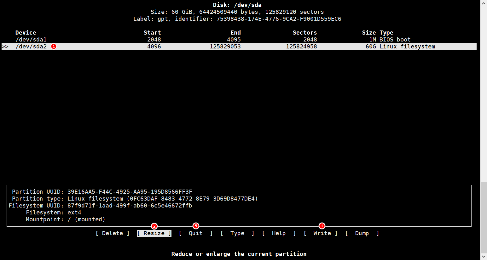

## 前言

在使用 VM 的時候，各種資源往往能省就省，所以一開始可能都不會開太大。

不過可能一不小心，就不知不覺把磁碟給吃滿了。

就算手動調整 Ubuntu VM 的磁碟空間，也不會在 Ubuntu VM 裡馬上生效。

這篇文章就簡單介紹如何透過命令模式來在 Ubuntu 中調整磁碟大小。

## 調整 /dev/sdaX 的大小

:::tip 小提示
sdaX 的 X 為我們要調整的磁碟編號。
:::

要調整 /dev/sda 的容量很簡單，個人比較推薦使用 `cfdisk`。

在 console 中輸入 `cfdisk`。

1. 選擇要調整的磁碟。

2. 選取 `Resize`。

3. 輸入新的容量。

4. 選擇 `Write`。

5. 選擇 `Quit` 退出。

最後在 console 中繼續輸入 `resize2fs /dev/sdaX` 即可。

## 調整 ubuntu--vg-ubuntu--lv (overlay) 的大小

Ubuntu 18.04 之後出現了 LVM (Logical Volume Management)，調整容量的方法和直接調整 sdaX 又有一點點差異。

基本上還是要先完成 sdaX 容量的調整，接著輸入 `pvresize /dev/sdaX`。

然後輸入 `lvresize -A n -l +100%FREE /dev/ubuntu-vg/ubuntu-lv`。

:::tip 小提示
上面指令的 +100%FREE 指的是把所有剩餘的空間都分配給 Logical Volume。
:::

最後輸入 `resize2fs /dev/mapper/ubuntu--vg-ubuntu--lv` 即可。
