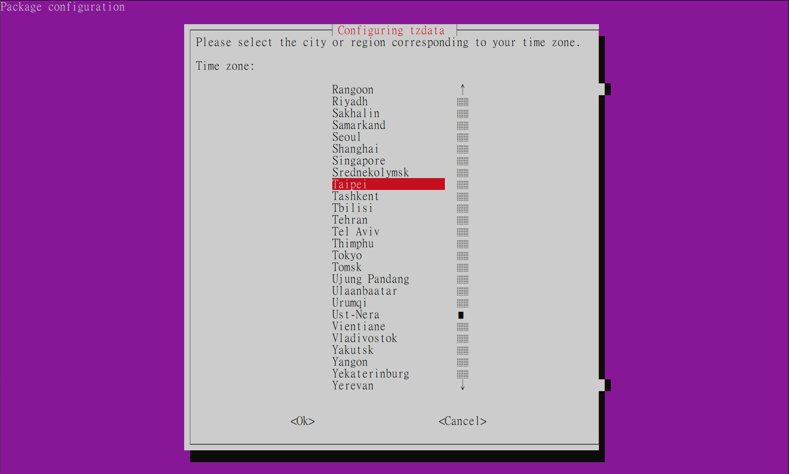

## 前言

在使用多台 VM 跑 Container 的時候，每台機器的時區和時間一致是很基本的要求。

這篇就簡單分享如何在 Ubuntu 中要怎麼更改時區，並且透過校時服務確保每台 VM 的時間都是一致的。

## 調整系統時區

我們可以透過輸入下面的指令來調整系統時區：

```sh
sudo dpkg-reconfigure tzdata
```

它會出現一個簡易的選單來讓我們選取時區，如下圖：


選取 OK 退出之後，Console 會顯示我們選取時區的時間，以及 UTC 的時間。

> Current default time zone: 'Asia/Taipei' <br/>
> Local time is now: Tue Sep 20 08:31:07 CST 2022. <br/>
> Universal Time is now: Tue Sep 20 00:31:07 UTC 2022. <br/>

非常簡單。

## 安裝並設定自動校時服務

接下來我們可以透過下面的指令來安裝 NTP (網路時間協定) 服務：

```sh
sudo apt-get install ntp
```

NTP 服務預設會使用 ubuntu.pool.ntp.org 的幾組伺服器來進行自動校時。

如果想要使用自訂的伺服器，則可以透過修改 NTP 服務的設定檔來達成，指令如下：

```sh
sudo nano /etc/ntp.conf
```

然後修改 NTP Pool 的部份，例如我想改成使用台灣的 NTP 伺服器：

```txt title="/etc/ntp.conf"
# /etc/ntp.conf, configuration for ntpd; see ntp.conf(5) for help

driftfile /var/lib/ntp/ntp.drift

# Leap seconds definition provided by tzdata
leapfile /usr/share/zoneinfo/leap-seconds.list

# Enable this if you want statistics to be logged.
#statsdir /var/log/ntpstats/

statistics loopstats peerstats clockstats
filegen loopstats file loopstats type day enable
filegen peerstats file peerstats type day enable
filegen clockstats file clockstats type day enable

# Specify one or more NTP servers.

# Use servers from the NTP Pool Project. Approved by Ubuntu Technical Board
# on 2011-02-08 (LP: #104525). See http://www.pool.ntp.org/join.html for
# more information.
// highlight-start
# pool 0.ubuntu.pool.ntp.org iburst
# pool 1.ubuntu.pool.ntp.org iburst
# pool 2.ubuntu.pool.ntp.org iburst
# pool 3.ubuntu.pool.ntp.org iburst

server 0.tw.pool.ntp.org
server 1.tw.pool.ntp.org
server 2.tw.pool.ntp.org
server 3.tw.pool.ntp.org
// highlight-end
# Use Ubuntu's ntp server as a fallback.
pool ntp.ubuntu.com
```

修改完畢存檔之後，再透過下面的指令重啟 NTP 服務即可。

```sh
sudo service ntp restart
```

以上。
