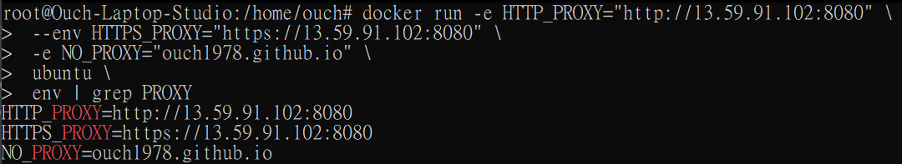
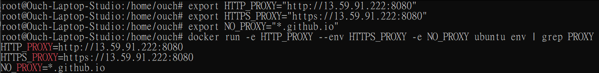
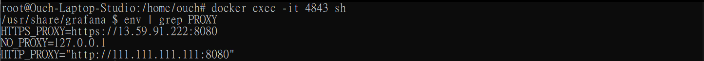

## 前言

之前在玩容器的時候，在讓容器透過代理伺服器(Proxy)上網這件事上面卡關卡了超級久。

在 Google 用 `Docker Proxy` 和 `Container Proxy` 這兩個關鍵字搜尋，也大多只能找到讓 Docker Daemon 透過代理伺服器連網的方法。

雖然大多數使用情境不會有這樣的需求，不過還是特別來記錄一下。

:::tip 小提示
其實要替容器設定代理伺服器的思路和 Linux 一樣，都只要在環境變數中動手腳即可。
:::

## 透過 ~/.docker/config.json 檔指定

如果想要針對所有容器設定共同的代理伺服器的話，可以透過建立並編輯 ~/.docker/config.json 檔來達成：

```sh
sudo nano ~/.docker/config.json
```

在裡面設定代理伺服器相關的資訊，例如：

```toml title="~/.docker/config.json"
{
  "proxies":
    {
      "default":
        {
          "httpProxy": "http://13.59.91.109:80",
          "httpsProxy": "https://13.59.91.109:80",
          "noProxy": "127.0.0.0/8"
        }
    }
}
```

在存檔退出之後所建立的容器就都會套用這些設定。

## 透過 docker 指令指定

有時候我們可能會想針對特定的容器個別指定代理伺服器。

這邊以 Grafana 的容器為例，如果我們想要建立一個 Grafana 的容器，並且讓它透過我們指定的代理伺服器連網，可以透過下面幾種方式完成。

:::warning 警告
容器在使用環境變數時有優先順序的差別，順序由高到低排列如下：

1. 直接指定
2. 作業系統的系統變數
3. ~/.docker/config.json 中設定的值
4. 環境變數檔
   若有在 ~/.docker/config.json 中設定代理伺服器，則透過環境變數檔指定的代理伺服器將不會生效。
5. 寫在 Docker file 裡
   :::

### 方法一：直接指定

```sh
docker run -e HTTP_PROXY="http://13.59.91.102:8080" \
 --env HTTPS_PROXY="https://13.59.91.102:8080" \
 -e NO_PROXY="ouch1978.github.io" \
 ubuntu \
 env | grep PROXY
```

執行結果如下：



基本上，就是透過 --env 或是 -e 去指定環境變數就對啦。

### 方法二：使用系統變數

我們也可以把目前作業系統中已經存在的環境變數指派進去，例如：

```sh
export HTTP_PROXY="http://13.59.91.222:8080"
export HTTPS_PROXY="https://13.59.91.222:8080"
export NO_PROXY="*.github.io"
docker run -e HTTP_PROXY --env HTTPS_PROXY -e NO_PROXY ubuntu env | grep PROXY
```

執行結果如下：



### 方法三：使用環境變數檔

除了上述兩個方法之外，我們也可以建立一個檔案給 Docker 讀，例如：

```toml title="proxy.list"
# HTTP 代理伺服器
HTTP_PROXY="http://13.59.91.102:8080"
# HTTPS 代理伺服器
HTTPS_PROXY="https://13.59.91.102:8080"
# 不使用代理伺服器的網址
NO_PROXY="ouch1978.github.io"
```

然後執行 docker run 的時候改成：

```sh
docker run --env-file proxy.list ubuntu env | grep PROXY
```

很重要，所以要再說一次：

:::warning 警告
若有在 ~/.docker/config.json 中設定代理伺服器，則透過環境變數檔指定的代理伺服器將不會生效。
:::

## 透過 Docker Compose 檔指定

使用 Docker Compose 的時候也可以在 yml 檔中指定代理伺服器，方法如下：

### 透過 environment 參數指定

```yml title="docker-compose.yml"
version: "3"

services:
  grafana:
    image: grafana/grafana
    ports:
      - 3000:3000
    restart: unless-stopped
    environment:
      - HTTP_PROXY="http://111.111.111.111:8080"
      - HTTPS_PROXY
```

基本上和直接使用 Docker 指令時大同小異，如果只指定變數名稱，就會把目前作業系統的環境變數帶進去。

結果如下：



### 使用環境變數檔

使用 Docker 指令的時候可以用環境變數檔，Docker Compose 當然也要來一下：

```yml title="docker-compose.yml"
version: "3"

services:
  grafana:
    image: grafana/grafana
    ports:
      - 3000:3000
    restart: unless-stopped
    env_file:
      - proxy.list
```

:::warning 警告
和使用 Docker 指令時一樣，若有在 ~/.docker/config.json 中設定代理伺服器，則透過環境變數檔指定的代理伺服器將不會生效。
:::

## 怎麼檢查容器裡的環境變數呢?

其實上面已經用過很多次了，只要透過 `env` 這個指令就可以了。

例如：

```sh
docker exec -it {容器 ID} env | grep PROXY
```

環境變數是一個很好用的東西，不光光只能指定代理伺服器而已喔!!

以上。
