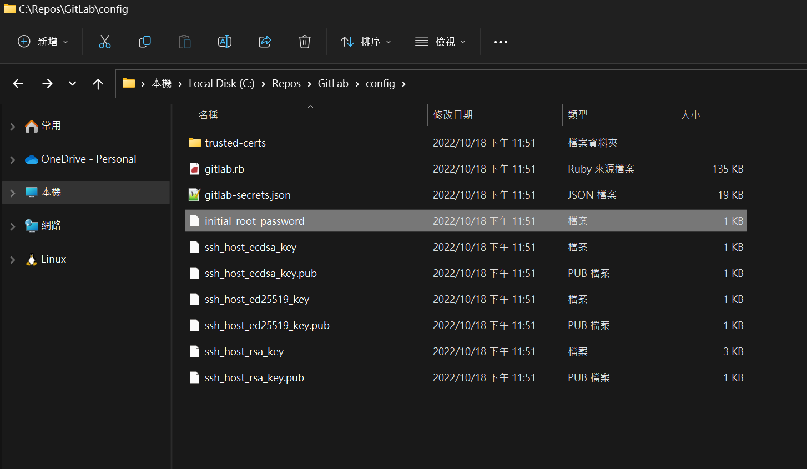

## 前言

在使用 Docker 容器架設 GitLab 的時候，第一個要面臨的問題就是：預設的管理者帳號密碼是什麼?

上網搜尋的話，應該很容易就會找到下面這一段：

> The default username is admin@local.host, and the default password is 5iveL!fe

如果很開心的直接拿來用，應該會覺得自己是不是被旋轉了...

沒錯!! 因為那是 2014 年的資料，現在已經不是這樣玩了。

網路上還有很多不同的設定方式，但是經過我親身踩雷體驗，看起來還是這一招最穩。

這邊就來分享一下正確的姿勢和我踩過的雷有哪些。

## 使用環境

在接下去之前，簡單說明一下我的測試環境配置：

作業系統： Windows 11 家用版 22H2

Docker Desktop： 4.12.0 with WSL2(Ubuntu 22.04 distro)

Docker Compose File：

```yml title="docker-compose.yml"
version: '3.7'

services:
  gitlab:
    image: gitlab/gitlab-ce:latest
    hostname: gitlab.example.com
    container_name: gitlab
    restart: always
    volumes:
      - './config:/etc/gitlab'
      - './logs:/var/log/gitlab'
      - './data:/var/opt/gitlab'
    ports:
      - 443:443
      - 5000:80
    networks:
      - gitlab
 
networks:
  gitlab:
    name: gitlab-network
```

## 使用管理者帳號登入 GitLab 的正確姿勢

其實在 GitLab 的容器跑起來之後，會在 config 資料夾下產生一個名為 `initial_root_password` 的檔案。



裡面就會包含一組預設的 root 密碼。

我們只要使用預設的 `root` 帳號，搭配文字檔裡面的密碼登入就行了。

## 網路上流傳的其它姿勢

這邊就收集一些我在網路上找到而且試過的其它方法。

### 古早流傳的帳號密碼

就是那意圖使人罵髒話的 `admin@local.host` 和 `5iveL!fe`。

別再相信古早的傳說了~~

### 透過環境變數設定

網路上也找得到其它透過環境變數設定管理者帳號密碼的 docker compose file。

例如透過指定 `GITLAB_OMNIBUS_CONFIG` 裡面的 `gitlab_rails['initial_root_password']` 變數 ：

```yml title="docker-compose.yml"
    environment:
      GITLAB_OMNIBUS_CONFIG: |
        gitlab_rails['initial_root_password'] = 'MyP@$$w0rd'
```

或是直接指定 `GITLAB_ROOT_PASSWORD` 環境變數：

```yml title="docker-compose.yml"
    environment:
      GITLAB_ROOT_PASSWORD: 'MyP@$$w0rd'
```

當然，我也試過這兩種方法，但是都以失敗作收。

## 後記

如果看倌大大有其他更聰明的方法，還請不吝跟我分享一下啊!!
