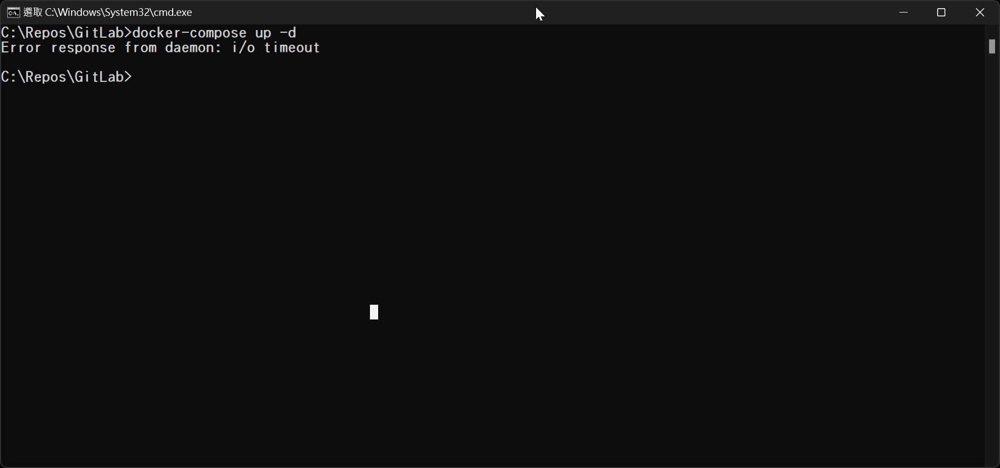
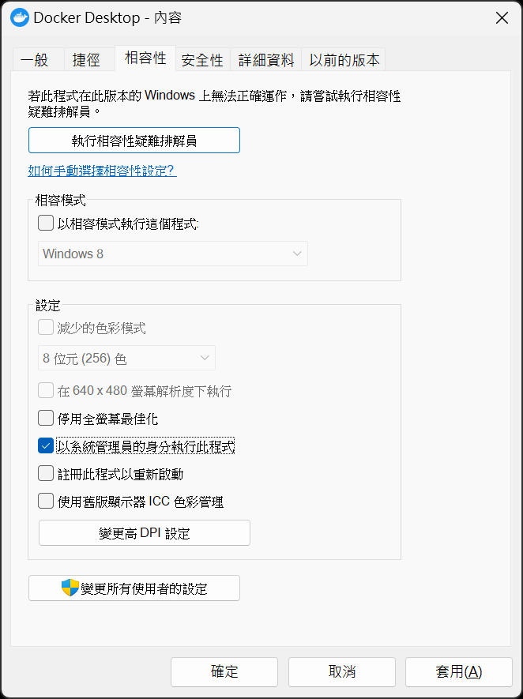
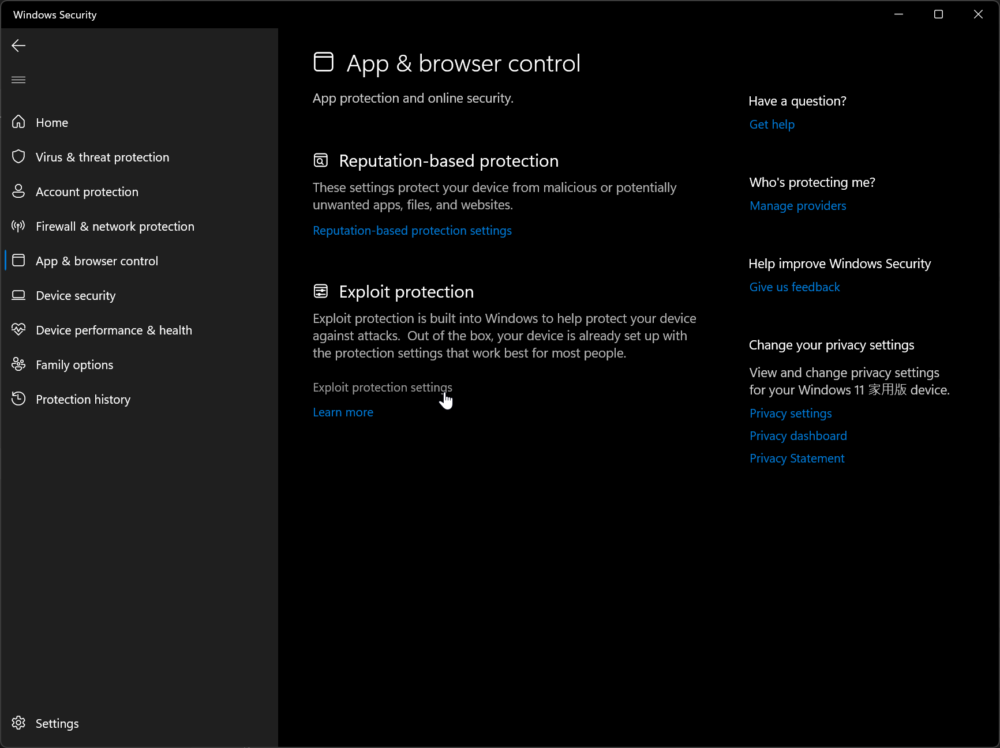
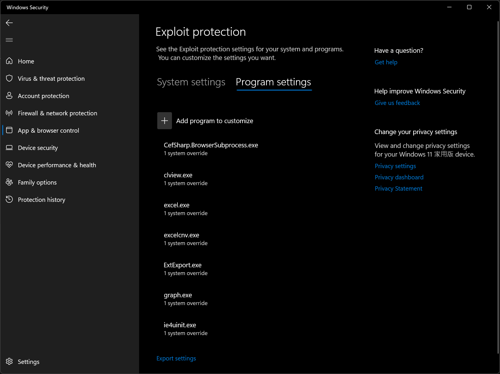

## 前言

有一次在透過 Docker Compose up 啟動容器的時候，直接回傳了 Error response from daemon: i/o timeout 錯誤。

我的 Compose File 裡面有兩個容器，其中一個有順利起來，另一個就是怎樣都起不來。

試了把容器都砍掉重建，還是出現一樣的錯誤。

甚至還出現過兩個容器都起不來的情況。

上網爬了一下，發現原來我又不是第一個遇到這個問題的人。

看了網路上的解法居然不只一種，我只好一個一個試看看了...

## 我的嚐百草之路

下面列出我試過的各種網路上有提到的可能解法和結果。

### 1. 下一次指令起不來，那就下第二次

有人說過「一個便當吃不飽，那就吃第二個」。

那指令下一次不成功，就多下幾次啊，反正下指令不用錢。(咦?)

但是，人在運氣差的時候，好像下幾次都是一樣的結果。

失敗...

### 2. 以系統管理員身份啟動 Docker Desktop

有人說用系統管理員身份啟動 Docker Desktop 就解決了，那我也來試看看。

嗯... 還是不行啊~~

### 3. 重開機

「重開治百病!!」

我重開機總行了吧!?

重開機之後，曾經有成功一次順利的啟動了兩個容器。

但是在我關掉容器要重新啟動它們的時候，然後這個錯誤就又跑出來了...

### 4. 調整 vmcompute 的安全設定

使用 Windows 11 的步驟如下(Windows 10 可能會有一些差異)：

1. 在 Windows 的設定(熱鍵為 <kbd>⊞ Win</kbd> + <kbd>I</kbd>)中點選 `Windows 安全性`(隱私權與安全性 -> Windows 安全性)。

2. 點選 `應用程式與瀏覽器控制`，應該就會再開啟 Windows Security 應用程式(很神奇的是在我中文版的 Windows 11 22H2 裡它居然沒被中文化)。

3. 點選 `Exploit protection settings`。
   

4. 切換到 `Program settings` 頁籤。(我在這一步還遇到神奇的 Bug，一連跳了好幾個錯誤訊息出來，重開 Windows Security 就又好了。)
   

5. 在清單裡尋找 `C:\WINDOWS\System32\vmcompute.exe`，如果存在的話請點選下方的 `Edit` 並接第六步，不存在的話可以直接跳到第七步。

6. 往下捲找到 `Code flow guard (CFG)`，然後將 `Override system settings` 取消勾選，然後按下 Apply 按鈕。
   ")

7. 刪除 `%UserProfile%\AppData\Roaming\Docker` 裡面所有的檔案。

8. 重新開機。

我依照上面的步驟，試了一次就解決問題了。

## 後記

:::tip 小訣竅
1. 也可以直接把 C:\WINDOWS\System32\vmcompute.exe 的安全性設定整個刪掉，我在自己的電腦試起來是可行的。
2. 懶人包就是刪除 vmcompute 的安全性設定、刪 Docker 資料夾下所有檔案，然後重開機。
:::

## 碎碎唸

每次遇到問題的時候，往往我都得要試到最後一個方法才會成功。

下次反過來試好了，可惡!!

希望大家不要跟我一樣倒楣啊~~~

## 參考資料

- [Cannot start docker - Error response from daemon: i/o timeout](https://github.com/docker/for-win/issues/4413 "Cannot start docker - Error response from daemon: i/o timeout")

- [How we tackle Docker Error response from daemon I/O timeout](https://bobcares.com/blog/docker-error-response-from-daemon-i-o-timeout/ "How we tackle Docker Error response from daemon I/O timeout")

- [docker compose build fails with IO timeout](https://stackoverflow.com/questions/68483576/docker-compose-build-fails-with-io-timeout "docker compose build fails with IO timeout")
