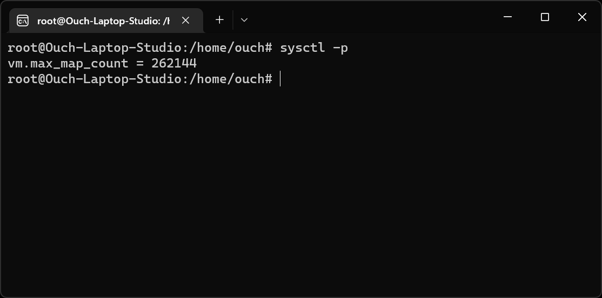

## 前言

最近在透過容器架設 ElasticSearch Cluster 的時候，遇到容器怎樣都起不來的狀況。 

一進去看容器的 Log，發現裡面出現了 max virtual memory areas vm.max_map_count [65530] is too low, increase to at least [262144] 這個錯誤。

![容器裡出現了 max virtual memory areas vm.max_map_count [65530] is too low 錯誤](./vm-max-map-count-is-too-low.png "max virtual memory areas vm.max_map_count [65530] is too low")

但是我的 Ubuntu 明明就有 8G 的記憶體啊...

## 解法

Google 了一下，原來 Elastic 的官網就有寫到：

> Elasticsearch uses a mmapfs directory by default to store its indices. The default operating system limits on mmap counts is likely to be too low, which may result in out of memory exceptions.

只需要在 Ubuntu 本機的 Console 輸入下列的指令：

```sh
sysctl -w vm.max_map_count=262144
```

這樣就可以解決這個問題了。

但是!!!凡事總是有個但是!!!

上面這個改法是一次性的，如果要永久性的改變這個值的話，可以透過修改 `/etc/sysctl.conf` 檔來達成。

只需要在裡面加上下面這行就行了：

```toml title="/etc/sysctl.conf"
vm.max_map_count=262144
```

要確認設定有沒有成功，可以透過 `sysctl -p` 這個指令來驗證。



沒意外的話，再重新啟動容器，應該就不會再出現這個錯誤囉!!

## 參考資料

* [Virtual memory](https://www.elastic.co/guide/en/elasticsearch/reference/current/vm-max-map-count.html "Virtual memory")