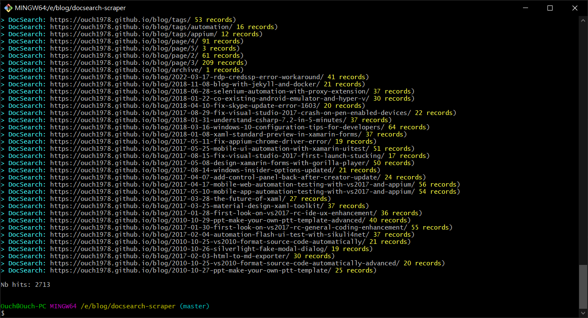

## 前言

Docusaurus 官方的搜尋功能合作伙伴是 [Algolia](https://www.algolia.com/ "Algolia") 這個搜尋引擎。

依照官方的說法，如果你的網站原始碼是開放的，那應該就能免費使用。

不過，依照我個人的經驗，好像整個申請的流程並不是那麼簡單直覺的，我從 2022/03/11 提出申請，到 2022/03/20 都還沒成功通過，所以搜尋功能一直是不能用的。

山不轉路轉，既然 Algolia 不會主動來爬，我就手動自己爬!!!

## 環境準備

要在 Windows 10 手動執行 DocSearch 的爬蟲，需要先完成下列幾項工作：

### 安裝 Git Bash

我依照官方文件直接透過 PowerShell 執行指令，結果一直出現 `CONFIG is not a valid JSON` 的錯誤。

後來問了谷歌大神，才發現[有人跟我遇到一樣的問題](<https://stackoverflow.com/questions/65807537/algolia-run-the-crawl-from-the-docker-image> "Algolia Run the crawl from the Docker image")。

原因是 PowerShell 不支援 cat 指令，改用 Git Bash 就可以正常執行。

通常安裝 Git 就會一併安裝 Git Bash ，所以安裝的步驟就不多作解釋了。

### 安裝 jq

安裝 jq 是為了能透過命令讀取 JSON 的內容，可以透過有系統管理員權限的 PowerShell 輸入下列指令呼叫 Chocolatey 進行安裝：

```powershell
choco install jq
```

### 準備 .env 檔

建立一個名稱為 .env 的檔案，內容如下：

``` title=".env"
APPLICATION_ID=你的網站在 Algolia 的 Application Id
API_KEY=你的網站的 Admin API Key
```

:::tip 注意
API_KEY 是 Admin API Key，不是 Search-Only API Key 喔!!
:::

### 準備 config.json 檔

```json title="config.json" {1-8}
{
    "index_name": "ouch1978.github.io",
    "start_urls": [
        "https://ouch1978.github.io/"
    ],
    "sitemap_urls": [
        "https://ouch1978.github.io/sitemap.xml"
    ],
    "sitemap_alternate_links": true,
    "stop_urls": [
        "/tests"
    ],
    "selectors": {
        "lvl0": {
            "selector": "(//ul[contains(@class,'menu__list')]//a[contains(@class, 'menu__link menu__link--sublist menu__link--active')]/text() | //nav[contains(@class, 'navbar')]//a[contains(@class, 'navbar__link--active')]/text())[last()]",
            "type": "xpath",
            "global": true,
            "default_value": "Documentation"
        },
        "lvl1": "header h1",
        "lvl2": "article h2",
        "lvl3": "article h3",
        "lvl4": "article h4",
        "lvl5": "article h5, article td:first-child",
        "lvl6": "article h6",
        "text": "article p, article li, article td:last-child"
    },
    "strip_chars": " .,;:#",
    "custom_settings": {
        "separatorsToIndex": "_",
        "attributesForFaceting": [
            "language",
            "version",
            "type",
            "docusaurus_tag"
        ],
        "attributesToRetrieve": [
            "hierarchy",
            "content",
            "anchor",
            "url",
            "url_without_anchor",
            "type"
        ]
    },
    "conversation_id": [
        "833762294"
    ],
    "nb_hits": 46250
}
```

請記得把 `index_name`、`start_urls` 以及 `sitemap_urls` 這三個屬性的值改為符合你網站的設定。

如果有必要的話，也可以自行調整 `selectors` 的內容。

## 透過 Docker 執行爬蟲

請在 Git Bash 中輸入下列指令來執行爬蟲：

```sh
docker run --env-file=.env -e "CONFIG=$(cat ./config.json | jq -r tostring)" algolia/docsearch-scraper
```

如果沒意外的話，應該會看到爬蟲爬完建立了多少筆記錄，如下圖：



## 小抱怨

話說，我原本以為只要架好網站，搜尋功能就能正常運作。

不過，事情往往不像憨人想得那麼簡單；依照 [Docusaurus 官方文件所述](https://docusaurus.io/docs/search#using-algolia-docsearch "Using Algolia DocSearch")，還得要主動向 Algolia 提出申請才行。

所以我就在 2022/03/11 提出了申請。

然後就發現它們的 Support Center 自動幫我開了一張問題單，我之後每天就上 Support Center 看問題單的狀態。

後來在 2022/03/15，我收到一封 E-mail(應該是客服工程師寄的)，問我是不是網站的管理者，如果是的話，就回信作為確認，所以我立刻就回信了。

接著，在 2022/03/20，我又收到另一封系統自動寄送的 E-mail，說我一直沒回覆，如果再不回的話問題單就會自動就切成已解決。(咦!?...)

我只好很無言了回信、同時到 Support Center 裡面也再回覆一樣的內容。(這次總不會再說我沒回了吧?)

原本我以為整個流程應該只要兩三天，不過經過實測，不知道什麼時候才能搞定，總不能讓搜尋功能一直是壞的，乾脆就先手動解決了。

## 參考資料

* [Run your own](https://docsearch.algolia.com/docs/legacy/run-your-own/ "Run your own")
* [愧怍-第二个博客搭建之Docusaurus](https://kuizuo.cn/develop/%E7%AC%AC%E4%BA%8C%E4%B8%AA%E5%8D%9A%E5%AE%A2%E6%90%AD%E5%BB%BA%E4%B9%8BDocusaurus/#%E6%89%8B%E5%8A%A8%E7%88%AC%E5%8F%96 "愧怍-第二个博客搭建之Docusaurus")
