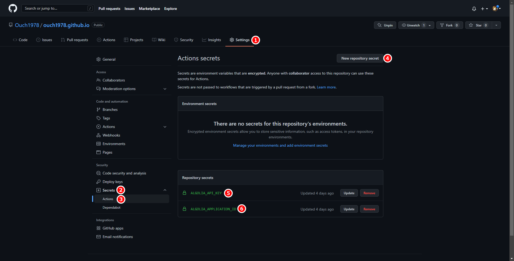

## 前言

經過好幾天的等待，Algolia 總算幫我開通了使用爬蟲的功能。

不過，事情進行的和我想像中的有著不小的落差：

1. Algolia 幫我建立了另外一個 Application，而不是幫我自己建好的 Application 原地升級。

2. 因為是新建的 Application，所以 Index 也是新的。

3. Algolia 幫我新建的 Application 和 Index 都不能重新命名。

4. Algolia Scraper 只能運作在他們幫我新建的 Index 上，就算在他們幫我建出來的 Applicaion 中建新的 Index 也不能套用 Scraper。

5. 如果要調整 Scraper 的設定的話，得要再上 Algolia Scraper 的 Web Console 修改。

6. Algolia Scraper 會定期執行(最短是每天執行一次)，

基於上述幾點原因，我只好想辦法繞路讓每次有新文章發佈的時候就能自動爬一次 Index。

最直覺的想法就是，如果能透過 GitHub Action，在網站發佈自動自動執行 DocSearch Scraper，不就能解決我的問題了嗎?

## 踩雷

在拜谷歌大神的過程中，我參考了幾篇文章的作法，不過都以失敗作收。

這邊列出我試過的方法，有興趣的同學也可以試看看。

- [构建更优的 GitHub Action 完成 Algolia 数据上传](https://chinese.freecodecamp.org/news/upload-algolia-index-with-github-action-build-by-myself/ "构建更优的GitHub Action完成Algolia数据上传")

  - 我遇到的問題是：透過 algolia cli 去執行 `algolia import -s $FILE_PATH -a $APPLICATION_ID -k $ADMIN_API_KEY -n $INDEX_NAME` 之後會噴錯，然後還是很開心的印出 `🚀 Successfully uploaded!`。

- [Algolia DocSearch Scraper in Docker for GitHub Actions](https://github.com/signcl/docsearch-scraper-action "Algolia DocSearch Scraper in Docker for GitHub Actions")
  - 我沒真的試過這個作法，主要原因是因為我不想把設定值那一大串 JSON 直接寫在 Action 裡，感覺還是獨立成一個 JSON 檔比較舒服。

## 最終採行方案

最後我還是用了最接近 Algolia 官方建議的作法，直接用 Docker 來執行爬蟲。

只需要在原來的 GitHub Workflow 中加入另一個動作就行了，作法詳列如下：

### 在 GitHub Repo 中加入 GitHub Action Secrets

在 GitHub Repo 中點選 `Settings` <sup>①</sup> -> `Secrets` <sup>②</sup>-> `Actions` <sup>③</sup>-> `New repository secret` <sup>④</sup>，依序建立名為 `ALGOLIA_API_KEY` 與 `ALGOLIA_APPLICATION_ID` 的 Key，並且將你的 Algolia Admin API Key 和 Algolia Application Id 輸入。



建立完之後應該會出現上圖的 ⑤ 和 ⑥。

### 在專案中加入 DocSearch Scraper 的設定檔

我的作法是在 .github 下建立一個名為 `scrapeConfig` 的資料夾，並且在裡面新增一個 JSON 檔，名稱和內容如下：

```json title=".github\scrapeConfig\docusaurus-v2.json" {2,3-4,6-7}
{
  "index_name": "ouch1978.github.io",
  "start_urls": ["https://ouch1978.github.io/"],
  "sitemap_urls": ["https://ouch1978.github.io/sitemap.xml"],
  "sitemap_alternate_links": true,
  "stop_urls": [],
  "selectors": {
    "lvl0": {
      "selector": "(//ul[contains(@class,'menu__list')]//a[contains(@class, 'menu__link menu__link--sublist menu__link--active')]/text() | //nav[contains(@class, 'navbar')]//a[contains(@class, 'navbar__link--active')]/text())[last()]",
      "type": "xpath",
      "global": true,
      "default_value": "Documentation"
    },
    "lvl1": "header h1",
    "lvl2": "article h2",
    "lvl3": "article h3",
    "lvl4": "article h4",
    "lvl5": "article h5, article td:first-child",
    "lvl6": "article h6",
    "text": "article p, article li, article td:last-child"
  },
  "strip_chars": " .,;:#",
  "custom_settings": {
    "separatorsToIndex": "_",
    "attributesForFaceting": ["language", "version", "type", "docusaurus_tag"],
    "attributesToRetrieve": ["hierarchy", "content", "anchor", "url", "url_without_anchor", "type"]
  }
}
```

### 在 GitHub Workflow 加入執行 DocSearch Scraper 的 Action

將 GitHub Workflow 調整如下：

```yml title=".github\workflows\deploy-docusaurus.yml" {44-52}
name: Deploy to GitHub Pages

on:
  push:
    branches:
      - main
    # Review gh actions docs if you want to further define triggers, paths, etc
    # <https://docs.github.com/en/actions/using-workflows/workflow-syntax-for-github-actions#on>

jobs:
  deploy:
    name: Deploy to GitHub Pages
    runs-on: ubuntu-latest
    steps:
      - uses: actions/checkout@v2
      - uses: actions/setup-node@v3
        with:
          node-version: 16.x
          cache: yarn

      - name: Install dependencies
        run: yarn install --frozen-lockfile
      - name: Build slides
        run: yarn reveal
      - name: Build website
        run: yarn build

      # Popular action to deploy to GitHub Pages:
      # Docs: https://github.com/peaceiris/actions-gh-pages#%EF%B8%8F-docusaurus
      - name: Deploy to GitHub Pages
        uses: peaceiris/actions-gh-pages@v3
        with:
          github_token: ${{ secrets.GITHUB_TOKEN }}
          # Build output to publish to the `gh-pages` branch:
          publish_dir: ./build
          # The following lines assign commit authorship to the official
          # GH-Actions bot for deploys to `gh-pages` branch:
          # https://github.com/actions/checkout/issues/13#issuecomment-724415212
          # The GH actions bot is used by default if you didn't specify the two fields.
          # You can swap them out with your own user credentials.
          user_name: github-actions[bot]
          user_email: 41898282+github-actions[bot]@users.noreply.github.com

      - name: Run DocSearch Scraper
        env:
          APPLICATION_ID: ${{ secrets.ALGOLIA_APPLICATION_ID }}
          API_KEY: ${{ secrets.ALGOLIA_API_KEY }}
        run: |
          docker run \
          -e APPLICATION_ID -e API_KEY \
          -e CONFIG="$(cat .github/scrapeConfig/docusaurus-v2.json)" \
          algolia/docsearch-scraper
```

## 還是要推一下 Algolia

雖然說我的網站套用 Algolia 之路走得不太順利，不過大部份的問題應該還是得算在我自己頭上。

誰叫我一開始不乖乖照著 Docusaurus 官方建議的方法提出申請呢?

還好 Algolia 還是很佛心的針對無付費的用戶提供索引和搜尋的服務，而且提供 API 讓我可以自己呼叫。

我個人的體驗，使用無付費的版本，在功能和整個的客製化支援程度上並不比升級 Premium 來得差，甚至有過之而無不及。

這麼佛心的服務，還是要推一下的啦!!~
