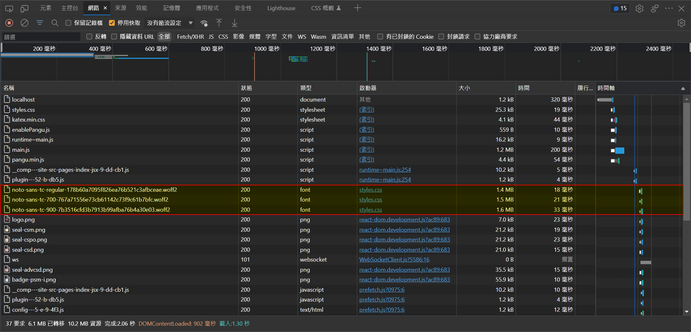
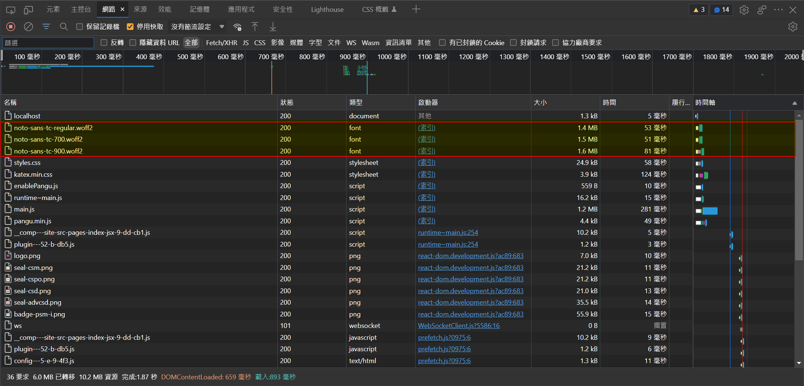
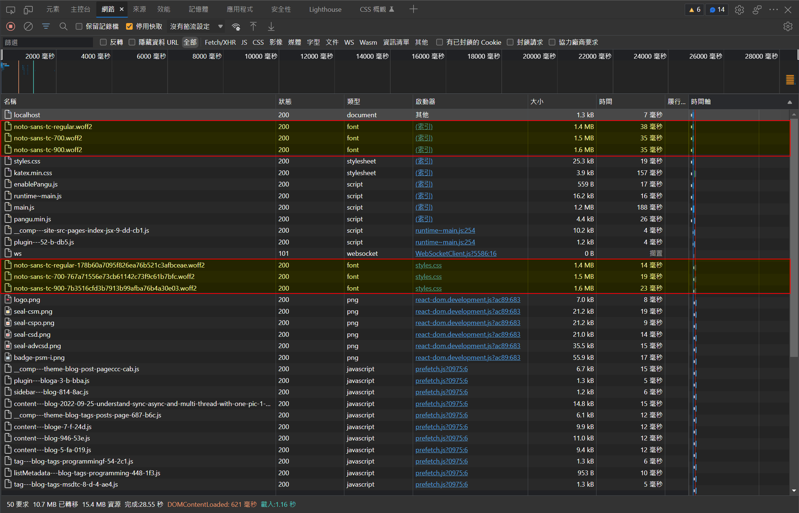
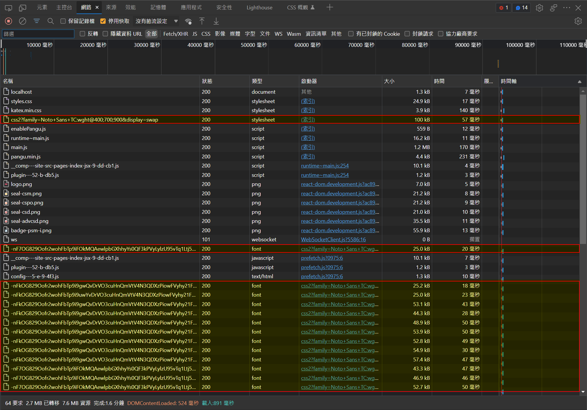

## 前言

不論是在寫部落格還是在架網站的時候，只要有使用到正體中文，以 Google 的思源黑體來取代預設的字型應該是大多數人的首選。

當然，我也不例外。

我當初也是花了好一番功夫研究到底怎麼在 Docusaurus 套用思源黑體，到處參考別人的作法。

但是，套用是套用了，仔細一看網路的傳輸狀況，哇咧!!!~~一個字體動不動就要吃掉 1.5 MB 左右的流量!?

三個不同粗細的字體就吃掉將近 4.5 MB 的流量了，內容都還沒看到就要先花時間下載一堆字體是哪招!?



## 我的 Web Fonts 引用進化之路

下面就來分享我的 Docusaurus 引用 Web Fonts 進化之路。

### 第一版：在 custom.css 中引用

當初我很開心的把我要用的三種粗細的思源黑體都下載下來當成本地資源，並且在 custom.css 中引用它們。

像下面這樣：

```css title="src\css\custom.css"
/* noto-sans-tc-regular - latin_chinese-traditional */
@font-face {
  font-family: "Noto Sans TC";
  font-style: normal;
  font-weight: 400;
  src: local(""),
    /* IE6-IE8 */
    url("/fonts/noto-sans-tc-regular.woff2") format("woff2"),
    /* Super Modern Browsers */
    url("/fonts/noto-sans-tc-regular.woff") format("woff");
  font-display: swap;
}

/* noto-sans-tc-700 - latin_chinese-traditional */

@font-face {
  font-family: "Noto Sans TC";
  font-style: normal;
  font-weight: 700;
  src: local(""),
    /* IE6-IE8 */
    url("/fonts/noto-sans-tc-700.woff2") format("woff2"),
    /* Super Modern Browsers */
    url("/fonts/noto-sans-tc-700.woff") format("woff");
  font-display: swap;
}

/* noto-sans-tc-900 - latin_chinese-traditional */

@font-face {
  font-family: "Noto Sans TC";
  font-style: normal;
  font-weight: 900;
  src: local(""),
    /* IE6-IE8 */
    url("/fonts/noto-sans-tc-900.woff2") format("woff2"),
    /* Super Modern Browsers */
    url("/fonts/noto-sans-tc-900.woff") format("woff");
  font-display: swap;
}
```

這樣使用起來不會因為字體還沒下載完畢就整頁白一片，在網路順暢的狀況下應該是蠻舒服的。

不過，它造成的流量基本上就像上面那張圖一樣... 夭壽。

### 第二版：改成 Preload 看看如何?

有人提到可以用 Preload 的方式，我也來試看看好了。

我的 Preload 是透過 docusaurus.config.js 裡的 stylesheets 實作的，方法如下：

```js title="docusaurus.config.js"
  stylesheets: [{
      href: "https://cdn.jsdelivr.net/npm/katex@0.13.11/dist/katex.min.css",
      type: "text/css",
      integrity: "sha384-Um5gpz1odJg5Z4HAmzPtgZKdTBHZdw8S29IecapCSB31ligYPhHQZMIlWLYQGVoc",
      crossorigin: "anonymous",
    },
    /*highlight-start*/
    {
      href: "/fonts/noto-sans-tc-regular.woff2",
      type: "font/woff2",
      as: "font",
      rel: "preload",
      crossorigin: "anonymous",
    }, {
      href: "/fonts/noto-sans-tc-700.woff2",
      type: "font/woff2",
      as: "font",
      rel: "preload",
      crossorigin: "anonymous",
    }, {
      href: "/fonts/noto-sans-tc-900.woff2",
      type: "font/woff2",
      as: "font",
      rel: "preload",
      crossorigin: "anonymous",
    }
    /*highlight-end*/
    ,]
```



看起來，只是讓網路流量提早發生而已。

而且沒搭配 custom.css 使用的話，字體完全不起作用。

更慘的是，還會出現下面這個錯誤：

>The resource http://localhost:8080/fonts/noto-sans-tc-700.woff2 was preloaded using link preload but not used within a few seconds from the window's load event. Please make sure it has an appropriate `as` value and it is preloaded intentionally.

一整個哀傷啊~~

### 第三版：使用 Preload 加上 custom.css

天真(~~明明就是蠢到不行~~)的我想說：上面兩個方法合在一起作成瀨尿牛丸總行了吧!?

事情往往不是憨人想得那麼簡單，沒有最慘，只有更慘!!



活生生被當成兩種不同的資源載入了兩次啊!!~~~

## 說好的正確姿勢呢?

其實，正確使用 Google Fonts 的方法很簡單，根本不用先把字型檔下載到本機、也不用預載。

用正確的姿勢載入，更可以藉由 Goolge 內建的字型檔分割功能大幅縮減每個連線的流量、加速網站內容呈現的速度。

不需要在 custom.css 裡面動手腳，只需要在 docusaurus.config.js 的 stylesheets 裡加上下列內容即可：

```js title="docusaurus.config.js"
  stylesheets: [{
      href: "https://cdn.jsdelivr.net/npm/katex@0.13.11/dist/katex.min.css",
      type: "text/css",
      integrity: "sha384-Um5gpz1odJg5Z4HAmzPtgZKdTBHZdw8S29IecapCSB31ligYPhHQZMIlWLYQGVoc",
      crossorigin: "anonymous",
    },
    /*highlight-start*/
    {
      rel: "preconnect",
      href: "https://fonts.googleapis.com",
    },
    {
      rel: "preconnect",
      href: "https://fonts.gstatic.com",
      crossorigin: "anonymous",
    },
    {
      rel: "stylesheet",
      href: "https://fonts.googleapis.com/css2?family=Noto+Sans+TC:wght@400;700;900&display=swap",
    },
    /*highlight-end*/
    ,]
```

調整完的結果如下，有圖有真相：



因為有加上 `display=swap` 的關係，網頁會先以系統預設的字體呈現，等 Web Font 下載完畢之後再進行替換，所以不會有白一片的情況發生。

另外，新版的 Google Fonts API 內建了字型檔分割的功能，會將字型檔切成多個小檔分別下載。

:::tip 小提示
其實不只是對 Docusaurus 有幫助，切成多個小檔下載對於還在使用 HPPT 1.1 的網站來說也是一大福音。
因為 HTTP 1.1 預設同時只能開六個 TCP 連線，然後就會被字型檔吃掉三個。
:::

## 參考資料

- [CSS font-face](https://pjchender.dev/css/css-font-face/ "[CSS] font-face")

- [Preload fonts with Docusaurus](https://blog.johnnyreilly.com/2021/12/29/preload-fonts-with-docusaurus "Preload fonts with Docusaurus")

- [Docusaurus build missing fonts](https://stackoverflow.com/questions/65333299/docusaurus-build-missing-fonts "Docusaurus build missing fonts")

- [How to customize the styling of the Docusaurus Classic Theme](https://theochu.com/docusaurus/styling/ "How to customize the styling of the Docusaurus Classic Theme")

以上。
