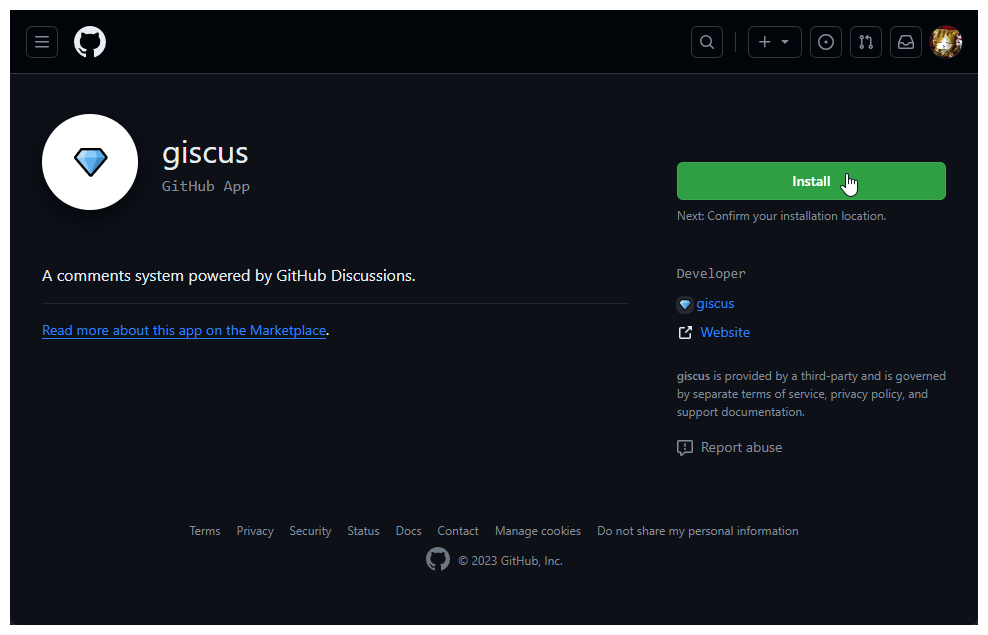
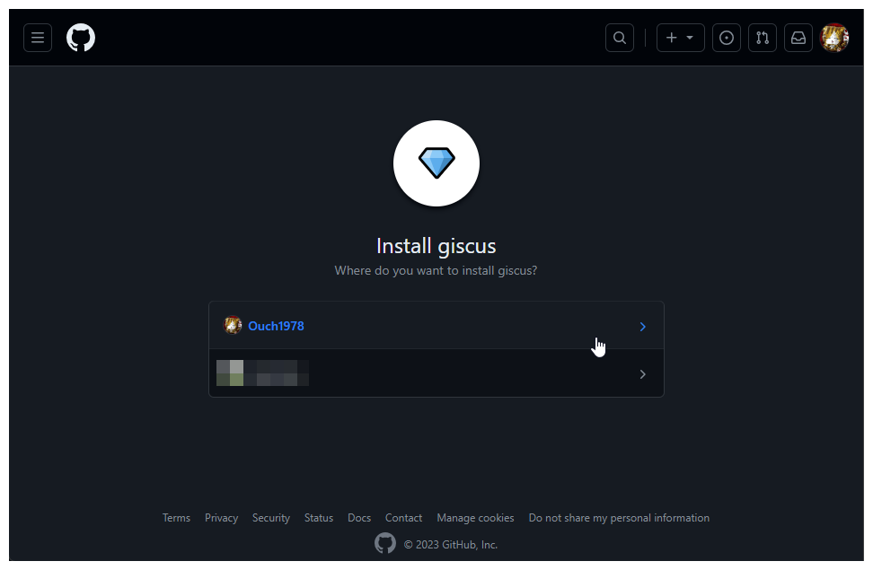
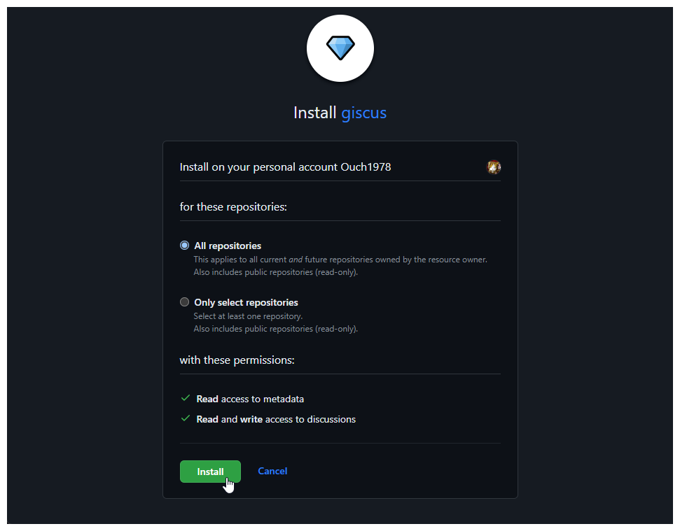
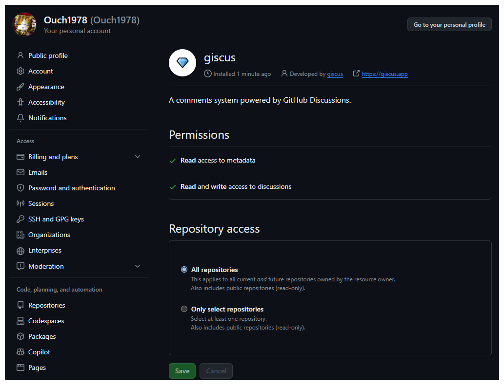
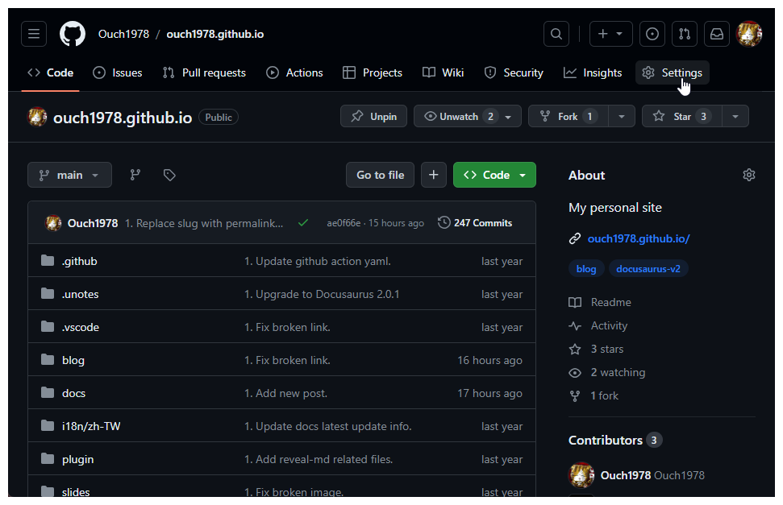
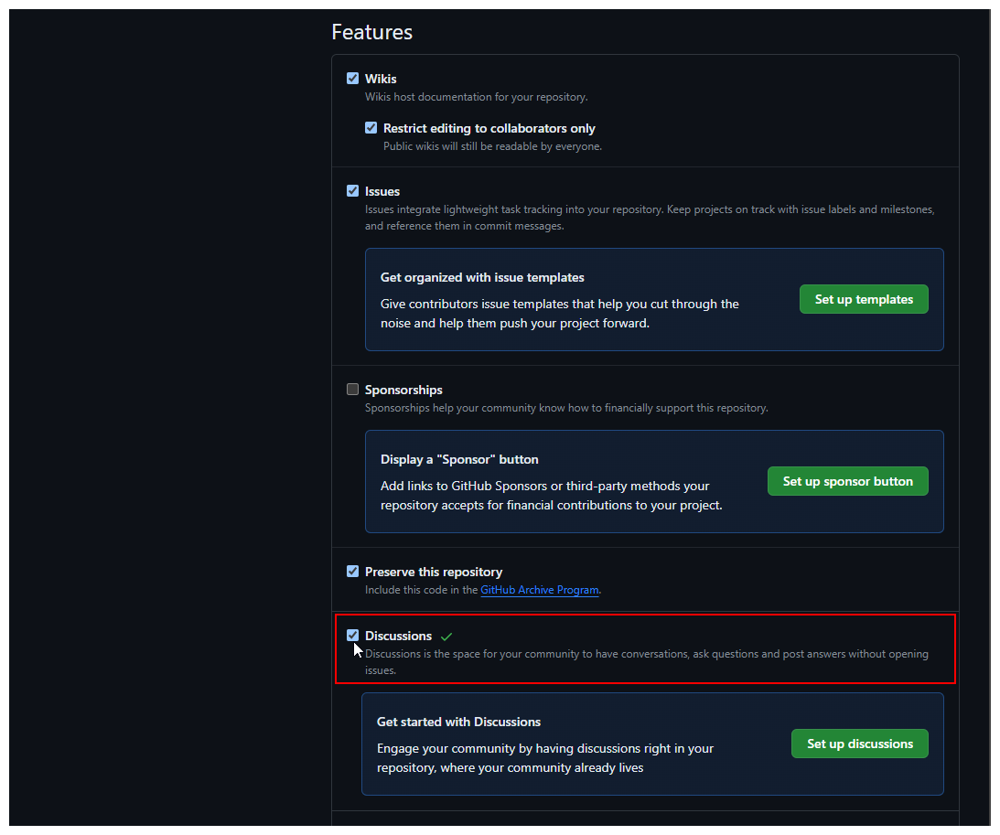
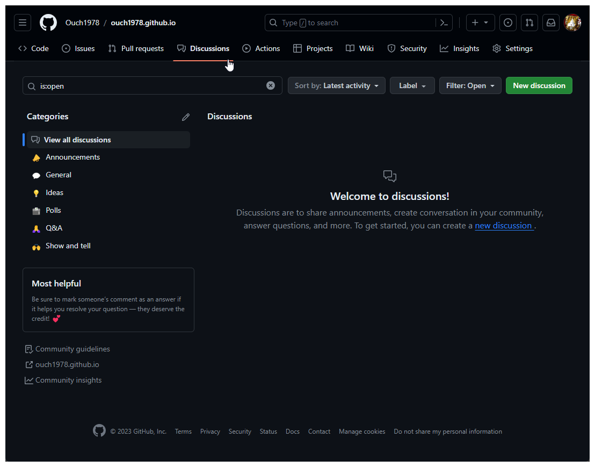
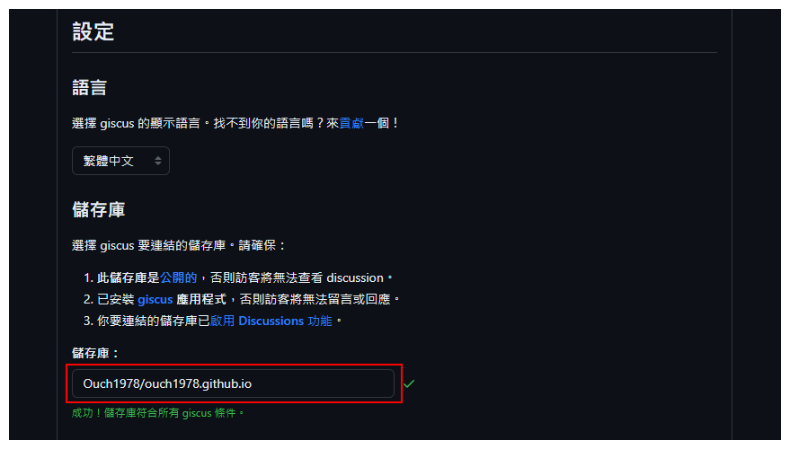
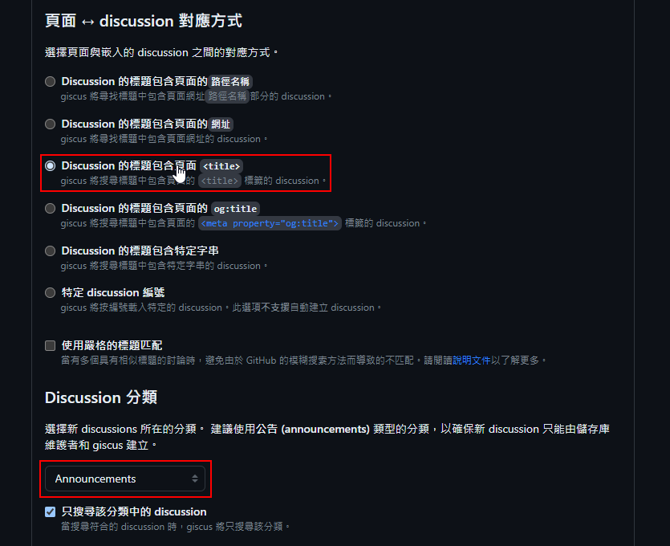
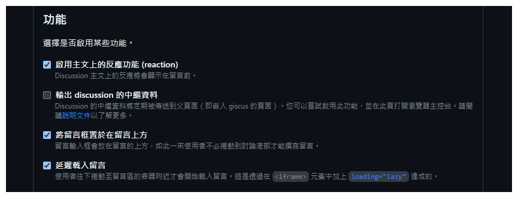

## 前言

使用了一段時間的 Disqus 之後，覺得它有以下幾個缺點，讓我決定把它換掉：

1. 載入所需的網路流量太大(光是要載入和 Disqus 相關的資源就花了快 1 MB 左右的的流量)。

2. 外部相依性高，可能因為 Disqus 官方政策的調整，導致留言被封鎖。

3. 留言管理相對麻煩，得要到 Disqus 的後台才能進行管理，而且管理介面蠻複雜的。

經過一番研究之後，發現應該可以改用 giscus 來取代 Disqus，相較之下， giscus 有以下的優點：

1. 界面相對簡潔，載入時耗費的網路流量也比 Disqus 小很多(應該不到 200 KB)。

2. 留言的過濾機制相對單純，且預設留言者需要透過 GitHub OAuth 授權。

3. 留言的內容儲存在 GitHub 的 Repository 中，也可以直接在 GitHub 的 Repository 進行管理。

接下來就直接進入主題，看要怎麼使用 giscus 吧!!

## 在 GitHub 啟用 giscus

### 安裝 giscus 應用程式

請先透過瀏覽器登入 GitHub，然後開啟 [giscus App 安裝連結](https://github.com/apps/giscus "giscus App 安裝連結")。



直接按下 `Install` 按鈕。

接著選擇要安裝的 Github 帳號，如下圖：



然後選擇要把 giscus 安裝到哪個 Repository，我這邊直接選擇 All Repository，讓所有的 Repository 都可以使用討論區的功能。

當然也可以只針對特定的 Repository 進行安裝，選擇好之後按下 `Install` 按鈕即可。



安裝完成之後，會自動跳轉到 GitHub 的 Applications 設定頁面，如下圖：



### 在 Repository 中啟用討論區功能

:::tip 小提示
要使用討論區功能的 Repository 必需是公開的，否則訪客無法看到討論區的內容。
:::

安裝完 giscus 之後，討論區的功能預設會是關閉的，所以我們得手動為 Repository 啟用討論區的功能。

在 Repository 頁面上按下右上方的 `Settings` 連結。



接著往下捲動頁面到 Features 區，把裡面的 Discussions 選項勾選起來。



看到右邊出現綠色的勾勾，就代表成功開啟了。

再把頁面往上捲，或是回到 Repository 首頁，就可以發現上面多了 Discussions 這個選項。



### 在 giscus 官網進行設定

再來我們要讓 giscus 可以存取 Repository 討論區裡的內容，並且自動依照頁面的路徑建立獨立的討論。

首先使用瀏覽器開啟 [giscus 設定頁面](https://giscus.app/zh-TW "giscus 設定頁面")。

在儲存庫欄位以 `{帳號/Repository 名稱}` 的格式輸入 Repository 的路徑，如下圖：



在 `頁面 ↔️ discussion 對應方式` 的部份我選擇使用 `Discussion 的標題包含頁面 <title>` 這個選項。

:::warning 注意
這邊選取的選項將會影響日後在 Discussions 裡面建立出來的討論標題，請儘量選擇日後不會被改變的屬性。<br/>
否則日後一改，討論的內容和文章的關聯就會斷掉喔!!<br/>
別外，如果你的 Docusarus 網站有支援多個版本，又想要把不同版本的留言個別獨立出來的話，使用檔案路徑或是網址就會比使用標題來得合適。
:::

然後 `Discussion 分類` 則使用官方建議的 `Announcements` 分類。



接下來`功能`區的部份，我勾選了 `啟用主文上的反應功能`、 `將留言框置於在留言上方`以及`延遲載入留言`這三個選項。

:::tip 小提示
要啟用哪些功能請依自己的需求斟酌和使用情境勾選。
:::



最後也是最重要的一個步驟，請把 `啟用 giscus` 區裡面的程式碼抄下來，後面我們會用到。

```js
<script src="https://giscus.app/client.js"
        data-repo="Ouch1978/ouch1978.github.io"
        data-repo-id="R_kgD1G-71Ag"
        data-category="Announcements"
        data-category-id="DIC_kwD2G-7JAs2Cbsvt"
        data-mapping="title"
        data-strict="0"
        data-reactions-enabled="1"
        data-emit-metadata="0"
        data-input-position="top"
        data-theme="preferred_color_scheme"
        data-lang="zh-TW"
        crossorigin="anonymous"
        async>
</script>
```

到這裡，我們就完成前置作業的部份了。

再來就要開始客製化我們的頁面囉。

## 引用 giscus-react 套件

在 Console 中輸入下列指令以安裝 giscus-react 套件：

```powershell
yarn add @giscus/react
```

## 建立 giscus 留言區元件

在 Docusaurus 中建立一個名為 `/src/components/GiscusComment` 的資料夾，並且在下面建立一個名為 `index.jsx` 的檔案，內容如下：

```jsx title="/src/components/GiscusComment/index.jsx"
import React from 'react';
import Giscus from "@giscus/react";
import { useColorMode } from '@docusaurus/theme-common';

export default function GiscusComment() {
  const { colorMode } = useColorMode();

  return (
  );
}
```

再來把 [在 giscus 官網進行設定](#在-giscus-官網進行設定) 這個步驟裡的 `啟用 giscus` 下面的程式碼作些調整，然後貼到 return 下，像下面這樣：

:::tip 小提示
所謂的調整基本上就是幾個動作：<br/>
1. 把 script 標籤改成 Giscus。<br/>
2. 移除 src 屬性。<br/>
3. 把屬性的名字去掉 `data-`，並且改成 camelCase。(例如 `data-category-id` 要改成 `categoryId`)<br/>
4. 把 theme 欄位的值改成吃變數。
:::

懶得動手自己調整的話也可以直接複製下面的範例，再填入各屬性的值即可。

```jsx title="/src/components/GiscusComment/index.jsx" {9-24}
import React from 'react';
import Giscus from "@giscus/react";
import { useColorMode } from '@docusaurus/theme-common';

export default function GiscusComment() {
  const { colorMode } = useColorMode();

  return (
    <Giscus
        repo="Ouch1978/ouch1978.github.io"
        repoId="R_kgD1G-71Ag"
        category="Announcements"
        categoryId="DIC_kwD2G-7JAs2Cbsvt"
        mapping="title"
        strict="0"
        reactionsEnabled="1"
        emitMetadata="0"
        inputPosition="top"
        theme={colorMode}
        lang="zh-TW"
        loading="lazy"
        crossorigin="anonymous"
        async
    />
  );
}
```

這樣我們就完成自己的留言區元件了。

## 客製 Docusaurus 的文件庫文章頁面

我們可以透過客製 DocItemFooter 來把留言區加到文件庫文章的下方。

先透過下面的指令把 DocItemFooter 的原始碼抽取出來：

```powershell
yarn run swizzle @docusaurus/theme-classic DocItem/Footer --wrap --typescript
```

抽取出原始碼之後，對 `src/theme/DocItem/Footer/index.tsx` 進行下列的調整：

```jsx title="src/theme/DocItem/Footer/index.tsx"
import React from "react";
import Footer from "@theme-original/DocItem/Footer";
import type FooterType from "@theme/DocItem/Footer";
import type { WrapperProps } from "@docusaurus/types";

{
  /* highlight-start */
}
import GiscusComment from '@site/src/components/GiscusComment';
import { useDoc } from "@docusaurus/theme-common/internal";
{
  /* highlight-end */
}

type Props = WrapperProps<typeof FooterType>;

export default function FooterWrapper(props: Props): JSX.Element {
  {
    /* highlight-start */
  }
  const { metadata, frontMatter, assets } = useDoc();
  const { no_comments } = frontMatter;
  const { title, slug } = metadata;
  {
    /* highlight-end */
  }
  return (
    <>
      <Footer {...props} />
      {/* highlight-start */}
      {!no_comments && (
        <GiscusComment />
      )}
      {/* highlight-end */}
    </>
  );
}
```

## 客製 Docusaurus 的部落格文章頁面

要在部落格文章下面加上留言區也可以比照辦理。

不過要客製化部落格文章的的作法和文件庫會有點差異，因為元件切法的關係，這邊我們得用 Eject 的方式來抽出原始碼。

指令如下：

```powershell
yarn run swizzle @docusaurus/theme-classic BlogPostPage --eject --typescript
```

然後編輯抽出來的 `src/theme/BlogPostPage/index.tsx` 這個檔案：

```jsx title="src/theme/BlogPostPage/index.tsx"
import React, { type ReactNode } from "react";
import clsx from "clsx";
import { HtmlClassNameProvider, ThemeClassNames } from "@docusaurus/theme-common";
import { BlogPostProvider, useBlogPost } from "@docusaurus/theme-common/internal";
import BlogLayout from "@theme/BlogLayout";
import BlogPostItem from "@theme/BlogPostItem";
import BlogPostPaginator from "@theme/BlogPostPaginator";
import BlogPostPageMetadata from "@theme/BlogPostPage/Metadata";
import TOC from "@theme/TOC";
import type { Props } from "@theme/BlogPostPage";
import type { BlogSidebar } from "@docusaurus/plugin-content-blog";

{/* highlight-next-line */}
import GiscusComment from '@site/src/components/GiscusComment';

function BlogPostPageContent({ sidebar, children }: { sidebar: BlogSidebar; children: ReactNode }): JSX.Element {
  const { metadata, toc } = useBlogPost();
  const { nextItem, prevItem, frontMatter } = metadata;
  const {
    hide_table_of_contents: hideTableOfContents,
    toc_min_heading_level: tocMinHeadingLevel,
    toc_max_heading_level: tocMaxHeadingLevel,
    {/* highlight-start */}
    no_comments
    {/* highlight-end */}
  } = frontMatter;
  return (
    <BlogLayout
      sidebar={sidebar}
      toc={
        !hideTableOfContents && toc.length > 0 ? (
          <TOC toc={toc} minHeadingLevel={tocMinHeadingLevel} maxHeadingLevel={tocMaxHeadingLevel} />
        ) : undefined
      }
    >
      <BlogPostItem>{children}</BlogPostItem>

      {/* highlight-start */}
      {!no_comments && (
        <GiscusComment />
      )}
      {/* highlight-end */}

      {(nextItem || prevItem) && <BlogPostPaginator nextItem={nextItem} prevItem={prevItem} />}
    </BlogLayout>
  );
}

export default function BlogPostPage(props: Props): JSX.Element {
  const BlogPostContent = props.content;
  return (
    <BlogPostProvider content={props.content} isBlogPostPage>
      <HtmlClassNameProvider className={clsx(ThemeClassNames.wrapper.blogPages, ThemeClassNames.page.blogPostPage)}>
        <BlogPostPageMetadata />
        <BlogPostPageContent sidebar={props.sidebar}>
          <BlogPostContent />
        </BlogPostPageContent>
      </HtmlClassNameProvider>
    </BlogPostProvider>
  );
}
```

:::tip 小提示
可以透過文章 front matter 中的 `no_comments` 這個屬性來決定是否要顯示 gisqus 留言區。
:::
