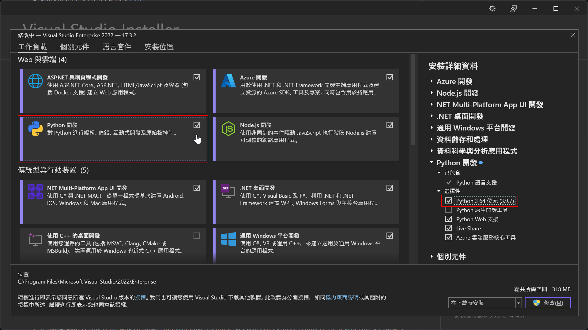
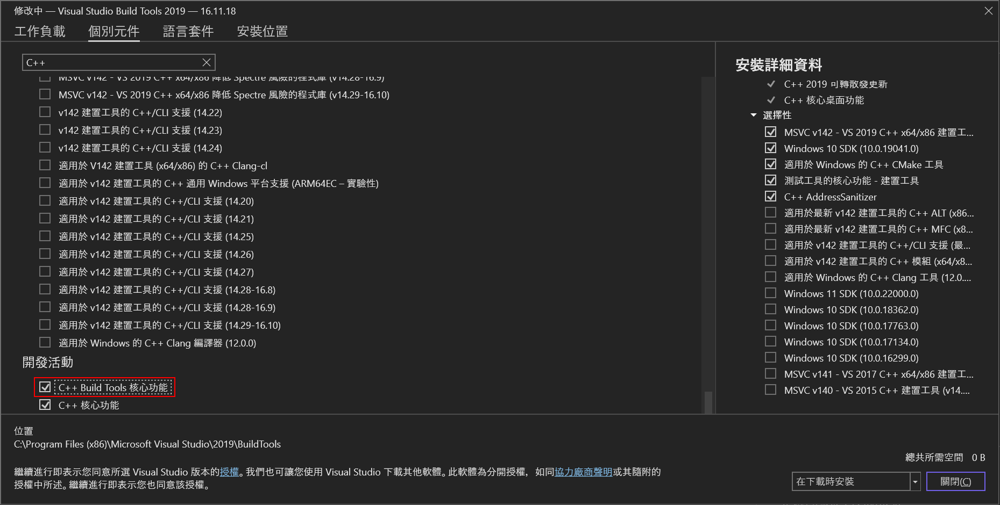
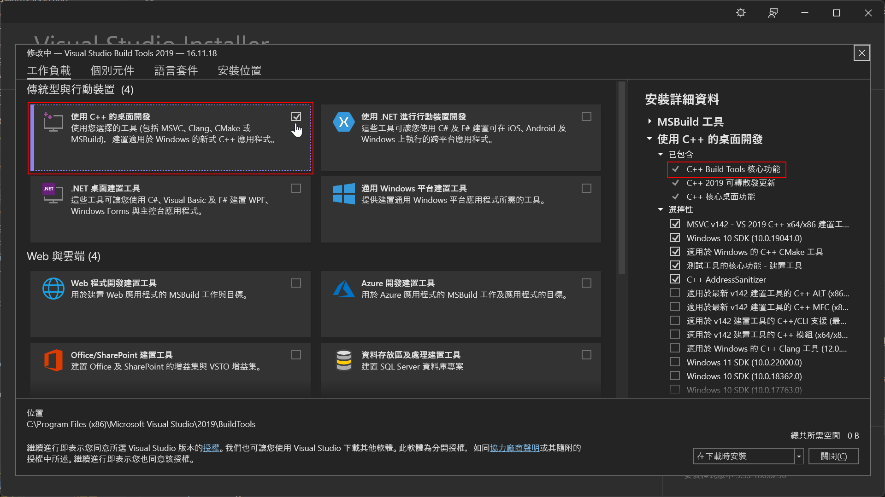

## 前言

之前為了讓 Docusaurus 具備本地搜尋功能的時候，使用了 @easyops-cn/docusaurus-search-local 這個套件，而它裡面又引用了 nodejieba(結巴分詞) 這個套件，然後 nodejieba 又得依賴於 node-gyp 之上運作。

有趣的是，要讓 node-gyp 乖乖運作好像不是那麼單純的一件事，而且可能會蠻吃人品的。

因為可能在不同的環境出現不同的狀況，這篇就來分享一下解法。

## 症狀

通常在使用 Docusaurus 會撞到這個問題都是在執行 yarn start 或是 yarn build 的時候會遇到，可能的錯誤訊息如下：

> gyp ERR! find Python Python is not set from command line or npm configuration.<br/>
> gyp ERR! find Python Python is not set from environment variable PYTHON.<br/>
> gyp ERR! find Python You need to install the latest version of Python.<br/>

如果是上面這串，基本上就是 npm 找不到 Python 相關的設定。

> gyp ERR! find VS msvs_version not set from command line or npm config<br/>
> gyp ERR! find VS VCINSTALLDIR not set, not running in VS Command Prompt <br/>
> gyp ERR! find VS You need to install the latest version of Visual Studio including the "Desktop development with C++" workload.<br/>

如果是上面這串，基本上就是 npm 找不到 VS Build Tools。

判斷是不是 node-gyp 造成的問題的關鍵字是 `gyp ERR!` 、 `Python` 和 `msvs_version`，基本上如果錯誤訊息出現這幾個字，應該就八九不離十了。

## 排除方法

既然問題是 node-gyp 造成的，那解決方法可以簡單分成兩種；一是不要用它，二是把環境裝到能讓它好好執行的形狀。

### 1. 使用不需要依賴 node-gyp 的套件

以我之前遇到的狀況為例，我們是因為使用了舊版的 easyops-cn/docusaurus-search-local 來作到本地搜尋的功能。

基於 nodejieba 的執行效率不是那麼理想，加上環境設定上相對的複雜，所以後來有人建議作者以 @node-rs/jieba 取代原來的 nodejieba。

後來作者也從善如流，所以 easyops-cn/docusaurus-search-local 之後就掙脫了對 nodejieba。的依賴。

只要把 easyops-cn/docusaurus-search-local 更新到 v0.23.0 之後的版本，就可以不需要安裝 Python 和 VS Build Tools 這些工具了。

### 2. 乖乖安裝 node-gyp 所需要的工具

其實錯誤訊息裡面也都多少會給一些解決方法的提示，不過基於每個人電腦裡環境不盡相同，所以不見得可以一體適用。

如同症狀中提到的，node-gyp 會依賴 Python 和 VS Build Tools 這兩個套件，缺一不可。

這邊就以 [node-gyp 官方文件](https://github.com/nodejs/node-gyp#on-windows "node-gyp on Windows") 作為基礎來提供解法。

#### 安裝 Python

##### 透過 Microsoft Store 安裝

可以選擇透過 [Microsoft Store](https://apps.microsoft.com/store/detail/python-310/9PJPW5LDXLZ5?hl=en-us&gl=US "Python 3.10") 這個連結來取得並且安裝 Python。

或是直接在 PowerShell 中輸入：

```powershell
Python
```

也可以達到一樣的效果。

##### 透過 Visual Studio Installer 安裝

如果機器上已經有安裝過 Visual Studio 2017 以上版本的話，也可以透過 Visual Studio Installer 選取 "Python 開發" 這個工作負載，以及選擇性項目中的 Python。



當然，也可以選擇直接到 [Python 官網](https://www.python.org/downloads/ "Download Python")下載安裝包進行安裝。

安裝完畢之後，請記得確認 Python 的路徑是否有被加到環境變數中，如果沒有的話記得手動幫它加一下。

#### 安裝 VS Build Tools

至於 VS Build Tools 的安裝，則可以看電腦裡是否已經有安裝 Visual Studio 或是 Visual Studio Build Tools。

如果已經有安裝過 Visual Studio 2017 或是 Visual Studio Build Tools 2017 以上的版本的話，可以透過 Visual Studio Installer 來安裝 "C++ Build Tools 核心功能" 這個個別元件，如下圖：



或是比較懶的話也可以直接安裝 "使用 C++ 的桌面開發" 這個工作負載，裡面就會包含 VS Build Tools。



如果沒有安裝過 Visual Studio 的話，則可以下載安裝 [Visual Studio Community](https://visualstudio.microsoft.com/thank-you-downloading-visual-studio/?sku=Community "Visual Studio Community")，並且選取安裝 "使用 C++ 的桌面開發" 這個工作負載。

安裝完畢之後，打開令命提示字元，輸入下列指令：

```shell
npm config set msvs_version 2017
```

:::tip 小提示
請配合你安裝的 Visual Studio 版號調整指令。
:::

以上。

## 參考資料

- [天空的垃圾場 v3：npm - 處理 node-gyp 和 canvas 的相依性](https://skychang.github.io/2020/03/10/npm-Fix%20node-gyp%20and%20canvas%20dependence/ "懷念 Sky Chang 長官")

- [Use wasm version of jieba to avoid build nodejieba](https://github.com/easyops-cn/docusaurus-search-local/issues/140 "Use wasm version of jieba to avoid build nodejieba")

- [node-gyp on Windows](https://github.com/nodejs/node-gyp#on-windows "node-gyp on Windowss")
