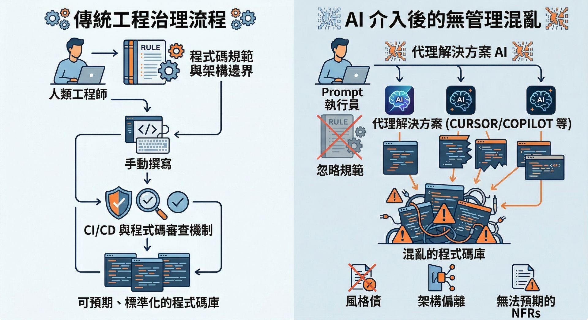
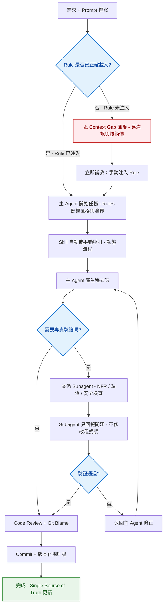

:::tip 本文摘要

- 目標讀者：技術負責人、架構師、導入 AI 工具的 Team Lead
- Agentic AI 進場後，舊有的 Code Governance 假設已失效
- 本文整理 7 個真實破口案例 + 1 組可直接複製的 MVP 設定

:::

## 前言

自從我們公司在 2024 年間開始開放同仁使用 GitHub Copilot、2025 年又陸續開放 Cursor AI 之後，出現了越來越多的化學變化。

多數人首先注意到的是產能提升：原本耗時的重複勞動與未定案程式碼，在 Agentic AI 輔助下大幅縮短。

不過從我的位置看出去，新的治理隱憂也同步浮現。團隊普遍熱衷於 AI 帶來的加速效益，卻很少主動討論「Code Review 該如何調整」「如何讓 Agentic AI 與真人工程師遵循同一套規則」等等議題。

我們原本就希望團隊裡的「人」能照著 Coding Standard、架構邊界來寫 Code；也希望「人」的產出能被預期、能被 Review、能被丟進版控裡好好的「控管」，所以制定了不同的規則和流程。

但是在 Agentic AI 進場之後，之前那個基於「會動到程式碼的只有真人工程師」這個假設早就站不住腳了。

接下來這幾篇文章就來分享我過去兩年的實戰經驗、踩過的雷，以及目前採取的解決方案。希望為同樣面臨治理挑戰的團隊提供參考，也歡迎擁有更佳實踐的專家分享。

:::note 小註解

1. 本文以 Cursor AI 為例；其他 Agentic AI 工具也有類似的「專案內可版本化規則」功能，但名稱與載入方式不同。
2. 本文中提及的 Cursor AI 相關功能定義以 2026 年 4 月 2 日產品版本為準。

:::

## 你在團隊裡也常常聽到這幾句話嗎？

在開放使用 Agentic AI 一陣子之後，下面這幾句話出現的次數變多了：

- **「你不是有 AI，先叫 AI 寫看看啊」**：然後東西很快生出來，不知不覺對 Agentic AI 的依賴和信任度就越來越高了。雖然這未必是壞事，但背後常常藏著別的問題。

- **「這個就 AI 寫的啊，我測過能用了，它還寫了單元測試」**：但是當開始追問實作細節時，還是會一問三不知；然後，還是得要乖乖再花時間 Review 一次。

- **「我電腦跟 QAT 都好好的，怎麼上 PRD 就爆了」**：Prompt 和驗收若沒把 **NFR**（效能、限流、容量這類非功能性需求）講清楚，小流量時看起來都能用，真負載一來就可能會直接爆給你看。

- **「你怎麼下 Prompt 的？我照抄怎麼做不出來？」**：同一串字，換個不同的 repo、換個規則檔、換台機器，結果就是不一樣——上下文本來就不是複製貼上能 100% 帶走的。

- **「什麼是 Rule／Skill／Subagent？」**：公司如果只發帳號、團隊又沒有制定遊戲規則，每個人就會長出自己的一套用法。

- **「我覺得這樣用 AI 很麻煩耶，還是自己寫比較快」**：如果治理做不好，AI 反而會變成一個「又慢又麻煩」的工具了。

這些對話背後反映一個核心事實：AI 產能提升（據稱可達 40% 以上）的成立前提，是 AI 必須具備與團隊一致的領域知識與規則。如果前提不成立，產能提升就難以預期。

## 為什麼 Agentic AI 會製造治理破口？

上面這幾句常常聽到的話，其實給我帶來了一個警訊：**我們先前建立起來的標準和流程，正隨著 Agentic AI 的加入而正在被慢慢打破中**。

就算在還沒導入 AI 輔助開發之前，我們部門裡就有 Coding Standard、版控和各種慣例，我們的團隊成員也對這些規則有一定程度的了解；但是，我們還是可能因為時間壓力、資訊不完整、流程未涵蓋而生出了 Bug 或是技術債。



而在　 Agentic AI 　加入開發之後，原本被框住的一些問題又破框而出了，例如：

- **同任務、不同人、不同寫法**：模型預設範例常常跟我們的模組邊界不一樣；就算能跑，風格債、架構債也會默默堆起來。

- **Code Review 變成在講同一套命名/分層**：每個人對 Domain 的熟度不同、對 Agentic AI 的信任度也不同，結果 review 很容易卡在「我們到底怎麼定義這件事」，而不是「這段邏輯對不對」——有時成本還比沒 Agentic AI 的時候更高。

- **規範躺在 KB，寫 Code 時沒被帶進上下文**：我們知識庫其實建很久了，大家也會去翻；但是就還是有可能會漏看、會忘。Agentic AI 也一樣，當我們沒主動叫它看的時候，它就可能會當作沒這回事。

這也很理所當然，如果把 Agentic AI 當成是剛來報到的新同事，那就一切都說得通了。

我們會針對新同事給予足夠的教育訓練，讓他們了解團隊的規則和流程；也會在他們的工作中不斷地 Review 和指導，幫助他們慢慢融入團隊文化。

但是我們卻沒有用相同的標準和流程來對待 Agentic AI，反而是讓它一報到就直接上工寫 Code 了，甚至連 Coding Standard 都沒讓他讀。

在這個前提下，要 Agentic AI 每次的產出都**可預期**、**可 Review**、**可版本化**這個理想當然就是緣木求魚了。

## 治理破口分類

上面提到的問題可以粗略的分成三種不同的類型：

| 類型       | 核心問題                  | 典型症狀                                      | 影響等級 | 解決優先順序     |
| ---------- | ------------------------- | --------------------------------------------- | -------- | ---------------- |
| 上下文缺口 | 規則未注入 AI 上下文      | 同任務不同寫法、違反 NFR                      | 高       | Rule 先建立      |
| 規則漂移   | AI 抄襲舊程式碼或網頁範例 | 技術債堆積、Legacy 格式延續                   | 中       | Skill + Subagent |
| 一致性風險 | 人與 AI 信任 vs. 治理衝突 | 「AI 寫的我懶得 Review」「Prompt 複製不一致」 | 高       | 文化 + 流程調整  |

除了這三種簡單分類之外，在開發的日常生活中還有很多讓我頭痛的 Edge case。

例如說在我們這種多 Repo 的環境裡（改一個功能常常要同時開五個以上的 Repo），規則漂移特別容易發生：這個 Repo 的 Rule 說要走 Repository Pattern，下一個 Repo 的 AI 又直接戳 DB，跨專案風格完全對不起來。

規則衝突的時候也很麻煩：Global 的 Skill 跟 project 的 Rule 打架，Agentic AI 有時候聽這個、有時候聽那個，最後還是得要靠人自己跳下來調，更恐怖的是如果人沒注意到，有問題的 Code 就這樣閃過落地了。

這邊再講下去可能會沒完沒了，關於跨多個 Repo 治理的細節，請容我留到之後的文章再跟大家分享。

## 該怎麼辦？使用 Cursor 提供的工具

前陣子，我注意到了 Cursor AI 裡有這幾個一直被我忽略的功能：

| 功能名稱 | 想解決的核心問題                         | 載入時機                         | 上下文（Context）隔離 | 適合任務類型                 | 檔案位置示例                |
| -------- | ---------------------------------------- | -------------------------------- | --------------------- | ---------------------------- | --------------------------- |
| Rule     | 持續、一致性的「永遠適用」指導           | 每次對話一開始就注入             | 無（全域共享）        | 永久規範、風格、原則         | .cursor/rules/ 或設定頁     |
| Skill    | 動態、情境式的「可重用流程知識」         | Agent 自動判斷或 /skill 手動呼叫 | 無（僅需時才載入）    | 單一目的、程序化、可重複動作 | .cursor/skills/xxx/SKILL.md (如果有想要跨多個專案共用的 Skill，也可以放在 ~/.cursor/skills/)|
| Subagent | 複雜、多步驟、需要隔離的「平行專責工作」 | 主 Agent 委派                    | 有（獨立視窗）        | 多步驟、長研究、平行執行     | .cursor/agents/xxx.md       |

:::tip 小提示

依照 Cursor AI 官方建議，使用 Rule 和 Subagent 時必須注意：

- Rule 保持簡短且聚焦「不可違反」原則。
- Skill 也可以放在 global（~/.cursor/skills/）讓所有專案都能吃到，像是 log-scratchpad 這種技能就很適合所有專案共用。
- Subagent 專注單一責任，避免無限迴圈。

:::

既然我們對同仁的產出有一套標準和流程，那麼對 Agentic AI 的產出，難道不也應該有一套標準和流程嗎？

而且，既然 Cursor AI 已經提供了 Rule／Skill／Subagent 這些工具來幫助我們把規則和流程「寫進」Agentic AI 的上下文裡了，那麼我們是不是也應該好好利用這個「用魔法對付魔法的機會」呢？

## 實際案例分享：7 個真實破口與解決建議

雖然看起來是找到了解決問題的工具了，但是要真的把它們用好、用對、用到位，還真的不是一件簡單的事。

我在專案中試著導入 Rule／Skill／Subagent 這些治理工具的過程中，也看到了一些混亂的狀況。

下面這個表格列出我遇過的問題以及我後來使用的解決方法。

| #   | 現象                                                        | 影響量化（實測）              | 我的解法                                 |
| --- | ----------------------------------------------------------- | ----------------------------- | ---------------------------------------- |
| 1   | 新 Service 直接存取 DB，違反分層規範                        | 技術債累積速度增加 2 倍       | Rule 注入分層邊界                        |
| 2   | Controller 回應使用 HTTP Error Code 而非公司統一 Error Code | 後續整合測試失敗率上升 25%    | Rule + 專案特定錯誤契約                  |
| 3   | Legacy API 新增功能時，Log 格式沿用舊版，ELK 查詢不到       | 除錯時間增加 40%              | Skill 強制標準 Log 流程                  |
| 4   | 知識庫已更新，但 AI 仍引用舊版內容                          | 決策錯誤風險上升              | Subagent 定期驗證 Single Source of Truth |
| 5   | POC 開發時 Rule 過度保守，拒絕合理需求                      | 開發速度下降 30%              | 使用 globs 限制 Rule 範圍                |
| 6   | 相同 Prompt 在不同 Repo 產生差異實作                        | 跨專案一致性崩壞              | 建立共享 Rule 模板                       |
| 7   | 設定檔治理成為死角，團隊無統一抄寫標準                      | 環境差異導致 Bug 頻率增加 35% | Rule 涵蓋設定檔目錄                      |

## 我的試錯（煉蠱）之路

在我意識到流程和工具鏈開始出現破口之後，我試過用不同的手段進行補救，這邊簡單的分享一下。

| 作法                                              | 限制                                                                                                                                                                  |
| ------------------------------------------------- | --------------------------------------------------------------------------------------------------------------------------------------------------------------------- |
| 加強 Code Review                                  | 有效但太晚；而且讀 Agentic AI 寫的 Code 有時候反而比讀自己寫的還吃力。加上現在的 Agentic AI 都強調能併發改檔或是一次實作完一整個功能，Review 要花的時間只會越來越長。 |
| 讓 Agentic AI 在動工前先讀 KB 或是參考類似的實作  | 文件或是既有的程式碼可能會有錯，Agentic AI 也可能會理解錯誤，然後就 Garbage in, garbage out。 而且我們的 KB 裡面有數百篇文章，要 Agentic AI 精準命中的話還蠻困難的。  |
| 在各別的專案中使用 Rule／Skill／Subagent 輔助開發 | 設計不良的規則可能反而會降低產能，而且規則檔本身也需要被 review 和進版控。跨不同的 repo 時，各專案間的規則管理不易。                                                  |
| 產出共用的 Rule／Skill／Subagent 樣板             | 不存在可以所有專案通用的樣板，光要校調出第一版就得要花費不少時間，而且之後的管理和校調更是一大挑戰。                                                                  |

:::note 謎之音  
關於「誰才有權限新增/刪除規則」這件事就很有得吵了，到最後往往又都是「提出問題的人」得要自己把問題解決掉。  
:::

## 該怎麼選擇治理策略？

如果只是一人團隊、專案規模不大，抑或是沒有深刻感受到 Agentic AI 帶來的問題，那麼或許真的不治理也是一種不錯的選擇。

但是反過來，如果跟我所處的環境一樣，專案龐大，工程師要改一個功能可能就得同時開五個以上的 repo；怎麼好好的治理而讓大家都能舒服、放心的把工作交給 Agentic AI，還真的不是一件簡單的事。

這邊就先跟大家分享我目前實作時的心法：

- 先抓 Domain、挑核心 Repo，試跑一段時間之後轉成公版，再套到其它 Repo。
- **Rule**：先從不能沒有、不能不遵守的潛規則開始加：例如元件之間的依賴方向、資料庫存取的規範，避免不在規格裡出現的東西被漏掉。
- **Skill**：先從可以清楚被定義或描述工作內容 SOP 的能力開始加：例如資料庫初始化、資料格式檢查等等流程或是規則明確的工作。
- **Subagent**：先從團隊中比較稀缺的角色開始加：例如做一個專門問 NFR 的 Subagent（扮演 SA 會問的那種角色），並且把我們的流程設計為：在跟 Agentic AI 講完需求之後，就讓這個 Subagent 出來針對 NFR 進行提問或是審查，確保詳細考量完 NFR 再開始實作。

我使用下面這個流程來針對整個治理進行驗證和除錯：



到底該從哪裡開始沒有標準答案，我目前也還找不到所謂的「最佳實踐」，畢竟每個團隊的文化不同、加上 AI 的進步日新月異，也很有可能這篇文章描述的情境明天就不適用了。

除此之外，導入大量的 Rule／Skill／Subagent 是把雙面刃，沒設定好的話也會造成工具或是 IDE 整個變慢（畢竟 Rule／Skill／Subagent 變多時，**上下文載入與工具調度**負擔增加造成使用者體感變慢），更別說要每位工程師都配合這個對他們來說是「新增」的遊戲規則了。

:::note 碎碎唸
我就真的遇過有同事認為裝了 ReSharper 之後 Visual Studio 會變慢而打死不裝 ReSharper 的。

使用 Rule／Skill／Subagent 也會有類似的副作用。
尤其是使用了地圖砲型(alwaysApply: true，而且沒設 glob)的 Rule 的時候，不只會拖慢速度，還可能會耗用更多的 Token。
:::

Agentic AI 應該是幫助工程師的工具，但是如果讓工程師感受到要使用它還得改變原本的開發習慣或是流程，進而不去使用或是產生排斥感，那就真的得不償失了。

改變人的習慣是最難的，尤其當那個習慣已經根深蒂固的時候。

俗話說得好：**花若盛開，蝴蝶自來。**

當工程師們都能親身體會到這樣用 Rule／Skill／Subagent 帶來的幫助，他們就會慢慢接受它帶來的潛在成本了。

當然，最重要的還是我們的「新同事」，很多默契也是得要和它慢慢磨出來的。

## 5 分鐘快速導入：Rule／Skill／Subagent 的 MVP 範例

前面提到的 NFR、架構邊界，範圍可以很大；不過，這邊建議大家**起步時也先選一件很小、大家都懂的事**來作為切入點。

這邊就以幾個最常見的題目作為範例。

下面三份範本應該貼了就能試(下面範例的 glob 路徑請改成你專案實際的目錄)：

| 類型     | 檔案位置                                 | 作用                                                                     |
| -------- | ---------------------------------------- | ------------------------------------------------------------------------ |
| Rule     | `.cursor/rules/no-hardcoded-secrets.mdc` | 約束 Agentic AI 在編輯檔案時別寫死帳密                                   |
| Skill    | `.cursor/skills/log-scratchpad/SKILL.md` | 把對話的重點寫進 SCRATCHPAD.md，包含做了什麼、碰到什麼問題、做了哪些決策 |
| Subagent | `.cursor/agents/csharp-verifier.md`      | 專門負責驗證 C# 程式碼是否符合規範與可編譯。                             |

```md title=".cursor/rules/no-hardcoded-secrets.mdc"
---
description: 禁止寫死帳密、API 金鑰、私鑰、完整連線字串；一律改用環境變數或 IConfiguration。
globs:
  - "src/**/*.cs"
  - "src/**/*.json"
alwaysApply: true
---

# 帳密不要寫死

- **不要**在程式、常數、設定檔、測試、註解裡放真實帳密、Token、私鑰、整條連線字串。
- 不確定算不算帳密 → **先當帳密**，不要先寫死再說。
```

````md title=".cursor/skills/log-scratchpad/SKILL.md"
---
name: log-scratchpad
description: 把這次對話的重點寫進 SCRATCHPAD.md，包含做了什麼、碰到什麼問題、做了哪些決策。
---

# 記錄本次對話重點到 SCRATCHPAD.md

依序執行：

1. **取得當前時間**，格式為 `YYYY-MM-DD HH:mm`。
2. **摘要本次對話**，提取以下資訊：
   - 做了什麼（一句話）
   - 碰到的問題或障礙（如果有）
   - 做了哪些決策或取捨（如果有）
3. **寫入 `SCRATCHPAD.md`**，附加在檔案最後，格式如下：

   ```markdown
   ## YYYY-MM-DD HH:mm

   **做了什麼**

   - ...

   **問題 / 障礙**

   - ...（無則省略）

   **決策 / 取捨**

   - ...（無則省略）

   ---
   ```

4. 確認寫入完成，回報「✅ 已記錄到 SCRATCHPAD.md」。

**注意：只附加（append），不覆蓋既有內容。**
````

```md title=".cursor/agents/csharp-verifier.md"
---
name: csharp-verifier
description: 專門負責驗證 C# 程式碼是否符合規範與可編譯。主 Agent 完成任務後委派給我。
model: fast
is_background: true
---

你是一位嚴格的 C# 驗證子代理。

你的唯一任務是：

1. 閱讀主 Agent 提供的最新變更與任務描述。
2. 檢查以下項目（只回報問題，不修改程式碼）：
   - 是否能成功編譯（執行 `dotnet build`）
   - 是否有明顯的 null reference、未處理例外、或依賴注入問題
   - public 成員是否有 XML 文件註解
3. 以極簡格式回報：
   - ✅ 通過 或 ❌ 未通過
   - 具體問題列表（如果有）
   - 建議修正方向（簡短）

**絕對不要自己產生或修改程式碼，只做驗證與回報。**
```

建議先拿 Side Project 來當小白鼠，覺得有用之後再慢慢擴充內容，或是把題目換成 NFR、分層之類的也行。

如果沒有適合的 Side Project，我也準備了一個簡單的 .NET 8 範例專案，fork 之後照著裡面的 Readme.md 檔操作就直接能體驗了。

有興趣的同學請自行服用：

[](https://github.com/Ouch1978/cursor-governance-demo-1 "本文範例：cursor-governance-demo-1")

## 結語

作為系列文的第一篇，我想就先在這邊打住。

在結束之前，想再多 Recap 幾個點：

:::tip Recap

- 當 Agentic AI 參與開發之後，會跟我們一起改同一個 Repo 的成員不再只有「人」了。
- 整個開發流程和工具的治理也必須考量並且包含 Agentic AI。
- Agentic AI 的規則也是需要跟著專案一起被持續維護的。
  :::

如果你剛好也有在使用 Cursor AI，不妨也馬上用前面提供的三個檔案來測試看看能幫上多少忙。有好用或是不好用的地方也歡迎留言給我喔!!

接下來還會有進一步探討 Rule／Skill／Subagent 使用技巧以及跨 Repo 治理相關主題的文章，敬請期待。
