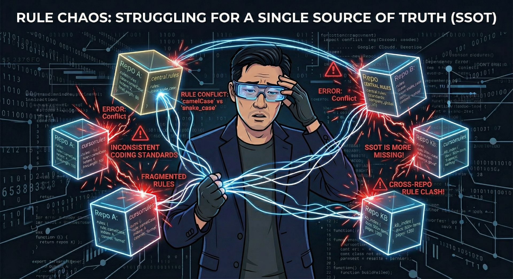
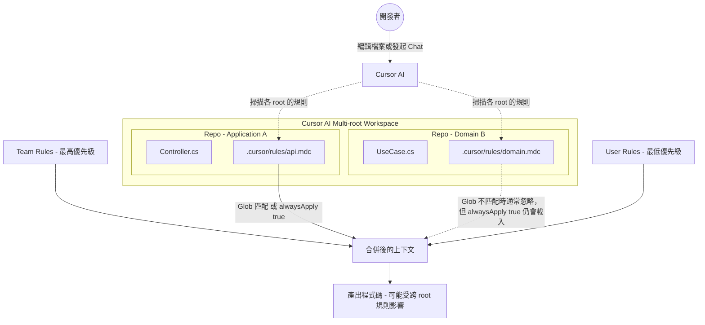
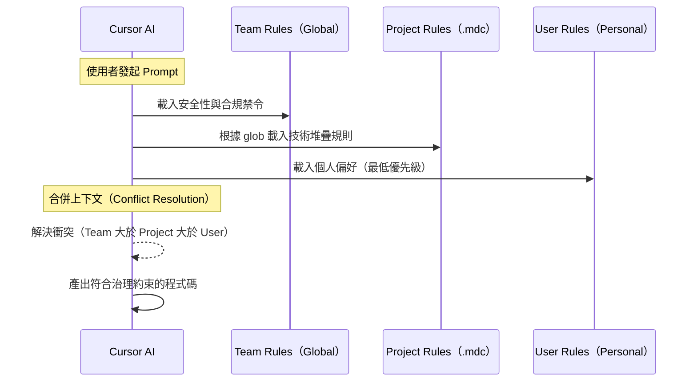

 
import Tabs from '@theme/Tabs';
import TabItem from '@theme/TabItem';
 
:::info 系列導覽
 
**Cursor AI 多 Repo 規則治理實戰系列**
 
1. **本篇：當我的多 Repo 規則開始打架 - Cursor AI 治理首部曲** — 痛點診斷與隔離原則
2. [Cursor AI 規則集中管理行得通嗎？ - 我的翻車之路](./cursor-ai-rules-management-part2) - 反模式與官方對照
3. [多 Repo 的 Cursor AI 規則治理 - 我怎麼活下來的](./cursor-ai-rules-implementation-part3) - 落地案例與執行藍圖
 
:::
 
:::tip 本文摘要
 
- 目標讀者：架構師、多 Repo 環境的技術主管、導入 Cursor AI 的團隊 Lead。
- 讀完你能：用自評表判斷團隊規則亂象的嚴重度，並理解 Team／Project／User 三層隔離是後續一切治理手段的前提。
- 延伸閱讀：對 Agentic AI 治理框架有興趣的讀者，可參考[Agentic AI 加入後，我看到的隱憂與治理破口](./cursor-ai-governance-for-team)（非必要）。
 
:::
 
## 前言：Repo 一多，打架就開始了
 
在[上一篇文章](./cursor-ai-governance-for-team)裡，我提到了多 Repo 環境中容易發生的規則漂移問題。
 
如果你的團隊跟我的一樣，同時得要維護多個不同的 Repo，那你可能也已經經歷過像這樣的尷尬局面了：
 
- **Repo A** 的 `.cursor/rules/architecture.mdc` 明確定義要用 Repository Pattern 存取資料
- Agentic AI 在處理 **Repo B** 的時候因為上下文不足，直接戳 Database、完全不走 Repository Pattern
- **Repo C** 裡甚至根本沒有設定 `.cursor/rules/`，所以每次都得要手動叮嚀 Agentic AI
 
然後當某個功能的改動同時要跨越 A、B、C 三個 Repo 時，Agentic AI 的實作風格也就五花八門，Code Review 成了一場「我們怎麼定義這件事」或是「都是 AI 惹的禍」的無盡辯論大會。
 

 
讓我先試著用這篇文章來協助你診斷問題到底有多嚴重，文章後面的判斷標準也可以作為參考。至於「規則到底該放哪裡」「該怎麼落地」，就容我留到後面兩篇再說囉。
 
## 我的多 Repo 架構與日常挑戰
 
在繼續下去之前，先花點時間讓大家對我的部門中所謂的「多 Repo」有個基礎的了解。
 
我們的系統是基於 Component-Based 和 Clean Architecture 的原則建立的，這意味著一個簡單的業務異動，往往會牽動一整片 Repo 叢林：
 
:::note 謎之音
到底是誰決定這樣切的!? 好像是我...
:::
 
:::tip 術語澄清
本文中的 **Repository Repo** 是指一個具體的程式碼倉庫名稱，用來存放資料存取層的程式碼。
這與設計模式中的 **Repository Pattern**（資料庫存取設計模式）是不同的概念。後者是一種程式設計方法，前者是我們的組織結構。
:::
 
| 物理 Repo | 對應的 Clean Architecture 階層 | 功能 |
|---|---|---|
| Application Repo | Frameworks & Drivers (Entry Points) | 定義如何啟動應用、設定 DI 容器、配置 Middleware 與 Routing |
| Domain Library Repos | Entities + Use Cases | 最純粹的邏輯層，所有商業邏輯都集中在這邊 |
| Repository Repo | Interface Adapters + Drivers | 將 Use Case 定義的介面轉化為具體的 SQL/NoSQL 操作 |
 
除了上述的 Repos 之外，我們還有一個很重要的 **KB Repo**，它是一個基於 Docusaurus 打造的部門知識庫，存放了包含但不限於下列各類型的文件：
 
- **架構決策記錄（ADR, Architecture Decision Record）**：為什麼要採用某個技術方案、背景與權衡
- **Domain Knowhow 文件**：特定領域的專業知識和約束
- **設計規格書**：各專案的需求分析、設計決策、限制條件
- **過去的經驗教訓**：曾經踩過的坑、解決方案
 
在我的部門裡，需求的落地流程通常是這樣的：
 
1. **分析與設計**：由 Project Lead 進行功能的分析與設計，並將決策記載於 KB Repo。
2. **任務領取**：工程師領取子功能任務，依照 KB 的設計開始實作。
3. **實作**：由於一個功能異動往往橫跨 Application、Domain 與 Repository，工程師們很自然的演化出兩種不同的開發風格：
 
   - **「逐一擊破模式 (The Purist)」**：一次只開一個 Repo 修改，模擬 Library 被使用的真實情境。AI 每次只載入當前 Repo 的 `.cursor/rules/`，環境純淨但缺乏跨層級上下文。
   - **「大混戰模式 (The Brawler)」**：為了方便，一次載入所有 Repo（使用 Local Reference）。這讓 AI 更有機會看見全貌，但也開啟了規則衝突的大門。
 
 
## 大混戰模式下的三大衝突機制
 
當你把多個 Repo 同時載入 Cursor AI 的 multi-root workspace 時，規則打架就有了舞台。
 
下面這張圖大概畫出了規則從哪裡來、又是怎麼會撞在一起的：
 

 
我自己觀察到在大混戰模式下比較容易踩到的衝突大概有這幾種：
 
| 衝突機制 | 觸發情境 | 具體現象 | 主要後果 |
|---|---|---|---|
| **alwaysApply: true 的重複載入** | 多個 Repo 的規則同時設 `alwaysApply: true` | Cursor AI 不會自動去除重複的規則，衝突規則同時進入 System Prompt（如「英文註解」vs「繁體中文註解」） | Token 增加、輸出不穩定、風格矛盾 |
| **過度寬鬆的 glob 導致規則越界** | 寬鬆 glob（如 `["**/*.cs"]`）搭配跨 Repo 操作 | 規則意外匹配其他 Repo 的同類型檔案 | 規則失去隔離性，不同層級程式碼被錯誤約束 |
| **不同操作模式的上下文融合差異** | Chat（<kbd>Ctrl</kbd>+<kbd>L</kbd>）或 Composer 進行跨 Repo 任務 | Inline Edit 隔離性高；Chat/Composer 積極融合多 Repo 規則 | AI 試圖同時滿足衝突規範，產生風格混亂 |
 
三種衝突的根源都一樣：**規則的作用範圍不夠精確**。
 
`alwaysApply: true` 是地圖砲、寬 glob 是散彈槍、Chat 模式則是把所有彈藥一次打出去。
 
相對應的解法如下：
 
- alwaysApply: true： 避免跨 Repo 設定衝突的 alwaysApply 規則；改用精準 globs
 
- 過度寬鬆的 glob： 使用精準相對路徑 glob（如 [`src/infrastructure/**/*.cs`]）
 
- 不同操作模式的上下文融合差異： Prompt 中明確指定範圍（如「僅限 Application 層」）
 
:::tip 重要區別
上面的**三大衝突機制**是 **Cursor AI 在技術層面** 的問題——「為什麼會打架」。
下面的**四大痛點**是 **規則治理在管理層面** 的問題——「打完架了該怎麼辦」。
 
換句話說：衝突機制是症狀，痛點是病因。
:::
 
## 跨多 Repo 規則治理的四大痛點
 
現在我們來看管理層面的問題。這四個痛點，是我觀察到在多 Repo 環境下，**治理本身**容易崩壞的核心原因：
 
| 核心痛點 | 症狀範例 | 核心代價 | 從我的角度看 |
|---|---|---|---|
| **規則內容或版本不同步** | 同一條規則在不同 Repo 內容不一，AI 為了符合規則會自己建 Adapter | 整合測試失敗次數顯著增加；需要更多人工驗證 | 讓 AI 寫 Adapter 來修補 API 差異，就像是在傷口上貼美工膠帶 |
| **規則優先級混亂** | Project Rules 的「測試檔案可寫死帳密」永遠被 Team Rules 的「禁止寫死帳密」擋下來 | 團隊因規則衝突而停滯，開發速度下降 | Team Rules 是聖旨，但 AI 有時候會覺得那只是「參考文獻」 |
| **人工同步成本** | 每次更新規則，都要在 N 個 Repo 間手動複製貼上，更常發生的是貼 A 漏 B | 維護成本隨 Repo 數量增長；容易發生遺漏 | 工程師的靈魂不該消耗在無止盡的 <kbd>Ctrl</kbd>+<kbd>C</kbd> 和 <kbd>Ctrl</kbd>+<kbd>V</kbd> 無窮迴圈中 |
| **可追蹤性破裂** | 缺乏 Git Blame，不知道規則為何被改、何時被改 | 規則審計困難；事後責任歸屬不清 | 查證規則來源像是一場考古活動，或者是對著螢幕通靈 |
 
📝 **重要提醒**：上述症狀來自我參與過的多個專案的實務觀察。具體的定量影響因團隊規模、Repo 數量、規則複雜度而異，建議根據你的環境進行實際量測。
 
這四大痛點都有一個共通點：**規則沒有被當成工程資產來管理**。
 
一旦沒有版控、沒有明確擁有者、沒有同步機制，規則治理就是空中樓閣。
 
 
## 你的團隊也有一樣的痛嗎？請服用快速自評表
 
如果你的團隊也有遇到類似的規則治理問題，又想要簡單的量化問題的程度；不妨在 Retro 會議的時候讓團隊成員也透過下面這份自評表來進行評分：
 
| 評估面向 | 🟢 輕度（0 分） | 🟡 中度（1 分） | 🔴 重度（2 分） |
|---|---|---|---|
| **Repo 數量** | 1–2 個 | 3–5 個 | 6 個以上 |
| **規則同步方式** | 有自動化或統一範本 | 有範本但靠人工複製 | 各 Repo 各自為政 |
| **multi-root 使用頻率** | 很少用 | 偶爾用 | 天天用（大混戰模式） |
| **alwaysApply: true 密度** | 幾乎沒用 | 部分規則使用 | 大多數規則都開 |
| **規則版控** | 全部進 Git | 部分進 Git | 沒有版控或散落各處 |
| **規則擁有者** | 有明確負責人 | 模糊、靠默契 | 沒有人負責 |
 
**計分方式**：把每一列的分數加總。
 
| 總分 | 嚴重度 | 下一步建議 |
|---|---|---|
| **0–3 分** | 輕度 — 還算健康 | 先建好隔離原則，預防未來惡化 |
| **4–7 分** | 中度 — 開始有痛感了 | 建議看完本系列三篇，挑最痛的 1–2 個點先改 |
| **8–12 分** | 重度 — 該認真治了 | 強烈建議照 [Part 3](./cursor-ai-rules-implementation-part3) 的 Phase 計畫逐步推進 |
 
可以讓每個人獨立打分數，之後再大家一起對答案，然後訂出要改善的方向和目標。

:::tip 現在就可以做的事
如果你的團隊自評分數在 4-7 分（中度問題），可以先：

1. **建立規則清單**：在 Confluence/Wiki 或 README 中列出「我們現在有哪些規則」，即使它們現在還很散亂
2. **選一個 Repo 試點**：不必一次改所有 Repo，先在最痛的一個 Repo 開始建立 `.cursor/rules/` 目錄
3. **邀請團隊認可**：在 Retro 或技術會議中分享自評結果，讓大家達成共識「我們有問題」是第一步

如果你的團隊已經 8+ 分（重度問題），建議耐心讀完三篇系列文，然後按 Part 3 的 Phase 計畫逐步推進——急不得。
:::
 
## Cursor AI 的 SSOT 隔離原則：Team／Project／User 各管什麼
 
> SSOT（Single Source of Truth，單一真實來源）是指在系統中應該只有一個權威的資料來源。在規則治理中，Team/Project/User 三層就是按這個原則隔離的。
 
知道問題有多嚴重之後，下一步是搞清楚 Cursor AI 本身提供的規則分層機制，畢竟要用對的方法，才能把事情做對。
 
Cursor AI 支援 4 種規則：Team Rules、Project Rules、User Rules、Agent。
 
不過這篇我們先專注在前三種比較直覺的規則， Agent 就留到之後的文章再來好好討論它。
 
這邊就把前三種規則整理成一個比較表，方便大家快速對照：
 
<Tabs
  defaultValue="summary"
  className="governance-tabs"
  values={[
    {label: '📊 快速比較', value: 'summary'},
    {label: '🏢 Team Rules', value: 'team'},
    {label: '🛠️ Project Rules', value: 'project'},
    {label: '👤 User Rules', value: 'user'},
  ]}>
 
<TabItem value="summary">
 
| 規則類型 | 定位 | 範例 | 儲存位置與版控 | 優先級 |
|:---|:---|:---|:---|:---:|
| **Team Rules** | **企業級護欄**：確保合規，防止事故 | `禁止寫死帳密` | Cursor AI Dashboard（✗ 無版控） | **1（最高）** |
| **Project Rules** | **專案級慣例**：確保實作風格一致 | `強制使用 Repository Pattern` | `.cursor/rules/`（**✓ Git**） | 2（中） |
| **User Rules** | **個人化偏好**：優化開發體驗 | `一律以繁體中文回覆` | Cursor AI Settings（✗ 無版控） | 3（最低） |
 
</TabItem>
 
  <TabItem value="team">
 
    <h3>🏢 Team Rules：企業級安全與合規</h3>
 
    這是治理體系中的「憲法」，由 IT 部門或架構師統一維護。
 
    - **強制性**：開發者無法在本地關閉或修改。
    - **維護頻率**：低（通常半年或發生重大架構變更時更新）。
    - **適用場景**：涉及資安、法律合規、或全公司層級的架構禁令。
 
    :::note
    如果你身處的環境和我一樣，Team Rules 的管理權在 IT / MIS 部門、不在業務部門手上，那麼「用 Team Rules 統一跨 Repo 規範」這條最直接的路應該就不會在你的選項內了。[Part 2](./cursor-ai-rules-management-part2) 的翻車之路就是從這個限制出發的。
    :::
    
    :::warning 如果你無法設置 Team Rules
    如果你的組織沒有設置 Team Rules，或你沒有權限修改，別氣餒。你還是可以用 **Project Rules**（存在各 Repo 的 `.cursor/rules/` 裡）來做大部分的事。只是需要在每個 Repo 重複定義那些「應該是全公司一致」的規則。Part 3 會介紹怎麼在這種限制下仍然推進治理。
    :::
 
    <h4>實作範例 (Cursor Dashboard)</h4>
 
      ```text
      - 嚴格禁止在程式碼中包含任何 API Keys、Secrets 或私鑰。
      - 所有的資料庫存取必須通過指定的資料層封裝，禁止直接連線。
      - 所有公開 API 的錯誤回應必須符合統一的 Contract 規範。
      - 日誌輸出必須包含 Trace-ID 以利跨服務追蹤。
      ```
 
  </TabItem>
  <TabItem value="project">
    <h3>🛠️ Project Rules：專案級實作指南</h3>
  
    存放於每個 Repo 的 `.cursor/rules/` 目錄中。這是最具價值的實踐型 SSOT。
 
    - **版控優勢**：規則與程式碼同步演進，支援 Git Blame 追蹤改動歷史。
    - **精準控制**：可透過 `.mdc` 的 `globs` 欄位控制作用範圍。
    - **ADR 連結**：規則應連結回 KB Repo 中的架構決策記錄。
 
    <h4>實作範例 (`.cursor/rules/repository-pattern.mdc`)</h4>
 
    ```yaml
    ---
    description: 所有資料庫查詢必須使用 Repository Pattern
    globs: ["src/**/*.cs"]
    alwaysApply: true
    source_kb: "[https://kb.internal/docs/adr/001-repo-pattern](https://kb.internal/docs/adr/001-repo-pattern)"
    ---
    # Repository Pattern 規範
    所有查詢必須透過 `_userRepository` 進行，禁止直接使用 `_dbContext`。
    - ✓ 正確：await _userRepository.GetByIdAsync(id)
    - ✗ 錯誤：await _dbContext.Users.FindAsync(id)
    ```
  </TabItem>
  <TabItem value="user">
    <h3>👤 User Rules：個人化開發風格</h3>
 
    這是開發者的「私人角落」，存放在個人的 Cursor 設定中。
 
    - **個性化**：不應包含任何業務邏輯或共用架構規範。
    - **最低權限**：一旦與 Team/Project Rules 衝突，User Rules 會自動失效。
 
    <h4>實作範例 (個人設定)</h4>
 
    ```text
    - 永遠使用繁體中文（台灣習慣）回覆我。
    - 在給出程式碼前，請先列出你預計採取的 3 個邏輯步驟。
    - 所有的單元測試請優先使用 xUnit 框架。
    - 參考外部內容時，請務必附上來源連結。
    ```
  </TabItem>
 
</Tabs>
 
:::tip 小提示
三個不同層級的規則就像是國家的法律（Team Rules）、公司的規章（Project Rules）與個人的生活習慣（User Rules）之間的關係。你可以習慣不吃早餐，但你不能在辦公室抽菸，更不能違反憲法。
:::
 
下面這個簡化版的表格，我個人覺得還蠻適合用來跟團隊成員分享的，不妨在新增規則之前先瞄一眼。
 
| 層級 | 定位 | 誰維護 | 能被覆蓋嗎？ |
|---|---|---|---|
| Team Rules | 不能違反的底線 | IT / 架構師 | 不能 |
| Project Rules | 這個 Repo 的遊戲規則 | 團隊 / Tech Lead | 不能覆蓋 Team，但可補充 |
| User Rules | 我個人的偏好 | 自己 | 被 Team 和 Project 覆蓋 |
 
## 規則載入順序：Cursor AI 怎麼決定聽誰的？
 
搞清楚三層各管什麼之後，你可能會好奇：當 Cursor AI 收到一個 Prompt 的時候，它到底怎麼把這些規則組合在一起？
 

 
簡單來說：**所有適用的規則都會被合併成一個統一的 Prompt**。
 
依據 [Cursor 官方文件](https://cursor.com/zh-Hant/docs/rules) 裡的描述：**當規則發生衝突時，優先級較高的規則會被採用**。
 
:::tip 小提示
隔離原則的核心就一句話：**規則應該按照「作用域」和「優先級」明確分工，確保不同層級的規則各司其職、互不干擾。**
:::
 
## 小結：打架打完了，接下來呢？
 
讀到這邊，你應該對幾件事情有感覺了：
 
:::tip Recap
 
1. 多 Repo + Agentic AI 的組合，會把規則不一致的問題**放大好幾倍**。
2. Cursor AI 的三層規則（Team / Project / User）設計上就有隔離機制，但如果不刻意治理，它們就會在 multi-root workspace 裡打得不可開交。
3. 四大痛點（不同步、優先級混亂、人工同步、可追蹤性破裂）的根源是：**規則沒有被當成工程資產來管理**。
 
:::
 
如果你已經服用了前面的自評表，也知道自己團隊的嚴重度了。接下來的問題就是：**規則到底該放在哪裡？**
 
我在這條路上翻過不少車——試過把規則全部收斂到 KB、也試過開一個獨立的規則 Repo 來當「規則控制中心」，結果都是悲劇收場。
 
下一篇我會從我踩過的坑談起：為什麼把 KB 或獨立規則 Repo 當成「集中式規則控制中心」往往行不通，再對照 Cursor AI 官方指南看看官方是怎麼想的。
 
如果你還沒填完自評表，不妨花個幾分鐘做個小健檢，再決定下一步。
 
如果你也剛開始走在規則治理這條路上，下一篇 [Part 2](./cursor-ai-rules-management-part2) 應該會讓你更清楚哪些坑可以直接跳過。
 
---
 
## 參考資源
 
- [Cursor 官方文件：Rules](https://cursor.com/zh-Hant/docs/rules)
- 前篇：[Agentic AI 加入後，我看到的隱憂與治理破口](./cursor-ai-governance-for-team)