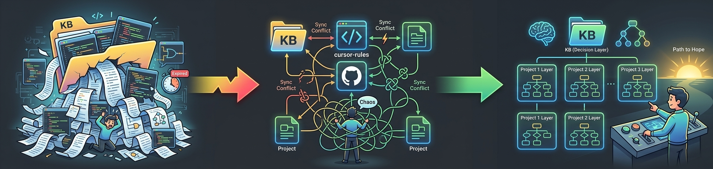
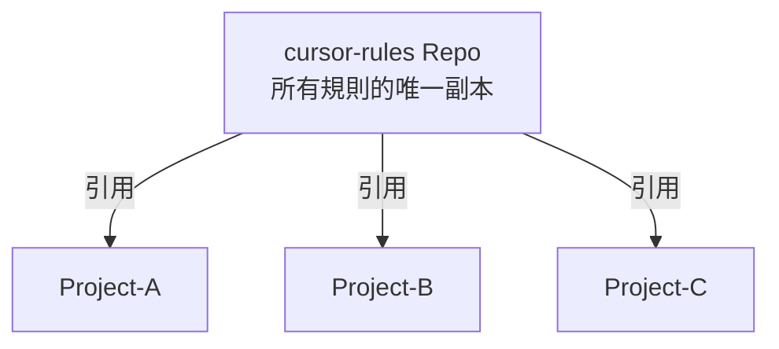
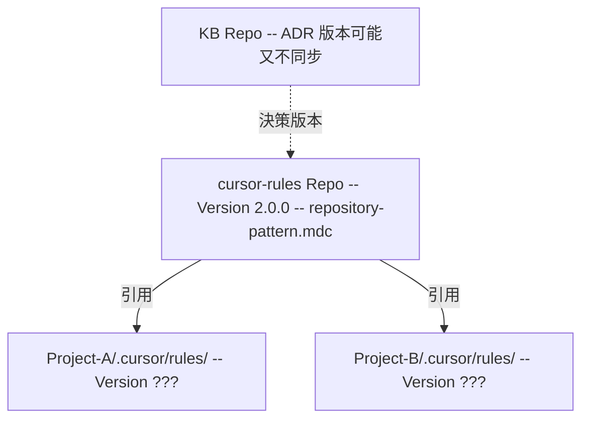
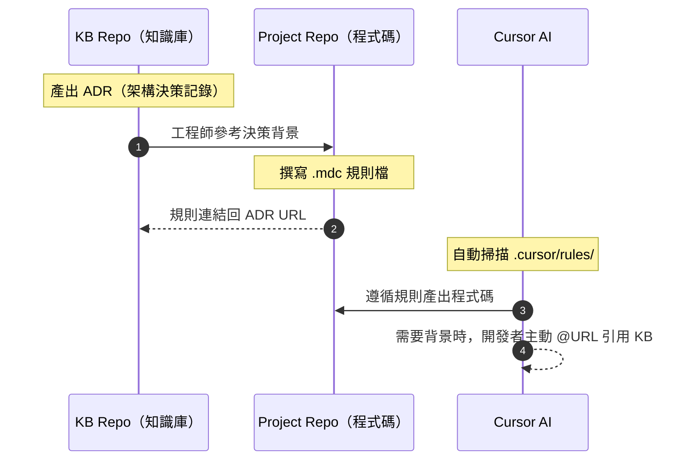
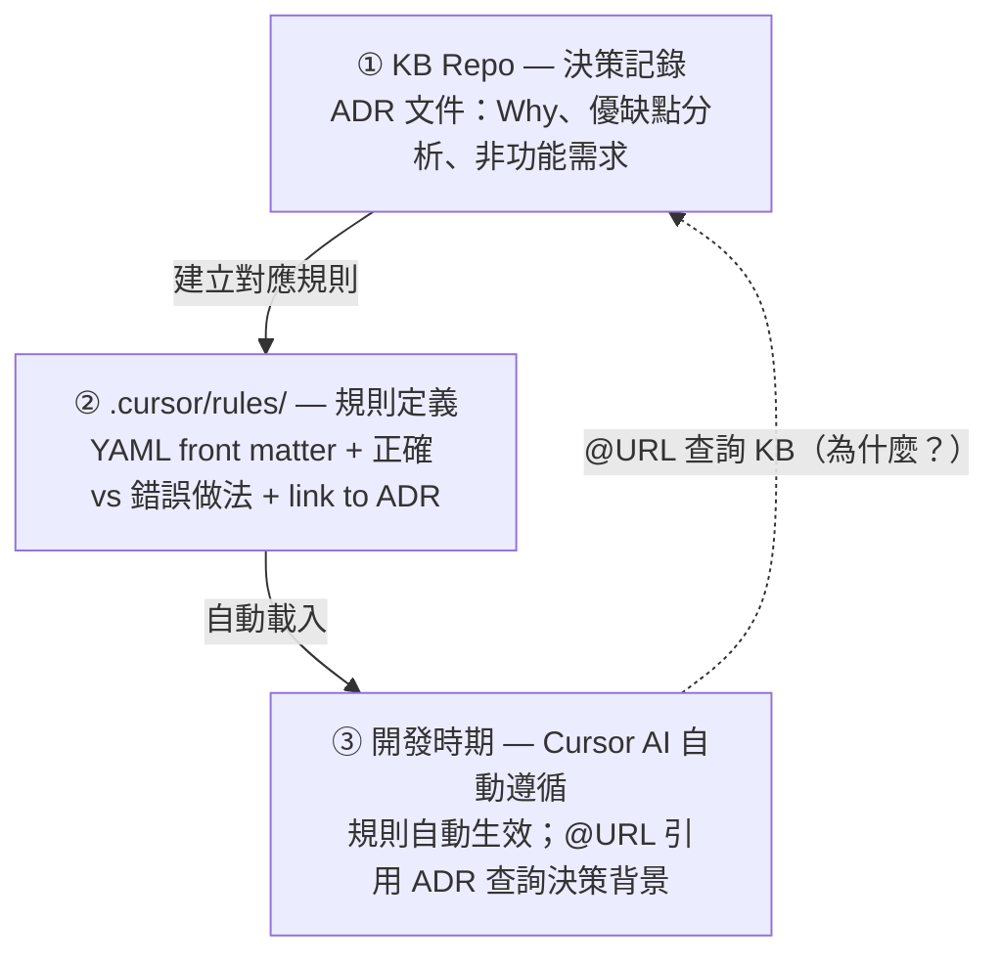

import Tabs from '@theme/Tabs';
import TabItem from '@theme/TabItem';

:::info 系列導覽

**Cursor AI 多 Repo 規則治理實戰系列**

1. [當我的多 Repo 規則開始打架 - Cursor AI 治理首部曲](./cursor-ai-rules-for-multi-repos) — 痛點診斷與隔離原則
2. **本篇：Cursor AI 規則集中管理行得通嗎？ - 我的翻車之路** — 反模式與官方對照
3. [多 Repo 的 Cursor AI 規則治理 - 我怎麼活下來的](./cursor-ai-rules-implementation-part3) — 落地案例與執行藍圖

:::

:::tip 本文摘要

- 目標讀者：正在考慮「把規則集中管理」的架構師或技術主管。
- 讀完你能：說清楚「為什麼 KB 不該當集中式規則控制中心」與「為什麼獨立 Rule Repo 常走不通」，並對照官方指南選定「決策在 KB、實作在 Project」路線。
- 前置知識：建議先讀完 [Part 1](./cursor-ai-rules-for-multi-repos)，了解三層隔離原則與規則治理健康度自評。

:::

## 上篇回顧與本篇切入點

在 [Part 1](./cursor-ai-rules-for-multi-repos) 裡，我分享了多 Repo 規則打架的四大痛點，也簡單的介紹了 Team Rules、Project Rules、User Rules 的隔離原則。

發現規則治理也是一個問題之後，下一個問題自然就是：**規則到底該放在哪裡？**

所以這篇我想先從自己踩過的坑聊起——我試過兩種「看起來很合理」的集中式管理方案，結果都翻車了。(好孩子千萬不要學)

翻完車之後，我又回頭去讀 Cursor 官方文件，然後才慢慢摸索出適合我我們團隊的治理模式。



## 我的翻車之路

發現規則打架的問題之後，我第一個直覺的反應就是：**那就把規則統一收在同一個地方管啊！**

這個想法聽起來很合理，畢竟 SSOT（單一真實來源，Single Source of Truth）上面都寫著**單一**了。

:::note 背景補充
更重要的是——在我們公司，Team Rules 的管理權掌握在 MIS 部門手上，我沒辦法改。<br/>
也就是說，「直接用 Team Rules 來統一跨 Repo 規範」這條最直覺的路，從一開始就不在我的選項內。<br/>
這也是我開始把腦筋動到「集中控管的 Rule」的根本原因。
:::

不過，問題往往不是憨人想得那麼簡單；我試過的兩個方法都撐不到一個星期就胎死腹中了。

我的「~~進化~~翻車史」可以用下面這張表格來做個簡單的描述：

| 階段 | 我做了什麼 | 發生了什麼事 |
|---|---|---|
| **Phase 1：全部收到 KB** | 把規則內容精煉到 KB，希望 KB 成為唯一的規則來源 | 規則更新速度跟不上 KB 文件異動，精煉出來的規則過期了自己還不知道 |
| **Phase 2：開獨立 Rule Repo** | 建了一個 `cursor-rules` Repo，所有規則放在裡面，各 Project 引用 | 三方同步（KB → Rule Repo → Project）變成災難，沒人搞得清楚誰是老大 |
| **Phase 3：回歸分層** | 放棄集中式，改成「決策留 KB、規則放各 Project」 | 總算看到了一線曙光（但不代表沒有挑戰） |

直覺上「集中管理 = 好管理」，但在我們多 Repo + Cursor AI 的環境下，這個等式看起來並不成立。

接下來，就讓我更詳細的說說翻車的細節和經過。

## 翻車第一站：把 KB 當規則中心 — 體質不合的失敗

我最初的想法很單純：既然我們部門原本就有一個 KB Repo（基於 Docusaurus 的知識庫），裡面放了 ADR（Architecture Decision Record，架構決策記錄）、設計規格、Domain Knowhow，而且它又是橫跨所有 Business Domain 的，那就讓 KB 順便管規則不就好了？

結果呢？我個人認為就是一個「慘」字。

### KB 與規則控制中心的職責不一致

如果把 KB 本來該做的事跟「規則控制中心」需要做的事放在一起比較，很容易就會發現兩者根本是不同的工作：

| 面向 | KB 的天職 | 規則中心需求 |
|---|---|---|
| **內容類型** | 決策背景、ADR、設計規格、經驗教訓 | 可執行的 `.mdc` 規則檔 |
| **更新頻率** | 中低（決策不常變） | 中高（跟著開發節奏走） |
| **消費者** | 人類（工程師查閱參考） | Cursor AI（自動載入到 System Prompt） |
| **版本粒度** | 文件級（整篇更新） | 欄位級（改一個 glob 就是一次版本） |
| **載入方式** | 開發者主動 `@URL` 引用 | Cursor 自動掃描 `.cursor/rules/` |

從這張表可以看出，KB 和規則控制中心之間的差距不只是「放哪裡」的問題，而是三個本質面向都對不上：**KB 存的是決策背景（為什麼），規則需要的是可執行指令（怎麼做）；KB 跟著決策節奏更新，規則要跟著開發節奏走；KB 是給人讀的，規則是要讓 Cursor 自動載入的**。

就算我有辦法把 KB 的內容同步成規則，這三個面向的錯位也會讓它們在第一次更新之後立刻開始漂移。

### 「煉蠱」失敗的三個原因

為了讓 Cursor AI 能讀到更精準的規則和背景，我還試過一種「煉蠱」流程——用魔法來打敗魔法，讓 Cursor AI 掃描整個 KB，把上百篇文件精煉成幾份「黃金規則精華」，再想辦法把這些精華同步到各個 Repo 裡。

結果證明，我把一堆東西丟進罐子裡讓它們互相 PK，最後爬出來的那隻完全不是我想要的。

更慘的是，因為處於多 Repo 的環境，隨時都有人在編輯不同的 Repo，什麼時候進行同步的動作好像都不對。

不過，我從這個「煉蠱」實驗裡也學到了不少的教訓，我把實驗失敗的原因簡單歸納成三點：

1. **更新頻率脫鉤**：KB 的文件可能每天都在微調，但精煉出來的「黃金規則」不會馬上自動跟著更新到所有其它 Repo。等我發現精華過期時，AI 可能已經拿著過期的「真理」指導了好幾天的開發——**這比沒有規則更危險**。

2. **維護黑洞**：這份精華檔需要有人定期校對。在我們的團隊裡，這個人就是我。但當我忙不過來的時候，精華檔就開始慢慢腐爛，變成一份「看起來很權威但內容已經不準確」的文件。

3. **精煉過程中的資訊損失**：AI 為了簡潔，會把很多關鍵的 Edge Case 捨棄掉。結果規則變成「正確但沒用」——大方向對了，但實際碰到的狀況都不在規則裡。結果我還是得花更多時間去針對煉出來的「蠱」進行 Code Review。

### KB 的正確定位

講到這裡，我要強調的是：**KB 不是沒用，它只是不該當「規則控制中心」**。

KB 的正確角色是存放**規則背後的「為什麼」**——ADR 記錄了我們為什麼選擇 Repository Pattern、設計規格說明了 API 的 Error Contract 該長什麼樣子。這些「為什麼」是規則的基石，但它們本身不是規則。

另外，要作到規則檔能完全即時的同步，本身就是有困難的；即時、動態的更新所有 Repo 中的規則，原本就是一件不切實際的事情，更何況還會有人正在編輯你正要更新的 Repo 裡面的檔案。

一旦某個 Repo 裡的規則沒被同步，那就又掉進了**用錯了規則比沒規則恐怖**這個大坑裡。

把 KB 當規則控制中心，就像是叫圖書館管理員來指揮交通——他知道交通規則寫在哪本書裡，但他站的位置根本不對。

## 翻車第二站：獨立 Rule Repo — 三個 Repo 共存時的治理崩潰

山不轉路轉——既然沒辦法讓 KB 裡的規則自動廣播，那就建一個專門存規則的 Repo，讓大家主動去拉，不就解決了嗎？

KB 行不通，那我換個思路：**建一個專門放 Cursor Rules 的 Repo**，叫它 `cursor-rules`，所有規則的「唯一副本」都放在這裡，各 Project 去引用它。

表面上看起來很美好：



但當 KB Repo（存決策背景）和 Project Repo（存本地規則）同時存在時，這個 Rule Repo 就會陷入**三角矛盾**。

:::info 這次翻車的原因有點不太一樣
第一站是「體質不合」——KB 存的東西和規則需要的東西根本是兩回事，而且自動同步的成本太高。<br/>
第二站是「治理崩潰」——這次規則格式對了，放的位置也對，但三個 Repo 同時存在，反而更沒有人知道誰該負責同步。
:::

### 矛盾 1：身份不清 — 到底誰是 SSOT？

假設我建好了 `cursor-rules` Repo，裡面放著 `repository-pattern.mdc`。

這時候就會出現三份「跟 Repository Pattern 有關」的東西：

- **KB Repo** 裡有 `adr-001-repository-pattern.md`（決策背景）
- **cursor-rules Repo** 裡有 `repository-pattern.mdc`（規則實作）
- **各 Project Repo** 裡有引用過來的本地副本（或某種同步機制）

如果有一天 KB 裡的決策更新了，誰該負責更新 Rule Repo？更新完之後，誰負責讓每個 Project 同步？

**結果就是沒有人知道誰該負責同步、什麼時候該同步。責任變成了模糊地帶。**

### 矛盾 2：版本管理爆炸

版本混亂的場景大概長這樣：



當我只是想寫個需求的程式碼時，我可能得追蹤：

- Rule Repo 中的版本（2.0.0）
- Project-A 引用的版本（2.0.0 還是 1.9.0？）
- Project-B 的版本（可能又不同步）
- KB 中的決策版本（可能又又不同步）

**結果就是：多層版本管理，容易出錯且難以追蹤。**

### 矛盾 3：Project 特殊性被忽視

Rule Repo 裡的規則應該是「通用版本」，但現實中每個 Project 都有自己的特殊需求：

- **Project-A**（API Gateway）：需要強制使用 async/await
- **Project-B**（定時任務）：可以允許同步 I/O
- **Project-C**（Legacy Service）：需要向後相容的豁免規則

如果硬要把所有規則都存在一個地方，就得：

1. 把所有 Edge Case 都列在通用規則中（規則爆炸，變得又臭又長）
2. 每個 Project 都拷貝一份（但是要修改的時候卻得回 Rule Repo 修改，很不直覺）
3. 為了精準的設定 alwaysApply 和 glob，又得在 Rule Repo 裡寫一大堆專門針對每個 Project 的規則（違背了「通用」的初衷）
4. 可能為了要讓特定的 Project 能用，還得在 Rule Repo 裡寫一些「專門給 Project-C 用的豁免規則」(反而又耦合了)

**結果就是：規則要麼過於通用（沒用），要麼過於具體（無法共享）。**

### 為什麼兩個 Repo 比三個清晰

你可能會問：「那為什麼不乾脆用一個 Rule Repo 取代 KB？」

我的回答是：**規則、決策、實作本質上是不同的東西，應該存在不同的地方。** 前端和後端的 Rule 就有很多是不好共用的——更別說我們還有 Legacy Service 需要特殊豁免。

獨立 Rule Repo 的根本問題在於：

- **太遠**：開發者寫程式碼時，需要的規則在另一個 Repo，拉取和同步成本高
- **太通用**：無法反映每個 Project 的特殊性
- **太孤立**：斷開了規則和決策背景的聯繫（決策在 KB，規則在另一個 Repo，實作又在 Project）
- **維護模糊**：不清楚三方之中誰應該負責同步

相比之下，**只有兩個角色的世界清晰得多**：KB 存決策（為什麼），Project 存規則（怎麼做）。

## Cursor 官方指南：官方到底期待規則怎麼放？

聊完自己的翻車經驗之後，再來比對一次 Cursor 官方文件怎麼說。

在翻車之後再回頭讀官方文件，真的是超級有感。

根據 [Cursor 官方文件](https://cursor.com/zh-Hant/docs/rules)，規則系統的設計重點如下：

:::tip 關於量化指標
下表對比中的「預期成果」基於實務觀察。如果你想量化驗證自己的改善幅度，可參考：
• **Code Review 時間**：統計 N 個 PR 的平均討論輪數或回覆等待時間
• **風格一致性**：Code Review 中因風格產生的評論數量
• **時間成本**：新增/修改規則時的人工同步時間
具體指標應根據團隊環境設定。
:::

| 官方說法 | 我先前的盲點 | 修正後的認知 |
|---|---|---|
| Project Rules 存放在 **`.cursor/rules/`** 目錄，**隨 Repo 版控** | 我試圖把規則放在 KB 或獨立 Repo，不在 Cursor 的載入路徑上 | 規則必須放在 Cursor 實際讀取的位置：各 Project 的 `.cursor/rules/` |
| `.mdc` 檔案支援 `globs` 欄位精準控制作用範圍 | Rule Repo 的通用規則無法反映各 Project 的路徑差異 | glob 是按 Project 的目錄結構設計的，天生就該跟著 Project 走 |
| Team Rules 是**全域護欄**，開發者無法在本地覆蓋 | 我想用 Rule Repo 來扮演 Team Rules 的角色 | Team Rules 透過 Cursor Dashboard 管理，不需要也不應該用另一個 Repo 來替代 |
| 所有適用規則會**合併成統一 Prompt**，衝突時高優先級勝出 | 我擔心「分散 = 混亂」 | 官方的合併機制本身就能處理衝突，前提是每層各司其職 |
| 規則應該**簡短聚焦**、控制在 500 行以內 | 我試圖用精煉方式把 KB 壓縮成「萬能規則」 | 規則不是百科全書，而是精準的行為指引 |

:::info 帶走這個：「官方說法 → 先前誤區 → 修正後認知」對照表

上面這張表可以直接拿來說服同事或主管「為什麼不該再另開一個規則 Repo」。官方的設計意圖很清楚：**規則跟著 Project 走，用版控管理，用 glob 控制範圍**。
:::

## 適用多 Repo 的 SSOT 應該長什麼樣？

好，翻了兩次車、讀完官方文件之後，目前我收斂到的分層長這樣：



如果要用三句話講完，大概就是：

1. **KB 不存 `.mdc`**：KB 存的是決策背景（ADR）、設計規格、Domain Knowhow——這些是規則的「為什麼」，不是規則本身。
2. **Project `.cursor/rules/` 才是 Cursor 規則的 SSOT**：這是 Cursor 實際讀取的位置，也是唯一應該放 `.mdc` 檔案的地方。
3. **連結而不是複製**：Project Rules 裡用 `source_kb` 欄位連結回 KB 的 ADR，不要把 KB 的內容複製貼上到規則裡。

### 團隊的協作流程

落到日常工作裡，協作流程大概會長這樣：



## ADR 與 .mdc 的映射實例

:::warning 如果你的團隊沒有 ADR 體系
不用擔心。ADR（Architecture Decision Record）只是一個知識庫中的文件形式。即使沒有正式的 ADR，你仍然可以：
1. 在規則的 `source_kb` 欄位連結到任何形式的設計文件（Confluence、Notion、GitHub Wiki 等）
2. 直接在 `.mdc` 檔案中詳細解釋「為什麼要這樣做」，代替 KB 連結
3. 在團隊 Onboarding 文件或 README 中記錄設計決策

核心概念不變：**規則應該有一個「決策背景」的連結或說明**。
:::

上面都是偏理論的說明，接下來我想用一個實際的例子來說明一下「決策在 KB、實作在 Project」的原則是怎麼落地的。

就拿除了 Repository 這個 Repo 之外，所有的資料訪問都必須透過 Repository Pattern 這個決策來說明吧。

### KB 側：ADR 骨架

```markdown title="kb-repo/docs/architecture/adr-001-repository-pattern.md"
# ADR-001：採用 Repository Pattern 進行資料訪問

**狀態**：已採納 | **決策日期**：2026-03-15

**決策**：所有資料訪問必須透過 Repository 抽象層，禁止直接使用 DbContext。

**Cursor Rule 連結**：
- [repository-pattern.mdc](https://github.com/my-org/backend-service/.cursor/rules/repository-pattern.mdc)
```

### Project 側：.mdc 骨架

```yaml title="project-repo/.cursor/rules/repository-pattern.mdc"
---
description: 所有資料庫查詢必須使用 Repository Pattern
globs: ["src/**/*.cs"]
alwaysApply: true
source_kb: "https://kb.internal/docs/architecture/adr-001-repository-pattern"
---

# Repository Pattern 規範

所有查詢必須透過 Repository 進行，禁止直接使用 DbContext。
詳見部門 KB：[ADR-001](https://kb.internal/docs/architecture/adr-001-repository-pattern)

- ✓ 正確：await _userRepository.GetByIdAsync(id)
- ✗ 錯誤：await _dbContext.Users.FindAsync(id)
```

### 速查對照：KB 欄位 ↔ `.mdc` 章節

下面這張對照表可以用來當作建立第一份映射時的起手式——ADR 寫「為什麼」，`.mdc` 寫「怎麼做」，中間用連結串起來。

| KB（ADR）欄位 | 對應到 `.mdc` 的位置 | 說明 |
|---|---|---|
| 狀態（已採納/已廢止） | Front Matter `source_kb` | `.mdc` 本身不記錄 ADR 狀態，靠連結回去查 |
| 決策內容 | `.mdc` 主體的指令段落 | 把決策翻譯成 Cursor 看得懂的正／反對比 |
| 背景與權衡 | `.mdc` 裡的連結（不貼全文） | 避免規則膨脹，讓想深入了解的人自己去看 |
| 適用範圍 | Front Matter `globs` | 按 Repo 的實際目錄結構設定 |

## 優先級與衝突解決機制

在結束前再回顧一下 Cursor 的規則優先級，因為它直接影響我們怎麼設計分層。

根據 [Cursor 官方文件](https://cursor.com/zh-Hant/docs/rules)：


所有適用規則都會合併到 AI 的上下文中，**當規則發生衝突時，優先級較高的規則會被採用**。

### 衝突範例速查表

下面的表格，可以用來說明在實際情況中，當 Team Rules、Project Rules、User Rules 發生衝突時，Cursor 的優先級機制是怎麼運作的：

| 場景 | Team Rules | Project Rules | User Rules | 最終結果 |
|---|---|---|---|---|
| 全部一致 | 禁止寫死帳密 | 同上 | 同上 | 統一執行 |
| Project 想豁免 | 禁止寫死帳密 | 測試檔允許 | — | **Team 勝**（無法豁免） |
| User 偏好不同 | — | 用 `var` | 想用 `let` | **Project 勝** |
| 互不衝突 | UTF-8 編碼 | Async 必用 | 繁體中文 | **全部合併** |

:::tip 小提示
記住一句話就好：**Team Rules 是憲法，Project Rules 是公司規章，User Rules 是個人習慣。憲法不可以觸犯，公司規章優先於個人習慣。**
:::

## Cursor 官方最佳規則實踐

在結束之前，我也把 Cursor 官方建議中跟「規則應該長什麼樣」有關的重點整理了一下：

| ✅ 應該做 | ❌ 不應該做 |
|---|---|
| 使用 `.mdc` 格式，含 YAML Front Matter | 把整份 Linter 設定複製到 Rule（Cursor 已經認識常見工具） |
| 用 `globs` 限制作用範圍，避免地圖砲 | 設定過度寬鬆的 glob（如 `**/*.ts`）讓所有檔案都套用 |
| 把規則進 Git 版控，讓團隊受益 | 新增只在極少數情況適用的規則（保持聚焦） |
| 定期回顧、廢止無用的舊規則 | 重複程式碼庫裡已有的內容（指向範例而非複製） |
| 控制在 **500 行以內**，大型規則拆成多份 | 寫出模糊、大而全的「萬能規則」 |

## 總結

:::tip Recap

1. **KB 不是規則控制中心**：KB 存「為什麼」，Cursor 規則存「怎麼做」，兩者靠連結串起來就好。
2. **獨立 Rule Repo 不是預設解**：在多 Repo + KB 的環境下，它會變成責任不清的第三者，帶來三倍同步成本。
3. **官方模型下的正確分工**：Team Rules 當護欄（不可違反）、Project Rules 當實作 SSOT（版控 + glob）、User Rules 當個人偏好（最低優先級）。

:::

知道了「不要怎麼做」之後，接下來就是「要怎麼做」了。

[Part 3](./cursor-ai-rules-implementation-part3) 會承接這篇的結論，專門講在 KB + 多 Repo 並存的真實條件下，怎麼把規則變成能維運的工程資產——包括可複製的案例、Phase 計畫、還有驗證機制。

如果你或是你的團隊也有討論規則該放哪的需求，不妨把上面的決策流程圖再拿出來看一次，應該很對收斂共識很有幫助。

---

## 參考資源

- [Cursor 官方文件：Rules](https://cursor.com/zh-Hant/docs/rules)
- 前篇：[Agentic AI 加入後，我看到的隱憂與治理破口](./cursor-ai-governance-for-team)
- 系列 Part 1：[當我的多 Repo 規則開始打架](./cursor-ai-rules-for-multi-repos)
- 系列 Part 3：[多 Repo 的 Cursor AI 規則治理 - 我怎麼活下來的](./cursor-ai-rules-implementation-part3)