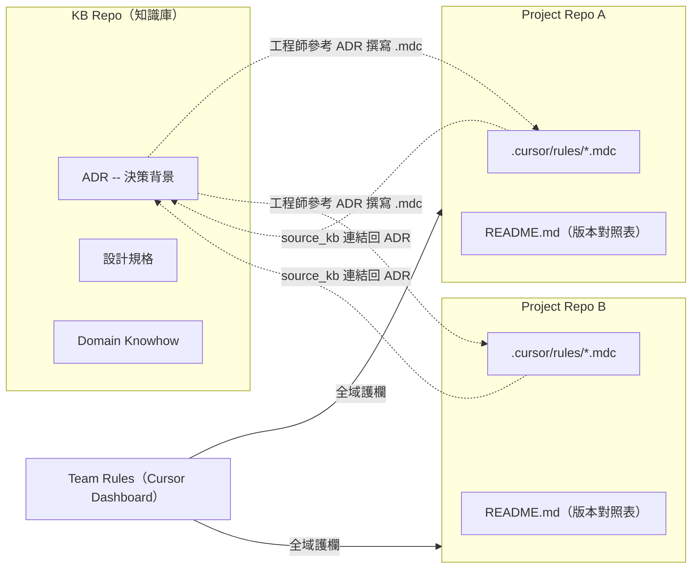
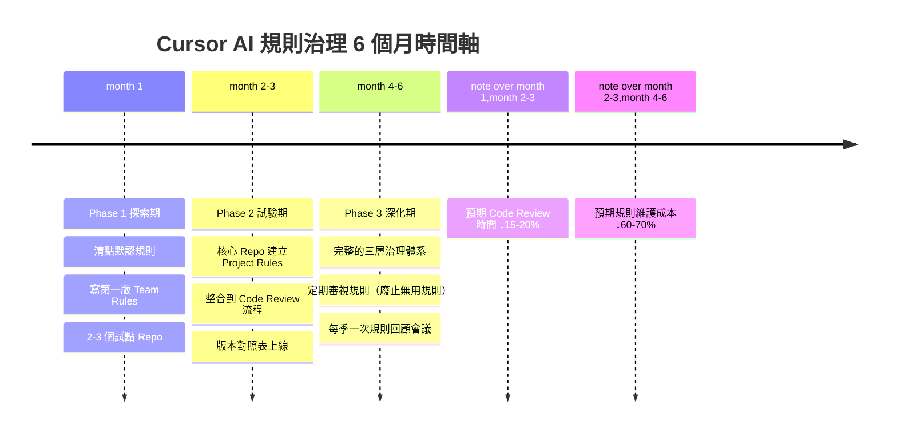

import Tabs from '@theme/Tabs';
import TabItem from '@theme/TabItem';

:::info 系列導覽

**Cursor AI 多 Repo 規則治理實戰系列**

1. [當我的多 Repo 規則開始打架 - Cursor AI 治理首部曲](./cursor-ai-rules-diagnosis-part1) — 痛點診斷與隔離原則
2. [Cursor AI 規則集中管理行得通嗎？ - 我的翻車之路](./cursor-ai-rules-management-part2) — 反模式與官方對照
3. **本篇：cursor-ai-rul多 Repo 的 Cursor AI 規則治理 - 我怎麼活下來的es-diagnosis-part1** — 落地案例與執行藍圖

:::

:::tip 本文摘要

- 目標讀者：準備動手導入規則治理的架構師、Tech Lead、或已經讀完前兩篇想開始行動的工程師。
- 讀完你能：在 KB 與多 Repo 並存的真實條件下，依官方建議組合 Team Rules、Project Rules 與 KB 連結，並複製案例、Phase 計畫來推動落地。
- 前置知識：建議依序讀完 [Part 1](./cursor-ai-rules-diagnosis-part1) 與 [Part 2](./cursor-ai-rules-management-part2)。

:::

:::note 關於案例中的量化數據

本文的量化成果（如「降低 25%」「節省 40%」）均標註為「作者團隊內部觀察」的經驗區間，並非業界統計。你的團隊需要自行量測來驗證效果。
:::

## 從「不要怎麼做」到「要怎麼做」

在 [Part 2](./cursor-ai-rules-management-part2) 裡，我們釐清了兩件事：

- **KB 不是 Rule 控制中心**——它存「為什麼」，不存「怎麼做」
- **獨立 Rule Repo 不是預設解**——在多 Repo + KB 的環境下，它會變成責任不清的第三者

那在 KB + 多 Repo 並存的條件下，**具體要怎麼做？** 就讓我用這篇來跟你分享我目前的做法。

| 面向 | Part 1 診斷 | Part 2 分析 | Part 3 解決方案 |
|---|---|---|---|
| **技術層** | 三大衝突機制：alwaysApply、glob、Chat 模式 | 為什麼多 Repo 會打架：上下文融合、規則越界 | 用三層隔離（Team/Project/User）化解 |
| **管理層** | 四大痛點：不同步、優先級混亂、人工同步、追蹤性破裂 | 為什麼集中管理行不通：KB 體質不合、Rule Repo 責任不清 | 決策在 KB、規則在 Project、護欄用 Team Rules |
| **實踐層** | 自評表診斷嚴重度 | 原則和官方指南對照 | 3 個案例 + Phase 計畫 + 檢查清單 |

## KB + 多 Repo 的總體打法

在開始前，先回顧一個核心概念：**SSOT（Single Source of Truth，單一真實來源）** 是指在系統中應該只有一個權威的資料來源。我們的做法就是把決策、規則、實作各自放在它們最應該去的地方，避免同一個概念在多個地方飄散。

我先用一張圖來說明整個資料流的全貌，後面的案例都是在這個框架下操作的：



如果要我用四句話來概括整個打法的話：

1. **決策與背景 → KB**：ADR（Architecture Decision Record，架構決策記錄）、規格書、Domain Knowhow 都放知識庫，供人閱讀和引用。
2. **可執行規則 → 各 Repo `.cursor/rules/`**：Cursor AI 實際讀取的 `.mdc` 檔案，跟著 Project 走、進 Git 版控。
3. **跨 Repo 一致性 → Team Rules + 版本對照表**：不可違反的底線用 Team Rules 護欄；各 Repo 間的版本同步靠 `README.md` 對照表追蹤。
4. **動態細節 → `@URL` 引用 KB**：遇到需要深入背景的情境時，開發者在 Prompt 中用 `@URL` 引用 KB 文件，而不是把整份 KB 塞進規則裡。

:::info 帶走這個：KB — 多 Project — Cursor 資料流總圖

上面這張 Mermaid 圖是整個系列的精華濃縮。可以直接複製到團隊 Wiki，當作治理架構的共識基準。

一句話記住：**決策在 KB，規則在 Project，護欄用 Team Rules，需要時 @URL 引用**。不要煉蠱，要連結。
:::

## 實戰案例

原則講完了，接下來我想用三個真實案例讓你看看在 KB + 多 Repo 下實際操作起來是什麼樣子。每個案例我都會附上量化指標和「可複製指數」，方便你評估哪個最適合你的團隊先拿來試。

### 案例 1：API 回應格式標準化（Team Rules + Project Rules）

**問題**：API Service A 用 HTTP Status Code + Body 的 Error 格式，Service B 直接拋 HTTP Exception。前端整合時得寫兩套 Error Handling Logic。

**治理流程**：

| 步驟 | 角色 | 做什麼 |
|---|---|---|
| 1 | 架構師 | 在 KB 寫 ADR：統一 API Error Contract |
| 2 | Tech Lead | 在 Cursor Dashboard 新增 Team Rules：「所有 API 回應必須使用統一 Contract」 |
| 3 | 各 Repo 工程師 | 在自己的 Repo `.cursor/rules/` 新增 `error-response-format.mdc`，glob 設為 `src/Controllers/**/*.cs` |
| 4 | Code Review | 確認新 API 端點是否遵循統一格式 |

**`.mdc` 骨架**（精簡版）：

```yaml title="api-service/.cursor/rules/error-response-format.mdc"
---
description: API 回應格式標準化 - 使用統一的 Error Contract
globs: ["src/Controllers/**/*.cs"]
alwaysApply: true
source_kb: "https://kb.internal/docs/adr/api-error-contract"
---

# API Error Response 標準格式

成功：{ success: true, data: {...}, traceId: "uuid" }
失敗：{ success: false, error: { code: "...", message: "..." }, traceId: "uuid" }
禁止直接拋 HTTP Exception。
```

**量化成果**（作者團隊觀察）：

| 指標 | 導入前 | 導入後 |
|---|---|---|
| 前端整合測試失敗率 | 每次整合平均 3–5 個格式錯誤 | 降至 0–1 個 |
| Code Review 中因規則導致的討論 | 每次 PR 約 15 分鐘 | 幾乎歸零 |

**可複製指數**：

| 維度 | 評分 | 說明 |
|---|---|---|
| 實施難度 | ★☆☆ 低 | 只需要 Team Rules + 1 份 `.mdc` |
| 前置條件 | ★☆☆ 低 | 不需要 KB，Team Rules 就能開始 |
| 跨 Repo 適用 | ★★★ 高 | 所有 API Repo 都適用 |

:::tip 小結
API Error Contract 是最適合「第一個導入」的規則——影響面大、實施成本低、效果立竿見影。
:::

### 案例 2：Legacy System 相容性豁免（Team Rules 例外管理）

**問題**：Team Rules 規定「禁止寫死帳密」，但某個 Legacy Service 為了相容舊系統，測試檔案裡暫時需要寫死帳密。

**治理流程**：

| 步驟 | 角色 | 做什麼 |
|---|---|---|
| 1 | 工程師 | 開 GitHub Issue，說明豁免理由和預計廢止期限 |
| 2 | 架構師 | 審批豁免，在 KB 記錄背景 |
| 3 | 工程師 | 在 Legacy Repo 新增 `secret-compat-exception.mdc`，glob 嚴格限定在測試目錄 |
| 4 | 定期審查 | 廢止期限到時，移除豁免規則或延期（需重新審批） |

**`.mdc` 骨架**（精簡版）：

```yaml title="legacy-service/.cursor/rules/secret-compat-exception.mdc"
---
description: "[TEMPORARY] 暫時允許在 Legacy 測試檔寫死帳密。廢止期限：2026-09-01"
globs: ["src/**/*.LegacySystemTest.cs"]
alwaysApply: true
source_kb: "https://kb.internal/docs/exceptions/legacy-secret-compat"
---

# Legacy 系統相容豁免

允許範圍：僅限 Legacy 測試檔案，生產環境禁止。
廢止日期：2026-09-01。替代方案：Azure Key Vault。
```

**量化成果**（作者團隊觀察）：

| 指標 | 導入前 | 導入後 | 改進幅度 |
|---|---|---|---|
| 豁免的可追蹤性 | 口頭約定，三個月後沒人記得 | Git Blame 可追溯，到期自動提醒 | ↑ 100%（從無到有） |
| Team Rules 「誤殺率」 | 平均每月 2-3 次工程師因規則卡住 | 0 次（有明確豁免流程） | ↓ 100% |
| 「能不能寫」爭論 | 每週 Code Review 中出現 1-2 次 | 0 次（規則清晰） | ↓ 100% |
| 審批成本 | 無流程，走各自為政的政治協商 | 1 個 GitHub Issue，5 分鐘完成 | ↓ 95%（從無定規到有規則） |

**可複製指數**：

| 維度 | 評分 | 說明 |
|---|---|---|
| 實施難度 | ★★☆ 中 | 需要建立豁免申請流程 |
| 前置條件 | ★★☆ 中 | 需要有 Team Rules 先到位 |
| 跨 Repo 適用 | ★★☆ 中 | 只有需要豁免的 Repo 才用 |

:::tip 小結
豁免不是「破壞規則」——它是「有紀律地管理例外」。關鍵在於：scope 要窄、期限要明、審批要留痕。
:::

### 案例 3：多 Repo 規則版本同步

**問題**：Repository Pattern 規則從 v1.0 升級到 v2.0（新增 Async 支持），有 8 個 Repo 都在使用這個規則，同時升級 8 個 Repo 很難追蹤。

**治理流程**：

| 步驟 | 角色 | 做什麼 |
|---|---|---|
| 1 | 架構師 | 在 KB 更新 ADR（新增 Async 支持的背景） |
| 2 | 架構師 | 通知各 Repo 負責人（可用 Slack / Teams / GitHub Notification） |
| 3 | 各 Repo 工程師 | 在自己的 Repo 更新 `.mdc` + `README.md` 對照表 |
| 4 | 架構師 | 檢查各 Repo 的 `README.md`，確認同步狀態 |

**版本對照表範本**：

```markdown title="project-repo/.cursor/rules/README.md"
# 本 Repo 的 Cursor 規則

| 規則名稱 | 對應 KB ADR | 版本 | 狀態 | 最後更新 |
|---|---|---|---|---|
| repository-pattern.mdc | ADR-001 | 2.0.0 | ✓ 同步 | 2026-04-02 |
| async-patterns.mdc | ADR-002 | 1.5.0 | ✓ 同步 | 2026-03-20 |
| logging.mdc | ArchSpec-Logging | 1.0.0 | ⚠️ 舊版 | 2026-02-01 |
```

**量化成果**（作者團隊觀察）：

| 指標 | 導入前 | 導入後 |
|---|---|---|
| 規則不同步被發現的時間 | 數週（等到有人踩到才知道） | 1–2 天（定期檢查對照表） |
| 跨 Repo 實作風格一致性 | 經常有 Repo 用舊版規則 | 各 Repo 版本差異一目了然 |

**可複製指數**：

| 維度 | 評分 | 說明 |
|---|---|---|
| 實施難度 | ★☆☆ 低 | 只需要在每個 Repo 維護一份 `README.md` |
| 前置條件 | ★★☆ 中 | 需要有 KB + 版本號慣例 |
| 跨 Repo 適用 | ★★★ 高 | 所有 Repo 都需要 |

:::info 帶走這個：版本對照表範本

上面的 `README.md` 格式可以直接複製貼上到你的 Repo 裡。欄位很簡單：規則名稱、對應 ADR、版本、同步狀態、最後更新日期。有了這張表，你就不用再靠「記憶」來追蹤規則是否最新了。
:::

:::tip 小結
版本同步的關鍵不是「讓所有 Repo 同時更新」——那不現實。關鍵是「讓不同步的狀態可見」，這樣至少你知道哪些 Repo 該處理了。
:::

## 常見痛點對策

在實際操作中，你大概會碰到這些問題。這張對策表跟 [Part 1 的衝突表](./cursor-ai-rules-diagnosis-part1) 呼應，但更聚焦在「碰到時怎麼修」：

| 症狀 | 根因 | 設定修正 |
|---|---|---|
| 「Cursor 沒套用我的規則！」 | glob 模式不匹配當前檔案 | 檢查 glob 路徑是否對應實際目錄結構 |
| 「Cursor 沒套用我的規則！」（其二） | `alwaysApply: false` 且 Cursor 判斷不相關 | 改為 `alwaysApply: true`，或在 Prompt 中手動引用 |
| 「規則套太多，AI 變慢了」 | 太多 `alwaysApply: true` 的地圖砲規則 | 用 `globs` 精準限定範圍，不需要的規則改 `alwaysApply: false` |
| 「Chat 模式下風格混亂」 | Chat/Composer 積極融合多 Repo 規則 | 在 Prompt 中明確指定範圍（如「僅限 Application 層」） |
| 「User Rules 被覆蓋了」 | Team Rules 或 Project Rules 優先級更高 | 這是正常行為——不要把團隊規範放在 User Rules 裡 |
| 「不知道哪些規則還有效」 | 缺乏版本追蹤 | 建立 `.cursor/rules/README.md` 版本對照表 |

:::info 帶走這個：「常見症狀 → 根因 → 設定修正」速查表

遇到 Cursor 沒套規則或行為怪異時，先翻這張表。大多數問題都出在 glob 設定或 `alwaysApply` 的配置上。
:::

## 效果驗證方法：你該如何知道成功了？

完成改進後，團隊應該能感受到明確的改善。下面是幾個常見的量測指標，幫你驗證治理是否見效：

### 量化指標對照表

| 指標 | 改進前 | 改進後期望 | 驗證方法 |
|---|---|---|---|
| **Code Review 平均耗時** | 15-20 分鐘討論規則 | ↓ 5-10 分鐘 | 抽樣統計 5 個 PR 的評論時間 |
| **規則不一致發現時間** | 數週後（整合時） | ↓ 1-2 天（CI 檢查） | 統計「發現不同步」到「修正」的時間差 |
| **跨 Repo 實作風格偏差** | 3-5 種不同做法並存 | → 基本統一（允許版本差異） | Code Review 時記錄「需要修改的風格問題」數量 |
| **工程師規則滿意度** | 「不知道該怎麼做」很常見 | ↑ 80% 以上有信心 | 簡單調查：「你知道該 Repo 的規則嗎？」 |
| **規則維護成本** | 每月 4-6 小時手動同步 | ↓ 每月 \<1 小時 | 統計「規則相關」的工作票務時間 |

### 成功標準檢查清單

- [ ] Phase 1（第 1 個月）：
  - ✓ Team Rules 已上線且無人反感
  - ✓ 至少 2 個試點 Repo 的開發者反饋正面

- [ ] Phase 2（第 2-3 個月）：
  - ✓ Code Review 時間縮短 15-20%（感受得到的改善）
  - ✓ 沒有人再問「這個該怎麼寫」

- [ ] Phase 3（第 4-6 個月）：
  - ✓ 規則成為日常工作的一部分（自動套用，不需提醒）
  - ✓ 跨 Repo 改動時實作風格保持一致

:::tip 小提示
改進成效不會一夜間出現。從「有規則但沒人認真用」到「規則成為日常」通常需要 3-4 週的磨合期。
如果第 1 個月沒看到改善，可能是規則本身不夠精準，此時應回到 Part 2 的「反省流程」重新調整。
:::

## Phase 時間軸一覽

下圖展示了從探索到深化的完整 6 個月時間軸：



**里程碑提醒：**
- **Week 2**: 第一版 Team Rules 上線，開發者反饋收集
- **Week 4**: Phase 1 評估，決定是否擴展到所有 Repo
- **Month 3**: Phase 2 驗收，Code Review 流程整合完畢
- **Month 6**: Phase 3 結束，體系化治理確立

## Phase 1–3 落地計畫

如果你讀到這邊覺得「好，我想開始做了」，下面是我建議的分階段計畫。不要試圖一次搞定所有 Repo——**從最痛的一個 Repo 開始**。

### Phase 1：探索期（第 1 個月）

**目標**：建立企業級 Team Rules，讓團隊對「隔離原則」有基本認識

**預計耗時**：
- 清點 + 撰寫：4-6 小時
- 試行 + 收集反饋：2 週
- 調整迭代：1-2 週
- **合計**：4 週

**任務清單**：

- [ ] 清點企業現有的「默認規則」——那些大家口頭約定但沒寫下來的潛規則
- [ ] 寫下第一版 Team Rules（建議從「禁止寫死帳密」開始）
- [ ] 在 Cursor Dashboard 中試行
- [ ] 選 2–3 個相對獨立的專案試行
- [ ] 收集回饋，調整規則

**Phase 1 預期成果**：1–2 個 Team Rules 被成功試行，團隊對三層隔離有基本認識。

:::tip Phase 1 小結
起步要輕。第一個 Team Rules 選那種「大家都同意不能違反」的規則（如帳密保護），共識門檻最低。
:::

### Phase 2：試驗期（第 2–3 個月）

**目標**：為主要 Repo 建立 Project Rules，整合到日常 Code Review 流程

- [ ] 為核心 Repo 定義 Project Rules（API 格式、DB 存取模式）
- [ ] 把 Project Rules 放進 `.cursor/rules/`，進版控
- [ ] 建立版本管理文件（`README.md` 對照表）
- [ ] 整合到 Code Review 流程——Review 時順便檢查規則是否被遵循
- [ ] 如果有 KB，開始建立 ADR ↔ `.mdc` 的連結

**Phase 2 預期成果**：所有主要 Repo 都有 Project Rules，Code Review 時間降低 15–20%（作者團隊觀察），跨 Repo 實作風格更統一。

:::tip Phase 2 小結
Phase 2 的關鍵是讓 Project Rules 進版控。一旦規則有了 Git 歷史，「誰改的、為什麼改」就再也不是謎了。
:::

### Phase 3：深化期（第 4–6 個月）

**目標**：完善規則體系，建立可持續的治理流程

- [ ] 建立「規則修改委員會」或明確的規則擁有者（不需要很正式，但要有人負責）
- [ ] 廢止無用的舊規則，更新過時規則
- [ ] 文件化每條規則的「引入背景」（連結到 KB 的 ADR）
- [ ] 定期審視：每季回顧一次規則清單，移除不再適用的規則

**Phase 3 預期成果**：完整的 Team / Project / User Rules 治理體系上線。開發者習慣於「Cursor 是受規則約束的隊友」。規則成為可版本化、可追蹤、可審計的工程資產。

:::tip Phase 3 小結
Phase 3 的成功指標不是「規則有多多」，而是「規則有多準」。定期審視、勇於廢止，比一直新增更重要。
:::

:::info 帶走這個：Phase 1–3 落地 checklist

上面三個 Phase 的 checklist 可以直接複製貼到 Notion、Jira、或 GitHub Project 的待辦清單。每個 Phase 結束時勾一次，確保進度可追蹤。
:::

## CI／CD 規則驗證（概念階段）

:::caution 注意

以下內容是**概念構想，尚未實際落地驗證**。我把它放在這裡是因為這是我們團隊未來想探索的方向，但目前還沒有實際跑過。請把它當作「未來可以嘗試的思路」，而不是「應該這樣做」的最佳實踐。
:::

在 Phase 3 之後，理想的下一步是在 CI/CD 中加入規則驗證——讓「規則是否符合治理標準」在 PR 時就被自動檢查。

我目前想像中可以驗證的面向包括：

- **格式檢查**：`.mdc` 是否有 YAML Front Matter、是否有 `description` 欄位
- **glob 寬度檢查**：是否有過於寬鬆的 glob（如空的 `globs: []`）可能變成地圖砲
- **與 Team Rules 衝突偵測**：Project Rules 是否試圖覆蓋 Team Rules 的安全性規則

一段概念示意的 YAML：

```yaml
# 概念示意 — 尚未實際落地驗證
name: Validate Cursor Rules
on:
  pull_request:
    paths: [".cursor/rules/**"]
jobs:
  validate:
    runs-on: ubuntu-latest
    steps:
      - uses: actions/checkout@v4
      - name: 驗證 .mdc 格式與 glob 寬度
        run: echo "TODO：驗證腳本待開發"
```

如果你的團隊已經在 CI/CD 中實作了類似的規則驗證，我很想聽聽你的做法——歡迎到 [GitHub Discussion](https://github.com/ouch1978/ouch1978.github.io/discussions) 分享。

:::tip 小結
CI/CD 驗證是治理的「最後一哩路」——但不是必須的第一步。先把 Phase 1–3 跑完，確保規則本身是對的，再考慮自動化驗證。
:::

## 完整檢查清單

<details>
<summary>點這裡展開：新增規則前的完整檢查清單</summary>

### 基本格式

- [ ] 使用 `.mdc` 副檔名
- [ ] 有 YAML Front Matter（`---` 中間隔）
- [ ] 有 `description` 欄位
- [ ] 有 `globs` 欄位（除非刻意要 `alwaysApply: true`）

### 不與 Team Rules 衝突

- [ ] 沒有試圖覆蓋安全性規則
- [ ] 沒有與企業級架構決策矛盾
- [ ] 如果需要豁免，已經走過豁免申請流程

### 範圍明確

- [ ] `globs` 設定精準（避免 `**/*` 地圖砲）
- [ ] 考慮過 `alwaysApply` 的影響——需要時才開 `true`
- [ ] 確認規則不會意外匹配到其他 Repo 的檔案（multi-root workspace 場景）

### 文件清晰

- [ ] 說明了為什麼需要這個規則
- [ ] 提供了正確 vs 錯誤的程式碼範例
- [ ] 有 `source_kb` 連結回 KB 中的 ADR 或設計文件

### 版本管理

- [ ] 已更新 `.cursor/rules/README.md` 的版本對照表
- [ ] 已提交 PR 並 Code Review

</details>

<details>
<summary>點這裡展開：Phase 結束時的自檢清單</summary>

### Phase 1 完成時

- [ ] 至少有 1 條 Team Rules 在 Cursor Dashboard 上線
- [ ] 團隊成員知道 Team / Project / User Rules 的區別
- [ ] 有 2–3 個試點 Repo

### Phase 2 完成時

- [ ] 核心 Repo 都有 `.cursor/rules/` 目錄且進版控
- [ ] 每個 Repo 都有 `README.md` 對照表
- [ ] Code Review 流程已涵蓋規則遵循檢查

### Phase 3 完成時

- [ ] 有明確的規則擁有者（或修改委員會）
- [ ] 至少做過一次規則清單審視，廢止了不適用的舊規則
- [ ] 每條 Project Rules 都有 `source_kb` 連結

</details>

## 常見障礙與對策

推動治理的時候，你八成會碰到一些「人」的問題。這些障礙通常比技術問題更棘手，但也不是沒辦法處理：

| 障礙 | 原因 | 對策 |
|---|---|---|
| 「這太複雜了」 | 一次想做完所有 Repo | 從 1 個核心 Repo 開始，跑完 Phase 1 再擴展 |
| 「為什麼要費這個事？」 | 沒看到具體效益 | 量化 Code Review 時間、Bug 率的改善，用數據說話 |
| 「我們沒時間」 | 優先級不夠高 | 向管理層展示「規則漂移導致的缺陷成本」——修一個跨 Repo Bug 要多久？ |
| 「Cursor 太新了，不穩定」 | 觀望心態 | 用試點 Repo 驗證穩定性，拿出 2–3 個月的數據再推廣 |
| 「誰有權限改規則？」 | 責任歸屬不清 | 明確指定每條規則的 Maintainer，寫在 `README.md` 裡 |

:::info 帶走這個：「常見障礙與對策」表

跟主管爭取資源或說服團隊採納時，這張表可以直接引用。每個障礙都有具體的對策，不需要你臨場發揮。
:::

:::tip 小結
推動治理最難的不是技術，是人。記住：**從小處開始、用數據說話、讓效果替你宣傳**。
:::

## 結語

寫到這裡，三篇系列文算是告一段落了。容我做個簡單的回顧：

:::tip 系列 Recap

1. **[Part 1](./cursor-ai-rules-diagnosis-part1)**：多 Repo + Agentic AI 會把規則不一致的問題放大好幾倍。先用自評表診斷嚴重度，再搞懂 Team / Project / User 三層隔離。
2. **[Part 2](./cursor-ai-rules-management-part2)**：KB 不是 Rule 控制中心、獨立 Rule Repo 不是預設解。官方設計的規則世界是：三層各司其職，不需要第四個「控制中心」。
3. **本篇**：在 KB + 多 Repo 的真實條件下，決策在 KB、規則在 Project、護欄用 Team Rules。用案例、Phase 計畫和清單把它變成能維運的工程資產。

:::

跨多個 Repo 的 SSOT 治理遠比想像複雜。技術層面上有工具和方法，但文化層面上還需要慢慢協商和共識。

我的建議很簡單：

1. **先解決最痛的問題** — 別試圖一次搞定所有規則，選最影響生產力的規則先做
2. **量化結果** — 用數據說話。Code Review 時間、Bug 率、技術債堆積速度
3. **讓規則成為資產** — 把規則放進版控、加上版本號、建立廢止流程，讓它們跟程式碼一樣被重視

最後還是那句話：**花若盛開，蝴蝶自來。** 當開發者親身體會到好的規則治理帶來的便利，他們自然就會主動遵守和推廣。

---

挑一個你最痛的 Repo，今天花 30 分鐘建好第一份 `.cursor/rules/README.md` 和 1 條 Project Rules。做完之後歡迎到 [GitHub Discussion](https://github.com/ouch1978/ouch1978.github.io/discussions) 分享你的成果或卡關。

---

## 參考資源

- [Cursor 官方文件：Rules](https://cursor.com/zh-Hant/docs/rules)
- 前篇：[Agentic AI 加入後，我看到的隱憂與治理破口](./cursor-ai-governance-for-team)
- 系列 Part 1：[當我的多 Repo 規則開始打架 - Cursor AI 治理首部曲](./cursor-ai-rules-diagnosis-part1)
- 系列 Part 2：[Cursor AI 規則集中管理行得通嗎？ - 我的翻車之路](./cursor-ai-rules-management-part2)