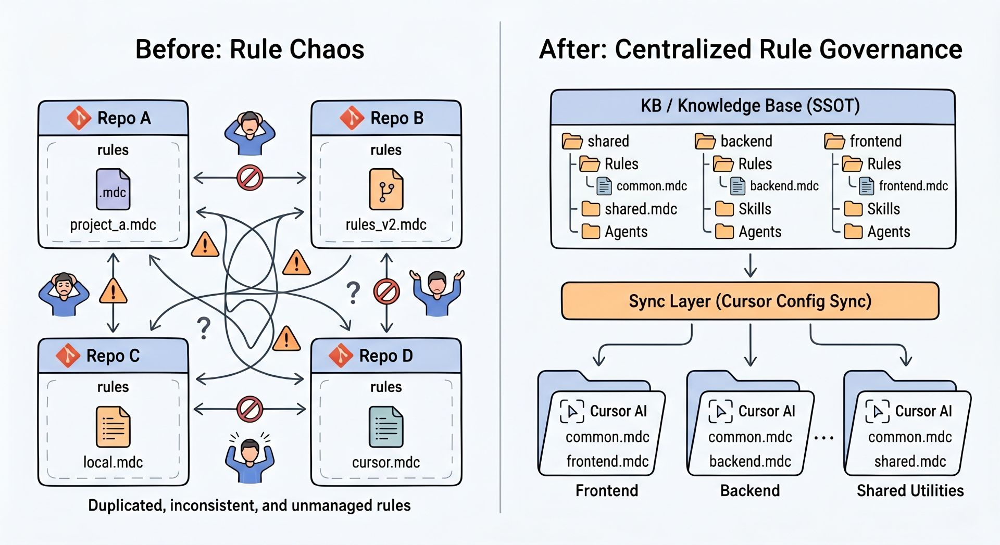
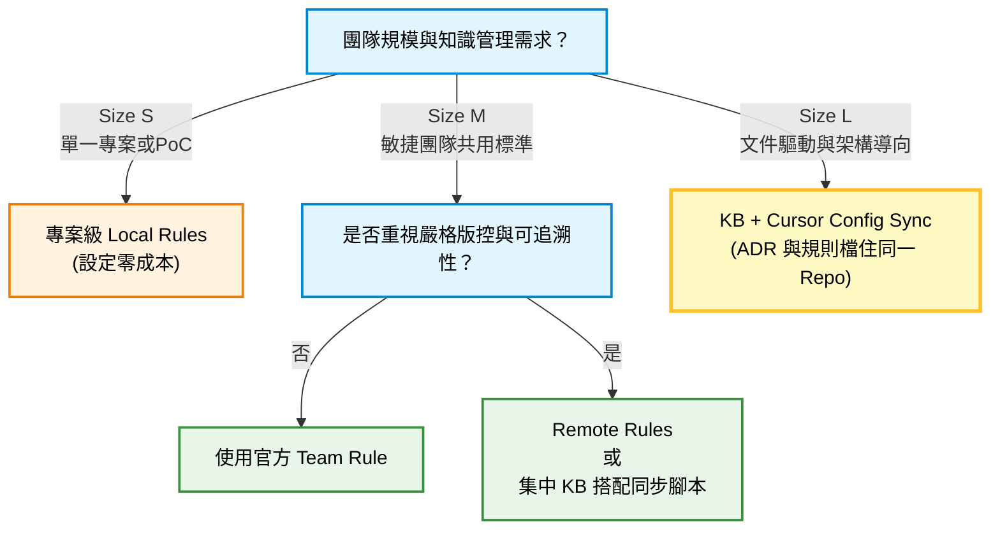
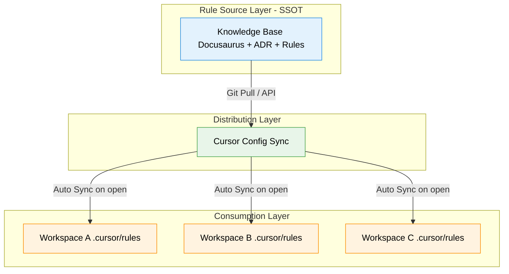
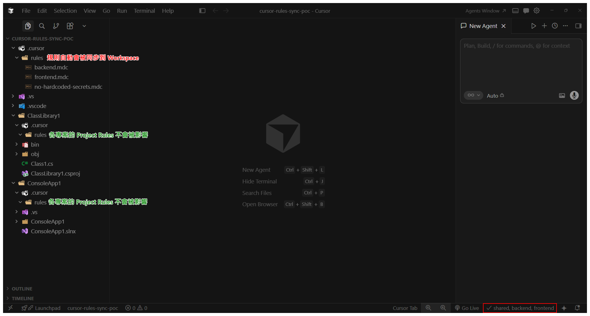
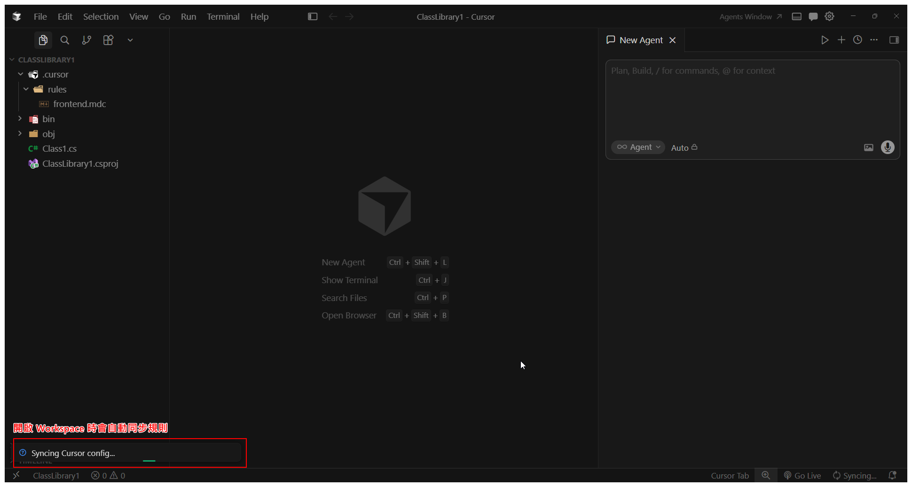
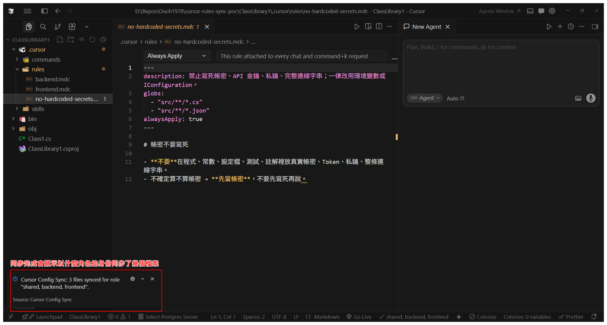

:::info 系列導覽

**Cursor AI 多 Repo 規則治理實戰系列**

1. [當我的多 Repo 規則開始打架 - Cursor AI 治理首部曲](./cursor-ai-rules-diagnosis-part1) — 痛點診斷與隔離原則
2. [Cursor AI 規則集中管理行得通嗎？ - 我的翻車之路](./cursor-ai-rules-management-part2) — 反模式與官方對照
3. **本篇：多 Repo 的 Cursor AI 規則治理：從受限環境出發的最小可行方案** — 一條可作為 MVP 起點的治理路線

:::

:::tip 本文摘要

- 問題本質：規則分散 + 同步不可控 + 多 Repo 衝突
- 目標讀者：受限於企業環境、暫時無法使用 Team Rules，但仍希望以較工程化方式治理 Cursor AI 規則的架構師與 Tech Lead。
- 前置知識：具備 Cursor AI 基礎使用經驗，了解 Project Rules 與 Team Rules 的差異以及 Docusaurus 基本概念。
- 核心方向：以 Docusaurus KB 作為 SSOT + Cursor Config Sync 作為分發機制。
- 本文定位：在現實限制下，利用現成工具可快速落地的 MVP 集中化治理方案(非最佳實踐)。

:::



## 前情提要：我的治理挑戰背景

回想起我從開始把腦筋動到 Cursor AI 的規則治理之後，真的是面臨到各種大大小小的挑戰。

先來簡單列一下我們的情境限制：

- **限制條件**：
  - 管理者權限在 MIS 手上，不能使用 Team Rules
  - GitLab 自架，無法用 Remote Rules
  - 前端 Mac / 後端 Windows，symlink 支援度不一致
- **既有資源**：已有 Docusaurus KB 作為技術文件中心
- **開發模式**：後端開發者常在同一 Cursor AI instance 開啟多個 Repo 同時編輯
- **前後端分工**：語言與框架不同，治理需求不一致
- **多 Repo 並行**：無專職 CI/CD 專家，需簡化流程

基於這些限制，我能選擇的方案就非常有限了。

## 規則治理的迭代過程

在上一篇文章中，我分享了兩個翻車的經驗。

但是我心中還是一直認為 ADR 和 Rules 可以住得越靠近越好，最好是在同一個 Repo 裡，這樣管理起來比較舒服。

但在沒有 Team Rules 掌控權加上有多 Repo 的企業受限環境下，我一直苦思如何才能更工程化地治理 Cursor AI 的規則。

原本，我已經設計好了一套「Rules as Packages (規則即套件)」的複雜架構，打算把全域規則打包成 NPM 或 NuGet 套件，然後透過 CI/CD 與建置腳本，強迫每個專案在開發或建置的時候自動把規則拉下來。

**但就在我準備將那套沉重的架構落地時，發現了一個看起來更好的解決方案。**

那就是在 Open VSX Registry 上由 KushalCodes 開發的 **[Cursor Config Sync](https://open-vsx.org/extension/KushalCodes/cursor-config-sync)** 擴充套件！

這個套件的出現，大幅降低了治理的複雜度，我不再需要重新造輪子，也不需要維護落落長的搬運腳本了。

更讓我開心的是：它可以讓 Cursor AI 的 .mdc 規則檔和 ADR 一起住在 KB 裡，在看 ADR 的同時就能看到規則的實際內容。

這個完完全全命中了我的需求啊！！

## 治理方式選擇懶人包

在繼續下去之前，我還是得先重申一下，**沒有一套放諸四海皆準的治理方案，只有適合當下團隊環境的相對解法**。

雖然我在整個 POC 過程中研究了不少方案，也試了不同的工具，不過這邊先用一個簡單的流程圖來幫大家整理一下，讓有類似困擾的同學可以快速找到適合自己團隊的治理路線：



至於我還看了、試了哪些其它的方案，就等到文章的尾聲再來跟大家分享。

## 我用 Cursor Config Sync 來解決哪些問題？

前一篇文章的兩個翻車痛點如下：

> 1. 硬要把 ADR 當成規則的單一真理來源，但是 ADR 的格式不適合直接當成規則使用，而且同步的時機和方法混亂。
> 2. 單獨建立一個規則專用的 Repo 的話，會變成 Repo 需要三方同步，提高了治理複雜度。

而這套新的做法，則是直接讓規則的實際內容可以直接放在 KB Repo 裡，在 ADR 的頁面上可以直接顯示規則的內容，這個同時解決了 ADR 不應該被當成規則的 SSOT 與三方同步的問題。

換句話說，這套東西其實沒有那麼神，也不是什麼銀彈。(而是我的血和淚啊~~)

它主要解決的是 **「規則怎麼分流、怎麼讓同一個群組的人規則保持一致」** 這件事，而**不是**把整個治理流程（審核、權限、版本）都搞定。

**解決範圍**

- 規則集中管理（SSOT）

- 自動同步到 Workspace

- 依不同角色分流（共用/前端/後端）

**不解決**

- 規則審核流程

- 細部權限控管

- 規則版本治理策略

### 設計原則與架構

這個解決方案的設計原則有下列三點(對應到我之前踩的三個坑)：

- ADR 與 Rules 物理分離、邏輯綁定

- 規則以 Git 作為 version control

- 同步機制應「自動且無感」

如果把這整個架構抽象來看，其實可以拆成三層（也剛好對應到責任分工）：



### 關於 Cursor Config Sync 的同步規則

除了規則本身，上一篇也有提到更新規則的時機，如果工程師每次要寫 Code 之前還得要手動去拉規則下來、再放到各自的資料夾，那應該完全不會有人想用。

除此之外， Cursor Config Sync 還可以基於不同的角色來同步不同的規則檔，也滿足了前/後端的規則可以各自獨立的需求。

Cursor Config Sync 只要工程師在 Cursor AI 設定好一次之後，只要在 Cursor AI 開啟 Workspace，就會依照工程師被分配到的角色，自動把相對應的規則拉下來放在 Workspace 的**根目錄**。

如此一來剛好解決了先前兩個方案的痛點，也剛好能讓大混戰模式下的所有專案都能共用同一份規則，而且不會蓋到原本的 Project Rule。


針對習慣使用逐一擊破模式的工程師來說，它恰巧會覆蓋掉檔名相同的 Project Rule；從 Cursor AI 官方建議的治理理念來說，也就剛好就扮演了 Team Rules 的角色。

講完原則之後，接下來就來看這整套東西實際是怎麼落地的。

## 使用 Cursor Config Sync 的前置作業

### 在 ADR 中看到 Rules 的實際內容 (Optional)

:::note
雖然這個步驟對於使用 Cursor Config Sync 來說是可選的，但是透過這個步驟，就可以讓 ADR 和規格檔住在一起，讓維護 ADR 和規格檔的體驗大大提升。
:::

為了要讓 Rule 檔的內容也能在 KB 的 ADR 頁面中顯示，這邊得要借用 `raw-loader` 這個套件，在 ADR 的 MDX 檔裡面直接把 Rule 檔的內容讀進來，這樣在瀏覽 ADR 的時候就能同時看到規則的內容了。

一個簡單的範例是這樣的：

```md title="KnowledgeBase\docs\20-adr\00-shared\01-no-hardcoded-secrets\index.md"
---
title: 不得把帳密寫死
description: 禁止寫死帳密、API 金鑰、私鑰、完整連線字串；一律改用環境變數或 IConfiguration。
author: Ouch
---

- 狀態: Approved

- 日期: 2026-04-01

- 決策者: Ouch

## 主旨

全面禁止在程式碼、版控檔案 (如 appsettings.json 的非加密節點) 中寫死任何帳號密碼、API 金鑰、私鑰或完整連線字串。

## 1. 背景與脈絡 (Context)

在過去的專案迭代中，部分服務為了快速開發與除錯...

---下略

## Cursor AI Rule

本規則所對應的 Cursor AI Rule 如下：

import CodeBlock from '@theme/CodeBlock';

import MyRule from '!!raw-loader!/cursor-configs/shared/rules/no-hardcoded-secrets.mdc';

<CodeBlock language="yaml" title="global-api-contract.mdc">
  {MyRule}
</CodeBlock>
```

以 Docusaurus 來說，只需要確保 .mdc 檔能在 ADR 文件裡透過 raw-loader 顯示出來就行了。

接下來是 Cursor Config Sync 的設定步驟，也是這個解決方案的核心。

### (管理者) 在 KB Repo 中建立相關的資料夾與檔案

如同前面提到的，Cursor Config Sync 可以使用角色的概念來控管規則檔，因此我選擇用資料夾來做為不同角色規則的實體隔離層。

為了讓整個資料夾結構更符合我部門的需求，我並沒有 Cursor Config Sync 預設的資料夾結構，而是做了以下調整：

```text
knowledge-base                               (KB 根目錄)
├── docs                                     (Docusaurus 文件庫根目錄)
│   └── 00-adr                               (ADR 根目錄)
│       ├── 00-shared                        (共用 ADR 根目錄)
│       │   └── 01-no-hardcoded-secrets   (ADR 目錄，一個 ADR 一個目錄)
│       │       └── index.md                 (ADR Markdown 檔)
│       ├── 01-backend                       (後端 ADR 根目錄)
│       └── 02-frontend                      (前端 ADR 根目錄)
├── cursor-configs                           (Cursor 相關設定檔根目錄)
│   ├── shared                               (共用設定檔根目錄)
│   │   └── rules                            (共用規則檔根目錄)
│   │       ├── no-hardcoded-secrets.mdc     (共用規則檔.mdc)
│   │       └── ...                          (共用規則檔...)
│   ├── backend                              (後端設定檔根目錄)
│   │   └── rules                            (後端規則檔根目錄)
│   │       └── ...                          (後端規則檔.mdc)
│   └── frontend                             (前端設定檔根目錄)
│       └── rules                            (前端規則檔根目錄)
│           └── ...                          (前端規則檔.mdc)
├── assignments.json                         (Cursor Config Sync 帳號/角色指派檔)
└── manifest.json                            (Cursor Config Sync 自訂資料夾設定檔)

```

#### (管理者) 建立角色定義檔

有用過 Docusaurus 的同學應該會留意到上面的資料夾結構最後面有兩個陌生的檔案，它們是 Cursor Config Sync 專用的設定檔。

assignments.json 用來存放 GitLab 帳號和角色之間的對應。
之後在 Cursor AI 裡就會自動依照你的帳號同步相對應的設定檔。

```json title="assignments.json"
{
  "ouch.liu": ["shared", "backend", "frontend"],
  "alice.lin": ["shared", "frontend"]
}
```

#### (管理者) 建立自訂路徑的 Manifest 檔

manifest.json 用來讓我們自訂每個角色設定檔的路徑。
如果不自訂的話，預設會使用名字叫做 "roles" 的資料夾。

```json title="manifest.json"
{
  "roles": {
    "frontend": {
      "path": "cursor-configs/frontend",
      "description": "Frontend development"
    },
    "backend": {
      "path": "cursor-configs/backend",
      "description": "Backend development"
    },
    "shared": {
      "path": "cursor-configs/shared",
      "description": "Shared and infrastructure"
    }
  }
}
```

### (使用者) 在 Cursor AI 中安裝 Cursor Config Sync 並設定同步來源

在 Cursor AI 裡安裝好 Cursor Config Sync 之後，可以依照下列步驟進行設定：

1. 打開 Command Palette (<kbd>Ctrl</kbd>+<kbd>Shift</kbd>+<kbd>P</kbd>)
2. 執行 `Cursor Config Sync: Setup`
3. 跟著指示輸入以下資訊：
   - Platform： GitLab 或 GitHub
   - Instance URL： 自架的 GitLab 或 GitHub 的 URL (例如 https://gitlab.mycompany.com)
   - Repository path:： Repo 的路徑 (例如 XXX/kb)
   - Username： 你在 GitLab 的使用者名稱 (要和 assignments.json 裡的相同)
   - Personal Access Token： 具備 **repo read** 權限的 Personal Access Token

上述設定完成之後，就可以透過 Command Palette 執行 **Cursor Config Sync: Sync Now** 來手動觸發同步，看看設定有沒有生效。

想要做到每次打開 Workspace 就自動同步的話，可以在 Cursor Settings 裡加上：

```json
"cursorConfigSync.autoSyncOnOpen": true
```

之後就會自動同步啦!!





:::tip 小提示
如果設定/同步遇到的過程中遇到問題，可以先參考 [Cursor Config Sync 的 Troubleshooting](https://open-vsx.org/extension/KushalCodes/cursor-config-sync#troubleshooting "Troubleshooting ") 章節。
:::

## 我還試過哪些其他的方案？

以下是我在研究這個問題的過程中，還看過、試過(打槍過)的方案：

| 方案                                                                                                    | 運作方式                                                                                       | 優點                                                                                      | 被我打槍的主要原因                                                                                         |
| ------------------------------------------------------------------------------------------------------- | ---------------------------------------------------------------------------------------------- | ----------------------------------------------------------------------------------------- | ---------------------------------------------------------------------------------------------------------- |
| 自行打包成 NPM / NuGet                                                                                  | Docusaurus Build 時打包 .mdc 成 npm/NuGet 套件，專案引用後解壓到 .cursor/rules                 | 1. 借用依賴管理的管理模式<br/> 2. 可版控                                                  | 1. CI/CD 成本大幅增加（需維護打包 Script）<br/> 2. 引用與解壓成本高<br/> 3. 大混戰開發模式下多專案重複下載 |
| [knowhub](https://github.com/yujiosaka/knowhub)                                                         | .knowhubrc 配置 GitLab raw URL，執行 npx knowhub 自動 fetch 並 copy 到 target                  | 1. 可自訂程度相對高<br/> 2. 可精準只同步特定資料夾<br/> 3. 可整合 hook / npm script       | 對 .NET 專案來說引入 Node.js 太突兀                                                                        |
| [AI Rules Syncer](https://marketplace.visualstudio.com/items?itemName=HerrInformatiker.ai-rules-syncer) | Cursor Settings 設定 Git Repo URL，開啟專案或定時自動從 Repo Root sync 到 .cursor/rules/remote | 1. 有 Team Names 過濾概念<br/> 2. 有 Cache，不怕 Repo 掛掉<br/> 3. 開啟專案時自動觸發     | 只能從 Repo Root 同步，會把整個 KB（含 ADR、docs 等）全部拉下來                                            |
| [lbb00/ai-rules-sync](https://github.com/lbb00/ai-rules-sync)                                           | Git-backed CLI，透過 symlink/copy 把規則從 Git Repo 同步到本地指定資料夾                       | 1. 強調 Git 作為 Single Source of Truth<br/> 2. 支援多 AI 工具（Cursor + Claude Code 等） | 1. GitLab self-hosted raw URL / 子資料夾精準 sync 支援較弱<br/> 2. 偏向 symlink                            |

## 結語

如果你的團隊也正在面對以下問題：

- 多個 repo 規則不一致

- 工程師各自為政

- 無法使用官方 Team Rules

或許你也可以花個半小時，試試看這套以 Docusaurus KB 為核心搭配 Cursor Config Sync 的治理方案。

可以考慮從這個最小行動開始：

1. 建立一個 KB repo 作為 ADR 和規則來源

2. 定義一條 shared rule（例如 no-hardcoded-secrets）

3. 在一個 repo 中導入 Cursor Config Sync 進行 PoC

### 範例 KB Repo 下載

如果想要更快速體驗的話，我也準備了一個可以用來當作 POC 的 Repo，只要直接 Clone 下來照著 README 裡的說明設定好 Cursor Config Sync 就可以直接看到效果了。

Repo 連結如下：

[](https://github.com/Ouch1978/cursor-configs-in-kb "本文範例：cursor-configs-in-kb")

:::tip 小提醒
雖然本文只專注在 Cursor AI 的規則檔管理，但是 Cursor Config Sync 也能管理 Cursor AI 其它種類的設定檔，例如 Skills 和 Sub Agent 的設定檔，如果你也有這方面的需求，也可以一起放在 KB 裡，然後透過 Cursor Config Sync 來管理喔!!
:::

當然，如果你已經有了更好的方案，或者在實施過程中遇到了什麼問題，也歡迎在留言區跟我分享你的經驗喔!!~
