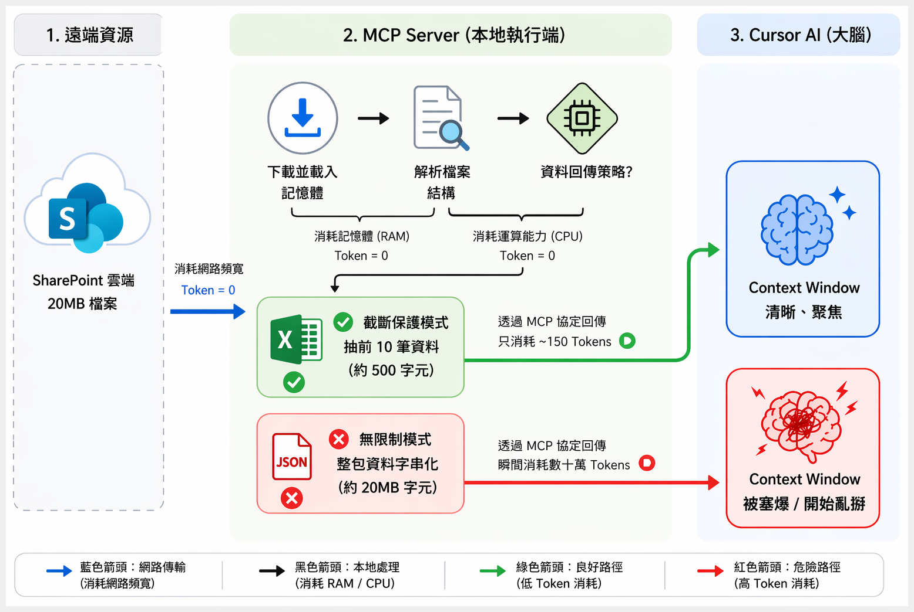
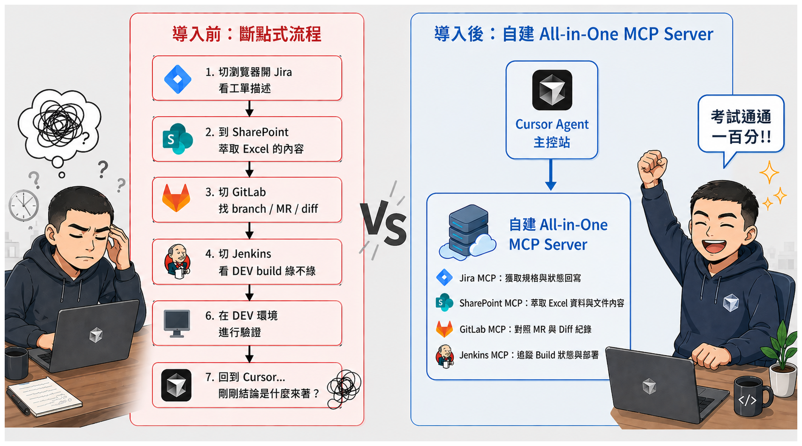
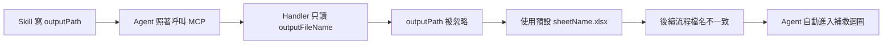
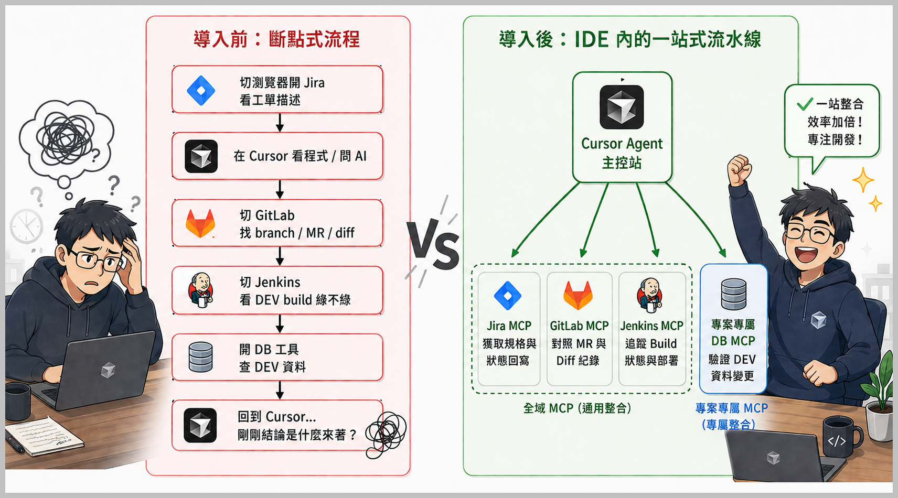
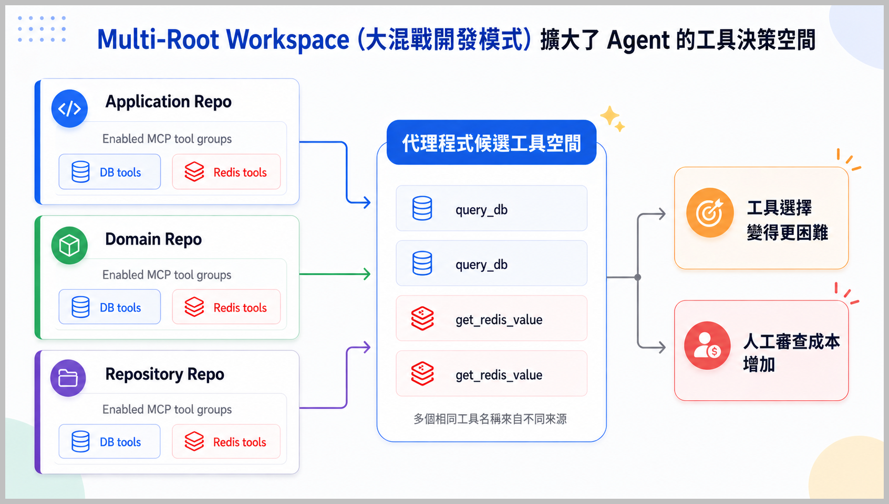
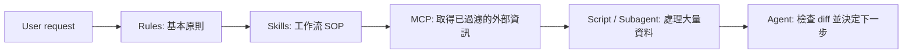

:::tip 本文摘要
- 目標讀者：追求極致開發效能、對 Token 成本敏感，且需要在複雜企業環境（Jira/DB/CI）建立高效 AI 工作流的資深架構師或是 Team Lead。
- 前置知識：具備 Cursor AI 基礎經驗，了解 `.mdc`、MCP 基本架構與 LLM Token 計費原理。
- 核心方向：建立「混合式 MCP 架構」進行隔離，並透過「Server 端過濾」與「Skills 按需求載入」實現 ROI 極大化。
- 本文定位：從實際案例中整理出來的實戰心得，分享如何透過「吝嗇型設計」在現實限制下打出高價值的開發 Combo。
:::

## 前言：Token 才是 Agentic AI 真正的成本

看著 Cursor AI 慢慢從之前只能完成單點突破的工作，到現在能夠串接整個流水線，大家也慢慢習慣有這個「新同事」了，甚至越來越依賴它。

不過，隨著使用的深入，**Token 的消耗量遠超過我們的預期** 這個問題也越來越明顯了。

之前本來很天真的以為 Token 應該不會有用完的一天，畢竟只是叫 AI 幫忙寫寫 Code、查查資料、跑跑流程而已嘛。

結果呢？

沒想到在整條工作流程被串起來之後沒多久，就收到 Token 用完的警告了。

而且，不只 Cursor AI，其它 Agentic AI 平台也都不約而同的開始限縮不同方案提供的 Token 數量。

:::danger 碎碎唸
前一陣子有一則新聞提到，黃仁勳曾開玩笑說：「如果輝達的工程師沒花到年薪價值一半的 Token 量，我會非常生氣。」
很不幸的是，我不在 NVIDIA 上班，也沒有年薪一半的 Token 可以用，所以我得對 Token 的使用斤斤計較。
:::

這時候我才真正意識到，Token 不是什麼躲在模型背後的技術細節，而是會直接影響我們每天能跑多少次 Agent、能解幾張工單、能省下多少人力的現實預算。

當 Token 用完的時候，不管我們的 Prompt 寫得多漂亮、MCP 接得多完整、Agent 多像新同事；如果不乖乖把錢錢掏出來、讓它變成 Token 的形狀，就通通都只能盯著 Cursor AI 那每個月重置一次的 Token 量發呆。

接下來，我會把 Cursor AI 的四大武器（Rules、Skills、Subagent、MCP）當成「經濟學工具」，用真實的案例，量化 Token 消耗前後差異，跟大家分享我從中整理出來，更有經濟效益的 Combo 玩法。

## 四大武器的 Token 經濟學

首先，先讓我試著用一張表格來簡單列出這些工具可能的成本。

先說在前面，這張表不是要幫助大家精準計價，畢竟每個人的環境、模型、Rules 和 MCP 數量都不同，硬要去算出一個絕對數字其實沒什麼意義。

這邊只是想先讓大家能抓個大概的感覺：有些工具看起來很輕，但其實是固定成本；有些工具看起來很重，但如果用對地方，反而可以幫我們把雜訊隔離掉。

不然很容易會變成「工具越接越多，Agent 越跑越貴，最後還不知道錢到底花去哪裡」。

| 工具 | Token 消耗機制 | ROI 判斷 | 適合情境 | 使用時要小心什麼 |
|---|---|---|---|---|
| Rule | 經常被帶進 input context | 最容易默默變貴 | 長期穩定、不常變的基本原則 | 只放「憲法」，流程細節和大量範例先忍住 |
| Skill | 按需求載入 | 通常最高 | 重複 workflow、SOP、固定操作步驟 | 把會變動、會展開的流程放進 Skill |
| MCP | tool schema 與 tool response 會進 context | 中高，但很看設計 | 高頻外部工具、結構化查詢、跨系統證據鏈 | Server 端過濾，回摘要與下一步需要的資訊 |
| Subagent | 另開 context，會有額外成本 | 適合隔離高耗能工作 | 長查詢、大檔案分析、CI log 追蹤 | 用來隔離 heavy task，不要濫開 |

我後來自己的理解是這樣：

:::tip 小訣竅
不要用 Rule 來處理流程，MCP 要避免回傳原始資料，Subagent 別拿來過濾資料。
:::

高 ROI 的關鍵不是把工具全部接上去，而是不要讓每個工具都變成萬用膠帶。

工具越多，並不代表 Agent 越聰明；很多時候只是代表它有更多東西可以誤會。

## 我的迷思：MCP 成本真正發生在哪裡

在討論 MCP 之前，先講一個我自己一開始也搞混的地方。

透過 MCP 下載大檔案、呼叫 API、執行查詢，本身不一定會消耗大量 Token。

真正會消耗 Token 的，是 **MCP Server 最後回傳多少內容給 LLM**。

換句話說，重點不是「工具在背後做了多少事」，而是「工具最後把多少東西倒進 Agent 的上下文」。



如果 MCP 把 5MB JSON、50 則 Jira comments、完整 Jenkins log、整頁 HTML 錯誤頁都原封不動回傳給 Agent，那些內容才會變成 Token 成本。

這也是我後來最有感的一件事：MCP 可怕的地方不是它能拿到資料，而是它太容易把「拿到的資料」誤當成「Agent 需要知道的資料」。

所以 MCP 最容易踩雷的地方不是「能不能拿到資料」，而是：

:::tip 小訣竅
MCP Server 最好先把資料整理到 Agent 做下一步決策所需要的最小形狀。
:::

## 真實案例的 Token 經濟學分析

接下來我們就來看看兩個真實的案例，看看這兩個案例在解決問題的背後，潛藏了多少看不到的成本。

### 案例 A：自建 All-in-One MCP

先來看一個我覺得很有代表性的場景。

在實作多語系相關的需求時，原本工程師得要到 Jira、Jenkins、SharePoint 和程式碼之間來回切換。

要查需求、抓檔案、轉格式、改 Code、跑 CI、回 Jira，中間的 context switch 多到讓人很容易想要摔鍵盤。

於是就有工程師做了一個 All-in-One MCP，讓 Cursor AI 可以直接串起整條流程。



如何？是不是改成右邊的解決方案之後考試就都一百分了？

從流程效率來看，這個方向真的很合理。

老實說，如果只看右邊那張圖，我也會覺得這樣很漂亮：工程師不用在一堆系統之間來回切換，Agent 看起來也終於能幫上整條流水線的忙。

但是在我仔細看完這個解決方案的實作細節之後，才發現它在 Token 經濟學上其實是非常不划算的。

接下來就一步步來跟大家分享原來的實作踩了哪些雷。

:::note 小提醒
下面的程式碼範例都已經基於原始案例做過簡化與去識別化，主要是拿來說明我看到的坑，不是還原完整實作。
:::

### Token 殺手一：把大型 JSON 直接回傳給 Agent

原本的 SharePoint tool 同時支援 Excel 與 JSON。Excel 分支有用 `maxRows = 10` 限制回傳筆數，但 JSON 分支卻直接把整包檔案 parse 後回傳。

```javascript title="sharepoint-client.js"
async function readSharePointFile(sharePointUrl, driveId = null, sheetName = null, maxRows = 10) {
    // ...
    if (fileType === 'json') {
        // 問題：直接把整包 JSON parse 完回傳。
        const jsonContent = JSON.parse(fileBuffer.toString('utf-8'));
        return {
            fileName: fileName,
            content: jsonContent,
            type: 'json'
        };
    } else if (fileType === 'excel') {
        // Excel 分支有使用 maxRows 限制回傳筆數。
        const dataObjects = allData.slice(1, maxRows + 1).map(row => { ... });
        result[targetSheetName] = dataObjects;
        return { fileName: fileName, sheets: result, type: 'excel' };
    }
}
```

這種設計在資料小的時候看不出問題，甚至還會覺得「很方便啊，Agent 一次都拿到了」。

但是如果哪天資料量變大，下載到的 JSON 檔的容量達數 MB，數十萬的 Token 可能會馬上噴光。這除了會造成高昂的 API 成本，還會觸發 LLM 的 context 迷失（Lost in the middle），大幅降低推理品質。

如果把 JSON 下載到本地，tool response 只回傳路徑、大小、格式、欄位摘要或 sample，就會好很多，例如：

```json
{
  "ok": true,
  "file": {
    "path": ".cursor/tmp/translations.json",
    "sizeBytes": 2148920,
    "type": "json",
    "preview": {
      "topLevelType": "array",
      "sampleCount": 3
    }
  },
  "nextActionHint": "Read the local file with a script instead of loading the full content into context."
}
```

Agent 需要知道資料在哪裡，不需要把整包資料都讀進腦袋裡。

這個差別看起來小，但是 Token 帳單會很誠實。

### Token 殺手二：Jira comments 無限制展開

另一個很容易不小心做過頭的地方，是針對 Jira ticket 的所有歷史留言進行載入。

```javascript title="get_jira_issue.js"
if (issue.comments && issue.comments.length > 0) {
    message += `\n\n**留言** (共 ${issue.comments.length} 則):\n`;
    issue.comments.forEach((comment, index) => {
        message += `\n---\n`;
        message += `**${index + 1}. ${comment.author?.name || 'Unknown'}**`;
        message += `\n\n${comment.body || '(無內容)'}`;
    });
}
```

撈回所有留言本身雖然說不是罪大惡極，但是 Agent 通常不需要讀完全部的留言。

以多語系需求來說，Agent 需要的是和翻譯、欄位、檔案、驗收條件相關的留言，像是 GitLab 自動產生的 commit log 或 pipeline 通知這些東西，連人看了都會跳過，更不用說還要花 Token 請 Agent 讀一遍。

比較好的 response 可以像這樣：

```json
{
  "ok": true,
  "issueKey": "APP-1234",
  "summary": "Update i18n resources for checkout flow",
  "comments": {
    "total": 42,
    "returned": 5,
    "truncated": true,
    "selectionReason": "latest comments with i18n-related keywords",
    "items": [
      {
        "author": "QA",
        "createdAt": "2026-04-20T10:30:00+08:00",
        "bodyPreview": "Please update checkout.title and checkout.cta..."
      }
    ]
  }
}
```

並不是說 comments 都不要給，而是讓 Agent 知道：總共有多少、這次回了多少、為什麼只回這些、如果需要更多該怎麼辦。

### Token 殺手三：過肥的錯誤訊息

外部的 API 錯誤也很容易變成 Token 黑洞，而且這些 Token 會花得很冤枉。

```javascript title="sharepoint-client.js"
res.on('end', () => {
  if (res.statusCode >= 200 && res.statusCode < 300) {
    // ...
  } else {
    // 問題：完整 response body 會被塞進錯誤訊息。
    reject(new Error(`HTTP ${res.statusCode}: ${data}`));
  }
});
```
如果外部的 API 回傳的是一整頁 HTML 錯誤頁，這整份 payload 其實對 Agent 的下一步判斷幫助有限，卻會照樣變成被花掉的 Token。

更讓人無言的是，Agent 讀完通常也只能得出「API 壞了」這種結論。

比較建議的作法會是：完整錯誤留在 MCP Server log，回給 Agent 的只是一個可行動、限制長度、去除機敏資料的摘要。

像下面這樣：

```json
{
  "ok": false,
  "error": {
    "type": "external_api_error",
    "service": "SharePoint",
    "operation": "download_sharepoint_sheet",
    "statusCode": 502,
    "retryable": true,
    "message": "SharePoint returned 502 Bad Gateway",
    "hint": "Retry later or verify SharePoint availability.",
    "detailPreview": "<html><title>Bad Gateway</title>..."
  }
}
```

### Token 殺手四：工具契約不一致

在看程式碼的時候我也意外發現另一個小問題，雖然它不能算是第一線的 Token 黑洞，但是它仍然有機會導致 Agent 進行無窮的重試迴圈，而讓 Token 憑白浪費。

這個問題小到如果沒仔細看的話可能永遠都不會被發現。

簡單的說，工程師在整個流程中設計了一個 Skill，用來處理語系 xlsx 檔 → JSON 檔的轉換。

Skill 檔裡教 Agent 傳 `outputPath`：

```text title="SKILL.md"
Use MCP tool to download the sheet.
Call the tool with outputPath set to translations_input. 
mcp_download_sharepoint_sheet
fileName: my_file_name
sheetName: my_localization
outputPath: translations_input
Then download the file using the returned URL and execute the processing script
node index.js
```

但是 MCP tool 裡實際使用的是 `outputFileName` 這個參數：

```js title="tools/definitions.js"
outputFileName: {
  type: "string",
  description: "輸出檔案名稱",
}
```

Handler 也只讀 `outputFileName`：

```javascript title="tools/handlers.js"
const { fileName, sheetName, siteName, outputFileName } = args;
const finalFileName = outputFileName || `${sanitizedSheetName}.xlsx`;
const outputPath = path.join(targetDir, finalFileName);
```

所以當 Agent 自動呼叫 Skill 要進行檔案的轉換時，可能會發生下列狀況：



問題會出在最後一步，Agent 可能為了自動修復整個流程，就會自動進入補救迴圈，多跑了好幾輪。

這種問題不一定會讓單次 tool response 變大，但會讓 Agent 多跑好幾輪。表面上看起來 Agent 很努力，實際上 Token 都花在替流程設計還債。

### 案例 A 的改善建議

把案例 A 的問題重新整理後，我會建議依照下面這張表格的內容進行改善：

| 元件 | 原始風險 | 建議做法 |
|---|---|---|
| MCP Server | 單一 Server 塞進 Jira / CI / SharePoint 多種工具 | 依用途拆分，或先讓每個工具只暴露必要能力 |
| tool response | 回全文、完整 comments、完整 error payload | 預設回 summary / sample / path，需要時再展開 |
| SharePoint 檔案 | JSON 或文字檔可能整包回傳 | 大檔案改走下載型 tool，只回 metadata 與本地路徑 |
| i18n 轉換 | 工具契約不一致 | 對齊參數名稱、輸出檔名與後續腳本 |
| Jira 查詢 | 預設 50 筆、comments 全展開 | 降低預設筆數，comments 限制長度並標註 truncated |
| 外部錯誤 | 完整 response body 回傳 | 結構化摘要、限制長度、去除機敏資料、標記是否可重試 |

## 案例 B：導入混合式 MCP 也可能踩雷

案例 B 的方向比案例 A 更好一點：它沒有把所有東西都塞進同一個 MCP，而是把 MCP 分成全域 MCP 和專案內 MCP。



這種分層確實比較健康，也比較符合治理和資安需求。但是：**分層不代表 Token 問題就會自動消失**。

讓我們繼續看下去~~

### Token 殺手：DB MCP 的查詢結果太大

案例 B 裡，工程師透過 DB MCP 讓 Agent 查 schema、產生 migration script，甚至協助調整資料。

但是在實際的運行中，DB MCP 回傳了過多的資料，導致 Agent 的 Context Window 被塞爆，甚至也出現了「Lost in the middle」的狀況。

舉例來說，Jira 的 QT 單只描述「某個欄位長度需要調整」，但是沒註明是哪個資料表，所以 MCP 就會掃一輪所有的資料表，把符合條件的資料表都回傳給 Agent。

如果要改的資料表其實只有一個，但是資料庫中有二十個資料表都有符合條件的欄位，那回傳的資料可能就會浪費原本十九倍以上的 Token。

這和案例 A 的本質一樣：MCP Server 沒有先在 Server 端幫 Agent 篩過。

我會希望 DB tool response 不要只是一大包查詢結果，而是先整理成 Agent 能判斷的候選清單，例如：

```json
{
  "ok": true,
  "queryIntent": "Find candidate columns for max length update",
  "candidates": {
    "total": 20,
    "returned": 5,
    "truncated": true,
    "rankingReason": "matched table prefix, column name, and recent migration history"
  },
  "items": [
    {
      "schema": "billing",
      "table": "invoice_item",
      "column": "display_name",
      "type": "varchar(50)",
      "confidence": "high",
      "reason": "column name and table domain match Jira description"
    }
  ],
  "nextActionHint": "Ask user to confirm the target table before generating migration."
}
```

這樣 Agent 不會被硬塞、讀完整個資料庫的掃描結果，而是拿到一個可判斷、可追問、可收斂的清單；同時，人類在 Review 時也比較不會看到懷疑人生。

## 全域 MCP vs 專案內 MCP

MCP 分層不只是治理或資安問題，也會直接影響 Token 成本與工具選擇成本。

簡單的分法如下：

- **全域 MCP**：放在 `~/.cursor/mcp.json`，例如 Jira、GitLab、Jenkins 這些跨專案高頻工具。
- **專案內 MCP**：放在 `<repo>/.cursor/mcp.json` 或類似專案設定裡，例如 DB、Redis、特定環境後台工具。

### 全域 MCP：大家都能用的平民武器

全域 MCP 的好處是跟著人走，所有的 Repo 都能用。

像 Jira 查單、GitLab MR、Jenkins build summary 這類型常用的跨專案工具，就很適合放全域。

它們的共同特徵是：

1. 多數 Repo 都用得到。
2. 不和特定 schema 或環境強綁定。
3. 回傳內容可以穩定控制在小範圍。
4. 不小心用錯時的影響範圍相對小。

但全域 MCP 的壞處也很明顯：一旦放進全域，它可能在某些不需要它的工作階段裡也變成工具的候選名單。

### 專案內 MCP：特定角色才能用的專武

專案內 MCP 的好處是邊界清楚，只有在專案內的範圍才能使用。

DB / Redis 這種跟 Repo、Schema 或是和環境強綁定的工具，就比較適合放在專案內。

這樣 Agent 只有在開到該 Repo 時，才會看到這些工具，也比較不會在不相關的任務裡誤查資料。

但這裡有個容易混淆的點：

:::note 小提醒
Rules 的作用範圍，不等於 MCP tools 的可用範圍。
:::

Cursor 的 Project Rules 可以透過 Nested Rules、glob、Manual、Agent Requested 等機制，貼近特定檔案或任務；換句話說，Rules 比較像是「越靠近目前工作，就越可能被帶進上下文」。

但 MCP tools 更像是「已啟用工具清單中的候選能力」。Agent 會依任務相關性選用工具，使用者也能在清單中啟用或停用；但這不代表可以完全依賴「最近的 Repo MCP」來隔離所有工具。

### Multi-root Workspace 會放大工具決策空間

Multi-root Workspace（也就是前面幾篇文章提到的大混戰開發模式）不單單只是把多個 Repo 放在一起，也會把這些 Repo 的工具候選集合放在同一個決策空間裡。

當 Application Repo、Domain Repo、Repository Repo 都啟用相似的 DB / Redis tools，Agent 需要在更多候選工具中判斷，人也需要審核更多相似選項。

若工具名稱又都叫 `query_db`、`get_redis_value`，邊界就更容易模糊，如下圖：



:::tip 小訣竅
在使用大混戰開發模式時，千萬要注意這三件事：

1. 專案工具命名要帶 Domain / Repo / 環境，例如 `billing_dev_readonly_query`。
2. 一定要確保查詢外部資料類的工具回傳給 Agent 的資料量是夠精簡又剛好精準夠用的。
3. 在 Multi-root Workspace 裡，先停用不需要的 MCP Server，至少不要讓名稱或功能相似的工具同時開太多。
:::

### 全域 MCP vs 專案內 MCP 的選擇指引

如果對於某個工具到底應該被歸類在全域還是專案內有選擇障礙的話，可以參考下面這張表格：

| 判斷問題 | 適合放全域 | 適合放專案內 |
|---|---|---|
| 多數 Repo 都會用到嗎？ | 是，例如 Jira 查單 / GitLab MR / Jenkins Build Summary | 否，只服務特定 Repo 或系統 |
| 是否跟特定 schema / env 綁定？ | 否 | 是，例如某個 Repo 專用 DB 查詢、Redis key 查詢 |
| 是否含敏感連線字串？ | 盡量否 | 可以，但要加到 `.gitignore`，並限制權限 |
| tool response 是否可控、短小？ | 最好是，例如精簡版 Context Hub 查詢 | 最好是，避免把大量資料直接丟進 context |
| 誤用時影響範圍大不大？ | 小 | 中高，需限制環境、權限與工具命名 |

:::tip 小訣竅
全域 MCP 解決跨專案流程效率，專案內 MCP 解決 repo-specific 驗證；兩者都要節制，因為可見工具越多，不代表上下文越清楚。
:::

## 架構重構心法

看完前面的案例之後，我自己整理出一個很簡單的原則：

:::tip 小訣竅
**不要讓 LLM 直接吞資料，讓它負責決策、寫程式和編排流程就好。**
:::

也就是說，架構重構的重點不是把 MCP 拆得越細越好，而是要先分清楚：

1. 資料比較適合在哪裡被處理？
2. 哪些資訊真的需要進到 Agent 的上下文？

很多 Token 浪費，其實都是因為把 **「工具拿資料」** 跟 **「Agent 做決策」** 這兩件事混在一起了。

### 原則一：把「資料流」移出上下文

大量的原始資料應該留在檔案、資料庫或工具自己的執行環境裡，不應該直接塞進 LLM 的對話上下文。

比較好的做法是：

1. 大型 JSON、Excel、log 先下載到本地或保留在外部系統。
2. tool response 只回傳 metadata、路徑、摘要、sample、查詢條件。
3. 需要處理大量資料時，由腳本讀檔處理，不由 LLM 逐字閱讀。

核心差異在於：**Agent 只需要知道資料在哪裡，不需要把整包資料都讀進腦袋裡。**

### 原則二：讓 LLM 寫程式，處理資料交給別的工具

很多資料轉換任務最貴的地方，不是轉換邏輯本身，而是我們很順手的把資料搬進上下文，畢竟直接無腦這樣做最快（但是也最貴）。

所以 Skill 的設計可以從「AI 直接處理資料」改成「AI 寫腳本，讓電腦處理資料」：

1. 確認來源檔案與目標檔案。
2. 呼叫 MCP，把資料下載到本地專案目錄。
3. 讓 Agent 產生 `transform.js` 或 `transform.py`。
4. 由腳本讀取本地檔案，執行轉換，覆寫目標檔案。
5. Agent 檢查 diff、補測試，最後再 commit。

這樣的話，大量資料留在檔案裡，上下文只會保留任務意圖、檔案路徑、轉換規則和執行結果。

花費的 Token 自然會少很多，也比較不容易出錯，因為真正處理資料的是腳本，不是 LLM 在上下文裡一邊讀一邊猜。

### 原則三：截斷、分頁、摘要都要成為預設值

MCP 每次要回傳資料給 Agent 之前，都應該先問一個問題：

:::note 自問自答
這段內容會幫助 Agent 做下一個決策嗎？
:::

如果答案是否定的，就不要回傳全文。這聽起來很基本，但很多 MCP Server 的 Token 就是這樣流掉的。

實作上可以從這些地方開始：

1. Jira comments 預設只回最新或最相關的幾筆，每筆限制長度。
2. 搜尋類的 API 預設回 10-15 筆，需要更多再分頁。
3. log 類的工具先回狀態、摘要、最後幾行或是行號。
4. 文件工具先回摘要、段落位置、來源連結，不要直接回全文。

這不是單純省 Token，而是避免工具回傳內容變成一整面雜訊牆。Agent 看到越多不相關內容，推理品質反而越容易下降。

### 原則四：以正確的姿勢處理外部錯誤

MCP 只要開始串接其它外部工具，就難免會遇到各種錯誤訊息，例如 API timeout、權限錯誤、502、429 rate limit，或是直接回傳一整頁 HTML 錯誤頁的情況。

以前我會很直覺的想說：「工具查到了什麼，我就把什麼丟給 Agent，讓它接手。」後來才發現這樣根本是在拿自己的 Token 開玩笑。

現在我會希望每個 tool response 先想一下這幾個欄位：

| 欄位 | 目的 |
|---|---|
| `ok` | 讓 Agent 先判斷成功或失敗 |
| `summary` | 用短文字說明結果，不讓 Agent 從大量資料裡自己猜 |
| `items` | 回傳已過濾、已排序、已限制數量的結果 |
| `totalCount` / `returnedCount` | 讓 Agent 知道這是不是完整結果 |
| `truncated` | 明確標示是否有截斷 |
| `sourcePath` / `sourceUrl` | 大資料放在外部，Agent 需要時再讀 |
| `nextActionHint` | 給 Agent 一個可能的下一步，減少無腦重試 |
| `requestId` / `logId` | 完整資訊留在 Server log，方便人類排查 |

舉例來說，成功的 response 可以長得像這樣：

```json
{
  "ok": true,
  "summary": "Found 5 candidate i18n keys related to checkout flow.",
  "totalCount": 42,
  "returnedCount": 5,
  "truncated": true,
  "items": [
    {
      "key": "checkout.title",
      "file": "src/i18n/en.json",
      "reason": "matched Jira summary and recent change history"
    }
  ],
  "sourcePath": ".cursor/tmp/i18n-candidates.json",
  "nextActionHint": "Ask user to confirm target keys before editing translation files.",
  "requestId": "req_20260428_001"
}
```

而失敗 response 可以長得像這樣：

```json
{
  "ok": false,
  "summary": "SharePoint download failed with 502 Bad Gateway.",
  "error": {
    "type": "external_api_error",
    "service": "SharePoint",
    "operation": "download_sharepoint_sheet",
    "statusCode": 502,
    "retryable": true,
    "message": "Upstream service returned 502.",
    "detailPreview": "<html><title>Bad Gateway</title>..."
  },
  "nextActionHint": "Retry later or ask the user to verify SharePoint availability.",
  "requestId": "req_20260428_002"
}
```

這個格式的重點不是漂亮，而是讓 Agent 能少猜一點：

- 成功或失敗？
- 結果完整嗎？
- 有沒有被截斷？
- 大包的資料在哪裡？
- 下一步該做什麼？
- 人類要查 log 時該去哪裡找？

## 以正確的工具打造出高 ROI Combo

整理到最後，我會把這幾個工具想成一個分工比較清楚的組合。

不是每個任務都要把所有工具用好用滿，也不是有 MCP 就不用 Rules、有 Skills 就不用 Subagent。

它比較像是每個工具都來幫一點忙，但是不要互相搶工作。



| 工具 | 我會拿來放什麼 | 例子 | 要小心什麼 |
|---|---|---|---|
| Rules | 長期穩定、跨任務都要遵守的基本原則 | 不要直接修改 production 設定；DB migration 要包含 rollback；外部資料查詢優先使用 readonly tool | 不要把大量範例、完整 SOP、冗長流程文件都塞進 Rules，不然每天一開工就先付一筆固定 Token 成本 |
| Skills | 會重複出現，但不一定每次都需要的 workflow | i18n Excel 轉 JSON；Jira ticket 分析與狀態更新；CI failure triage；release checklist | 價值在於 on-demand，需要時再載入，Token 成本才比較像是花在當下那個任務上 |
| MCP | 外部系統整合能力 | Jira 查單、留言摘要、轉狀態；GitLab MR / branch / pipeline；Jenkins job / build summary / failed stage；DB schema 查詢、Redis key 查詢 | tool response 要回得精準，不要把外部系統內容整車倒進 context |

尤其是 MCP，接外部系統很容易讓人有一種「既然查到了，就全部回給 Agent 吧」的衝動；但真正有價值的地方，其實是在 Server 端先幫 Agent 過濾、摘要、結構化，避免把 Token 拿來打水漂。

## Token 優化後的效益估算

還是要再重申一次：這篇文章裡提到的 Token 數字，可以看成是「案例估算值」就好，不是通用的 benchmark。

大家可以把重點放在量級的比較，不要在數字上過度鑽牛角尖。

| 浪費點 | 原始做法可能造成的量級 | 優化後方向 | 節省來源 |
|---|---|---|---|
| 大型 JSON / text 直接進 context | 100k~500k Token | 只回 schema / sample / path | 大資料不進 context |
| Jenkins log 完整回傳 | 數千到數萬 Token | 只回 failed stage / summary / tail | 先在 Server 端摘要 |
| Jira comments 完整展開 | 數千 Token | 只取最新或最相關幾則並限制長度 | 降低不相關歷史訊息 |
| 外部錯誤 payload 全量回傳 | 數千到數萬 Token | 截斷、去除機敏資料、結構化 | 錯誤頁不進 context |
| 契約不一致造成補救 loop | 視重試次數而定 | 對齊 Skill、schema、handler | 減少查檔、重跑、猜測 |
| Excel / i18n 轉換流程 | 若工具回全文，成本會放大 | MCP 下載 + 腳本處理 + 摘要 | 主要資料量留在執行環境 |

在案例估算中，如果原本是「重 Rule + 大 MCP + 大量原始 tool response」的做法，單次工單的 input tokens 可能會落在較高的區間；在經過前面提到的原則進行優化後，通常會有明顯改善。

但是!!! 我認為更重要的不是宣稱固定節省多少百分比，而是用下面的步驟先建立一個自己的團隊也能真的做到有圖有真相、量得出 Token 用量的方法：

1. 先記錄同一類任務在原本流程下的 input tokens。
2. 拆出最大宗的 tool schema 與 tool response。
3. 將大型 response 改成 summary / sample / path。
4. 將重複 SOP 從 Rules 移到 Skills。
5. 用相同任務重跑，觀察 input tokens、重試次數、人工插話次數。

最後的最後，我覺得更值得看的不是「這次省了多少 Token」，而是：

:::tip 小訣竅
Token 是花在交付，還是花在補救？
:::

## Token 浪費自評表

這邊也提供一個可以協助自評 Token 浪費狀況的自評表。

下面每一題，如果答案是「是」，就記 1 分。

| 編號 | 症狀 |
|---|---|
| 1 | Agent 明明拿到工具，卻還在問「我要用哪個參數？」 |
| 2 | Agent 呼叫工具失敗後，開始反覆查文件或 schema。 |
| 3 | Agent 產生了檔案，但下一步找不到那個檔案。 |
| 4 | Agent 一直在猜檔名，例如 `output.xlsx`、`result.xlsx`、`translations.xlsx`。 |
| 5 | Agent 跑完工具後，又自己寫一段 script 來搬檔案或改檔名。 |
| 6 | Agent 執行 command 失敗後，開始連續試好幾種 command。 |
| 7 | 同一個任務，每次 Agent 走的流程都不太一樣。 |
| 8 | 需要中途插話提醒 Agent：「不是這個檔案」、「不是這個參數」。 |

| 分數 | 狀態 | 代表什麼 | 建議 |
|---|---|---|---|
| 0 ~ 2 | 健康區 | Token 多半花在理解需求、讀 code、產出結果 | 維持現有做法，新增 Skill 或 MCP tool 時繼續檢查契約一致性 |
| 3 ~ 5 | 輕症區 | 已經有 token leak，Agent 偶爾會猜檔名、重跑 command、或多查幾次文件 | 優先修正最常出錯的一條流程 |
| 6 ~ 8 | 重症區 | Agent 開始把不少 Token 花在補救，而不是交付 | 暫停擴充新流程，先盤點 Skill、schema、handler、script 是否對齊 |

如果大家也剛好開始串接了 MCP，而且發現「Agent 看起來很努力，但是就是怪怪的」，就可以考慮拿出這份小工具來幫團隊把脈看看。

如果 Agent 大部分努力都花在補救，那通常不是因為模型不夠聰明，而是流程中有漏洞，或是沒有設計好。這時候如果再接更多工具進去，通常只會讓坑越來越大。

## 結語

MCP 很容易讓人上癮，因為它真的能把原本分散在 Jira、GitLab、Jenkins、SharePoint、DB 裡的證據鏈串起來。

但我踩完這些坑之後，最大的感想是：**工具接上去只是第一步，後面更難的是怎樣才能讓工具回得剛剛好**。

全域 MCP 很方便，但不要把它變成萬用工具箱；專案內 MCP 邊界清楚，但也不能放任查詢結果無限制回傳；自建 MCP Server 最容易有成就感，但也最容易不小心把外部系統的原始 payload 當成 tool response 倒給 Agent。

Cursor AI 的 Token 經濟學很簡單：

:::tip 小訣竅
少塞永遠載入的東西，多用 on-demand 機制；讓資料留在工具和檔案裡，讓 Agent 只拿做決策需要的資訊。
:::

如果大家也想開始優化 Cursor AI / MCP 的 Token 成本，就試試看先從前面的自評表開始吧!!
