## API 自動化測試

### 以 NBG 為例

---

## 大綱

<section style="text-align: left;">

### ． 環境準備

### ． 流程步驟

### ． 撰寫測試腳本

### ． 佈署到 Jenkins

### ． 附錄

</section>

---

## 環境準備

----

### 完成本 Lab 必需工具

* Postman
* Node.js
* Newman
* Postman Interceptor Chrome Extension

----

### Newman 安裝

```npm
npm install -g newman
```

----

### Postman Interceptor Chrome Extension

https://chrome.google.com/webstore/detail/postman-interceptor

---

## 流程步驟

----

### 完整步驟如下

* 在 Postman 撰寫測試腳本
* 匯出測試腳本和環境變數
* 將測試腳本佈署到 Jenkins Server
* 執行並產出測試報告

---

## 撰寫測試腳本

----

### 範例流程

1. 登入並取得 Token
2. 取得可用的 Draw
3. 下正常注
4. 下異常注

---

### 設置不同環境變數

之後可以透過更換環境變數檔在不同環境測試。

----

### 新增環境

切換到 Environment 頁籤，按下 + 號

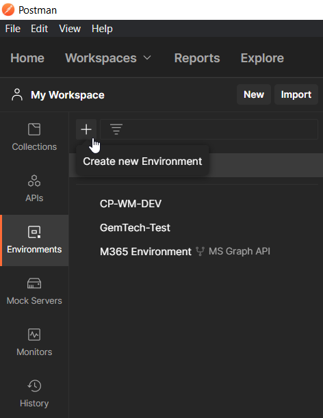

----

### 建立環境變數

1. 輸入環境名稱，如：`NBG-DEV-JWT`。
2. 建立變數，如：`baseUrl`，並且賦與初始值，如：`http://d-kngc.xndev.net:3183`。
3. 按下 Save 按鈕。

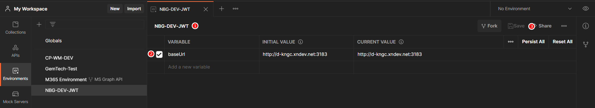

---

### 建立 Collection

Collection 是一堆 API Call 的集合。

測試會依照 Collection 中的 API 排列順序執行。

----

### 建立 Collection 範例

1. 切換到 Collections 頁籤
2. 按下 + 號按鈕
3. 輸入 Collection 名稱

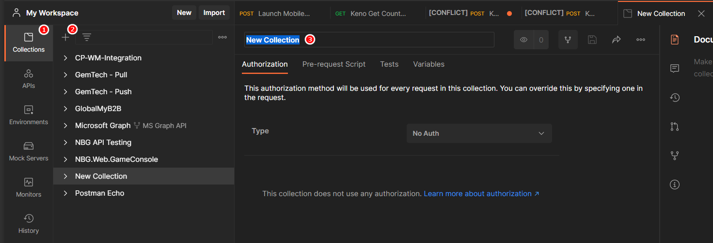

----

### 透過 Swagger 建立 Collection

#### 以瀏覽器開啟

[NBG GC 的 Swagger](http://d-kngc.xndev.net:3183/swagger/ui/index)

http://d-kngc.xndev.net:3183/swagger/ui/index

----

複製 swagger docs 的網址。

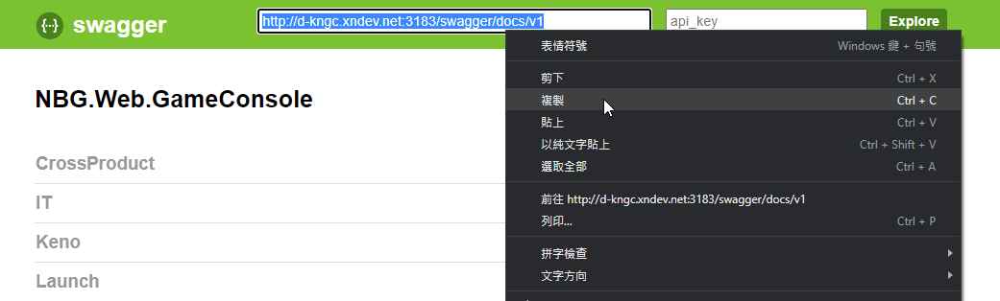

----

開啟 Postman，按下 Import 按鈕。

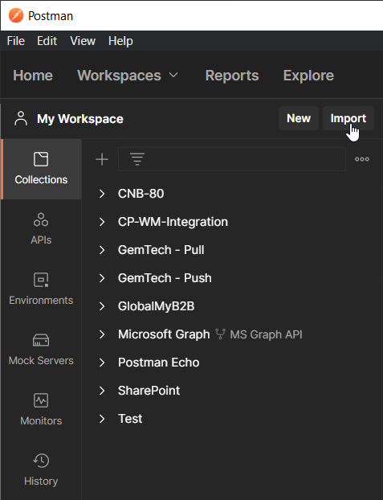

----

在網址列貼上剛才複製的網址，然後按下 Continue 按鈕。

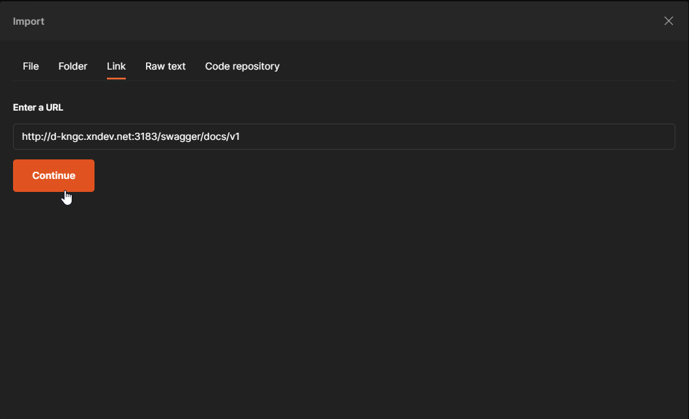

----

直接套用預設的設定，按下 Import 按鈕。

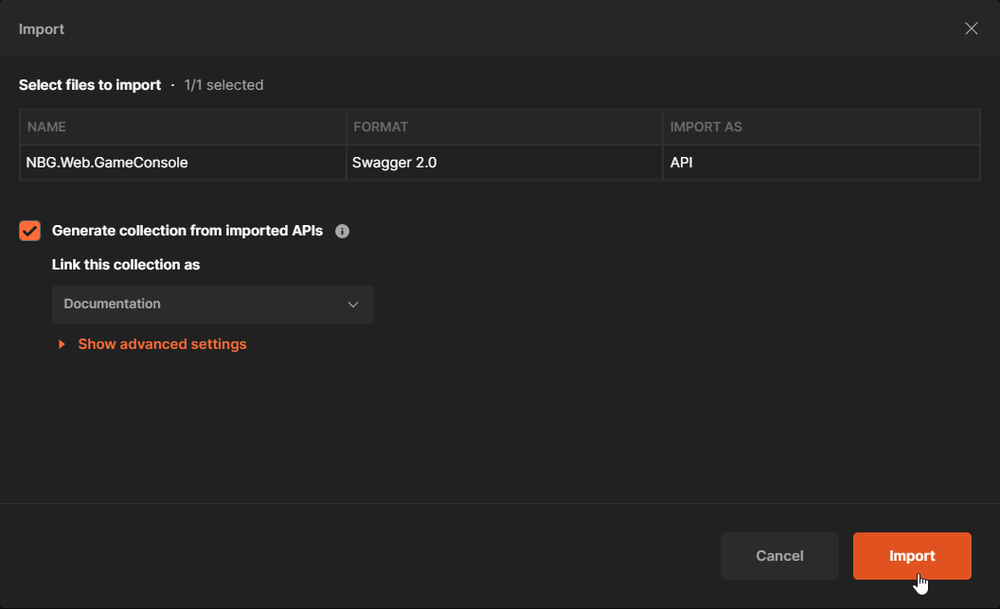

---

### 建立 Request 及撰寫測試

可以透過下列方式建立 Request：

1. 手動建立
2. 透過 Swagger 匯入
3. 透過 Interceptor 錄製

----

### 透過 Interceptor 錄製 Request

1. 點擊 Capture reuests and cookies from postman 按鈕。
2. Source 選擇 Interceptor。
3. 點擊 Save requests to 下拉選單，並且選取要使用的 Collection。
4. 點擊 Hide additional filters 下拉選單。
5. 在 URL must contain 欄位中輸入 http://d-kngc.xndev.net:3183/。
6. 在 Methods 欄位中輸入 POST。
7. 按下 Capture Requests 按鈕。

----

### 透過 Interceptor 錄製 Request - 圖例

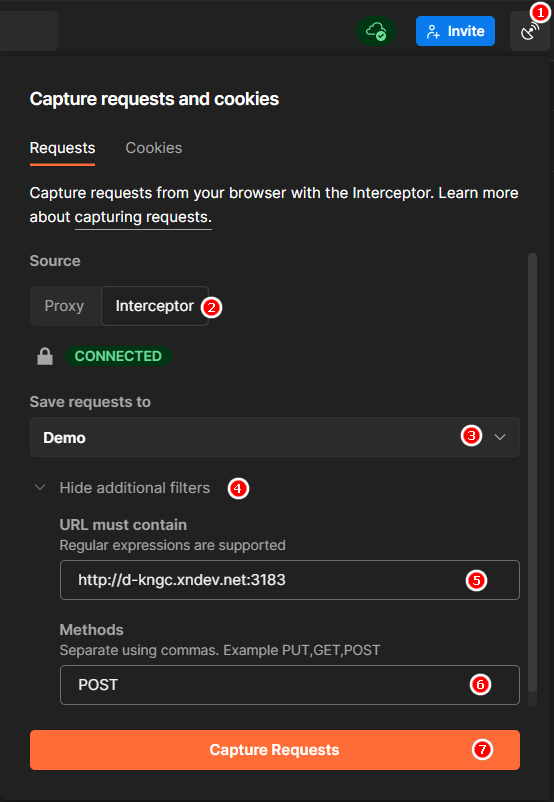

----

### 透過 Interceptor 錄製 Request - Cont.

1. 以 Chrome 開啟 http://d-kngc.xndev.net:3183/ 。
2. 進行下注。
3. 修改 Request 顯示名稱。

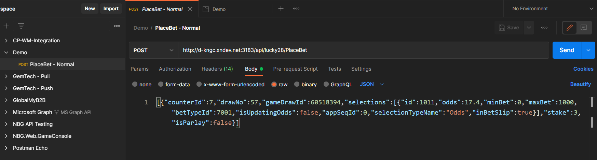

---

## 撰寫測試程式碼

----

### 使用變數

以兩個大括弧來使用變數，如： <span style="color:red;"> `{{baseUrl}}` </span>。

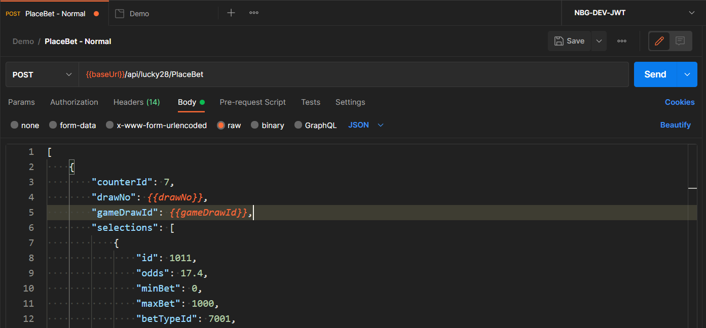

----

### 變數的優先順序

越下層的變數會被越上層的覆寫。


----

### 幾個常用的 API

```javascript
var jsonData = pm.response.json(); //將 response 解析為 json 物件。

//檢查 jsonData 的 isSuccess 是否為 true。
pm.expect( jsonData.isSuccess ).to.eql( true ); 

//取得 drawStatus = 4 的 draw。
var draw = jsonData.data.find( d => d.draw.drawStatus === 4 ).draw; 

pm.expect( draw ).not.undefined; //檢查 draw 不應該是 undefined。

//將 draw.drawNo 寫入 Collection Variables 的 drawNo 變數裡。
pm.collectionVariables.set( "drawNo" , draw.drawNo );

//取出 response header 中 Authorization 的值。
pm.response.headers.get( "Authorization" );
```

----

### 幾個常用的 API - Cont.

```javascript
//設定下一個 Request 會在 10 秒後才發送。
setTimeout( function() {} , 10000 );

//指定下一個要執行的 Request 為目前的 Request (重跑)。
postman.setNextRequest( pm.info.requestName );
```

<br/>

關於更多詳細的語法，請參閱： https://www.chaijs.com/api/bdd/

---

## 匯出所需資料

----

### 匯出 Collection

點選 Collection 名稱右邊的 … 按鈕，選擇 Export。

按下 Export 按鈕後，選擇匯出檔的路徑和檔名。

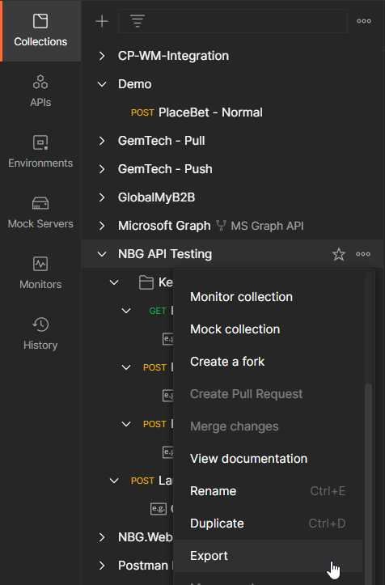

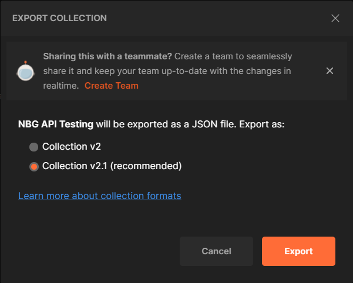

----

### 匯出 Environment Variables

在下拉選單裡選擇要匯出的 Environment。

點選眼睛圖示，再按下 Edit，接著按下右邊的 … 按鈕，再選擇 Export。

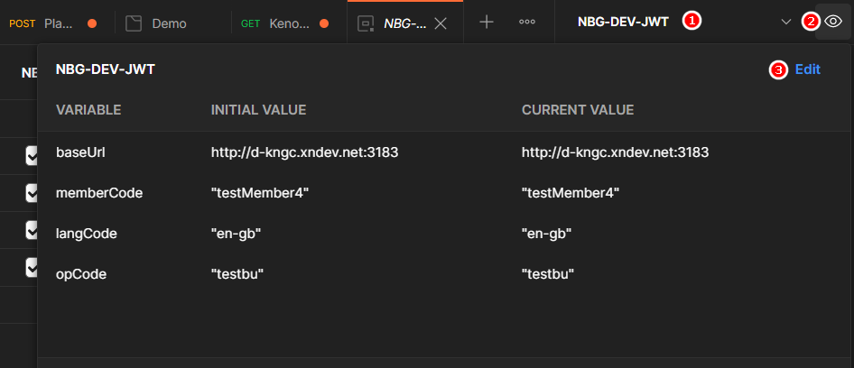

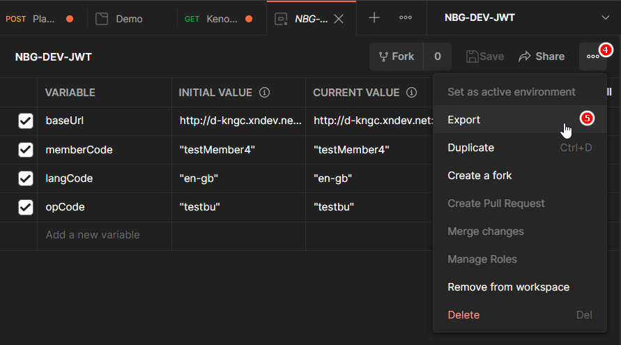


---

## 佈署到 Jenkins

----

### 佈署流程

1. 複製 Collection 和 Environment Variables 檔到 Jenkins Server。
2. 準備 node.js 環境。
3. 安裝 HTML Publisher plugin。
4. 安裝 Groovy plugin。
5. 建立建置工作。

----

#### 準備 node.js 環境

<section style="text-align: left;">

1. 安裝 [node.js 外掛](https://plugins.jenkins.io/nodejs)。
2. Global Tool Configuration -> NodeJS
  * 按下 新增 NodeJS 按鈕。
  * 名稱：取一個自己喜歡的，如 NodeJs。
  * Global npm packages to install 輸入：
```js
newman newman-reporter-htmlextra
```
  * 按下 Save 或 Apply 完成設定。

</section>

<br/>

詳情可參考 [這個連結](http://monkeybinbin-blog.logdown.com/posts/1870651-jenkins-set-the-implementation-of-npm-installed-nodejs-script-task)

----

#### 解除 Jenkins 讀取本機 CSS、JS 限制

1. 管理 Jenkins -> Tools and Actions -> Script 主控台
2. 輸入：
```groovy
System.setProperty( "hudson.model.DirectoryBrowserSupport.CSP" , "" )
```
3. 按下執行按鈕。
4. 若結果顯示 "Result:" 即為成功。

---

#### 建立建置工作

1. 組態 -> 建置環境 -> "Provide Node & npm bin/ folder to PATH" 打勾。
2. 下拉選單選擇前面建立的 Node.js 名稱。
3. 建置 -> 執行 Windows 批次指令 -> 輸入：

```npm
newman run "C:\Newman Scripts\NBG-API-Testing.json" 
-e "C:\Newman Scripts\NBG-DEV-JWT.json" 
--disable-unicode 
--delay-request 2000
--reporters cli,htmlextra 
--reporter-htmlextra-export "newman/myHtmlReport.html"
--reporter-htmlextra-title "NBG API Testing" 
--reporter-htmlextra-browserTitle "NBG API Testing" 
--reporter-htmlextra-showEnvironmentData
```

----

#### 輸出報表

1. 建置後動作 -> 新增建置後動作 -> Publish HTML reports。
2. HTML directory to archive 欄位輸入 "newman"。
3. Index pages 輸入 "myHtmlReport.html"。
4. 按下 儲存 按鈕。

----

## 大功告成

[看範例](http://jksui.xn-dng.com:8080/view/Lab/job/NBG%20API%20Test/HTML_20Report/)

---

## 範例在這

http://gitlab.ict888.net/07178.ouch.liu/api-testing-with-newman

---

# Q & A
