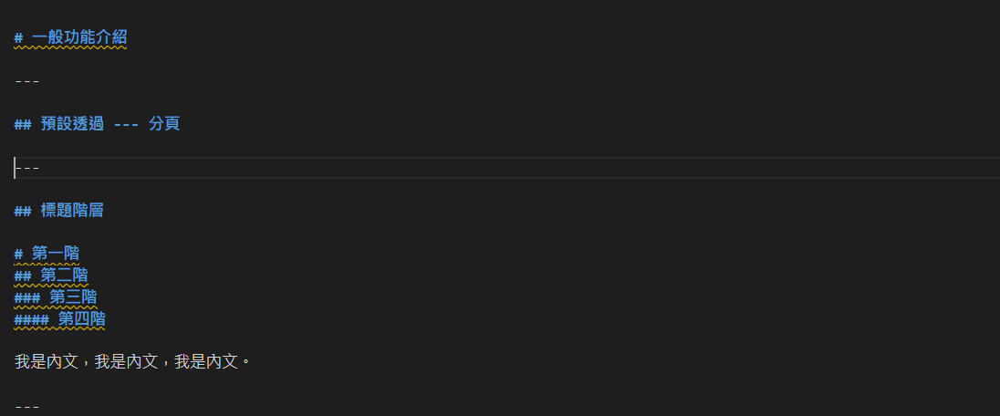

# Md to Slide 範例

## (built with reveal-md)

Powered by Reveal.js

---

# 一般功能介紹

---

## 預設透過 --- 分頁



---

## 標題階層

# 第一階
## 第二階
### 第三階
#### 第四階

我是內文，我是內文，我是內文。

---

粗體可以用 **兩個星號** 或是 __兩個底線__ 包起來

斜體可以用 *一個星號* 或是 _一個底線_ 包起來

或是 __*兩個底線夾一個星號*__ 呈現粗體+斜體

當然，也可以用 ~~兩個波浪符號~~ 來寫出刪除線

---

## 使用項目編號

1. Ordered list
2. Use a 1 on every line
3. And they will be given the correct sequence

..................................

- Unordered list
* Use any of these three characters
+ And you will get a bulleted list

---

## 引用

>You miss 100 percent of the shots you never take. ~Wayne Gretzky

---

## 使用表格

| Tables        | Are           | Cool  |
| ------------- |:-------------:| -----:|
| col 3 is      | right-aligned | $1600 |
| col 2 is      | centered      |   $12 |
| zebra stripes | are neat      |    $1 |

---

  <h2>透過 LaTeX 語法呈現數學公式</h2>
  \[\begin{aligned}
  \dot{x} &amp; = \sigma(y-x) \\
  \dot{y} &amp; = \rho x - y - xz \\
  \dot{z} &amp; = -\beta z + xy
  \end{aligned} \]

  或是

  `$$ J(\theta_0,\theta_1) = \sum_{i=0} $$`

  詳細使用方式請[點我](https://revealjs.com/math/)

---

## 透過 highlight.js 呈現程式碼

 支援 [HighLightJs](https://highlightjs.org) 的 189 種語言和 94 種樣式。

```csharp
using System.IO.Compression;

#pragma warning disable 414, 3021

namespace MyApplication
{
    [Obsolete("...")]
    class Program : IInterface
    {
        public static List<int> JustDoIt(int count)
        {
            Span<int> numbers = stackalloc int[length];
            Console.WriteLine($"Hello {Name}!");
            return new List<int>(new int[] { 1, 2, 3 })
        }
    }
}
```

---

## 支援各種 Emojis

😞 😟 😠 😡 🤬 😔 😕 🙁 ☹ 😬 🥺 😣 😖 😫 😩 🥱 😤 😮‍💨 😮 😱  

---

# 特殊功能

---

## 垂直投影片

我是垂直的開始

----

### 我是子頁面一

我是內容

----


### 我是子頁面二

我是內容

---

<!-- .slide: data-background="pink" -->
## 自訂背景色

---

<!-- .slide: data-background="https://github.com/webpro/reveal-md/blob/master/demo/sub/cat.jpg?raw=true"  -->

## 使用圖片作為背景

---

<!-- .slide: data-background="https://www.marketersgo.com/wp-content/uploads/2019/01/tenor-1.gif" -->
## 也支援 Gif 動態圖片作為背景

---

## 自定轉場效果

---
<!-- .slide: data-transition="convex-in fade-out" data-background="#234" -->
### "convex-in fade-out"

---

<!-- .slide: data-transition="zoom-in zoom-out" -->
### "zoom-in zoom-out"

也可以試試 none/fade/slide/convex/concave/zoom 各種搭配。

---

<!-- .slide: data-transition="zoom-in zoom-out" data-transition-speed="slow"-->
### 轉場效果可以調整速度

Slow 或是 Fast

---

### 自訂文字出現順序

- Item 1 <!-- .element: class="fragment " data-fragment-index="2" -->
- Item 2 <!-- .element: class="fragment " data-fragment-index="1" -->

---

## 自動動畫

---

### 從這樣

<!-- .slide: data-auto-animate -->
  <div data-id="box" style="height: 50px; background: yellow;"></div>

---

### 變這樣
<!-- .slide: data-auto-animate -->
  <div data-id="box" style="height: 100px; background: pink;"></div>

---

## 在相同的物件上套用自動動畫

---
<!-- .slide: data-auto-animate -->

### 看下面三個方塊

<div class="r-hstack justify-center"><div data-id="box1" style="background: #999; width: 50px; height: 50px; margin: 10px; border-radius: 5px;" data-auto-animate-target=""></div><div data-id="box2" style="background: #999; width: 50px; height: 50px; margin: 10px; border-radius: 5px;" data-auto-animate-target=""></div><div data-id="box3" style="background: #999; width: 50px; height: 50px; margin: 10px; border-radius: 5px;" data-auto-animate-target=""></div></div>

---
<!-- .slide: data-auto-animate -->

### 變成這樣

<div class="r-hstack justify-center">
<div data-id="box1" data-auto-animate-delay="0" style="background: cyan; width: 150px; height: 100px; margin: 10px;" data-auto-animate-target="51"></div>
<div data-id="box2" data-auto-animate-delay="0.1" style="background: magenta; width: 150px; height: 100px; margin: 10px;" data-auto-animate-target="52"></div>
<div data-id="box3" data-auto-animate-delay="0.2" style="background: yellow; width: 150px; height: 100px; margin: 10px;" data-auto-animate-target="53"></div>
</div>

---
<!-- .slide: data-auto-animate -->
### 再變這樣

<div class="r-stack">
<div data-id="box1" style="background: cyan; width: 300px; height: 300px; border-radius: 200px;" data-auto-animate-target="55"></div>
<div data-id="box2" style="background: magenta; width: 200px; height: 200px; border-radius: 200px;" data-auto-animate-target="56"></div>
<div data-id="box3" style="background: yellow; width: 100px; height: 100px; border-radius: 200px;" data-auto-animate-target="57"></div>
</div>

---

# 特殊功能

---

## 鍵盤控制

### 按下 ? 鍵看看~

---

## 講者視窗

### 按下 S 鍵看看~

Note:
這段文字只會出現在講者視窗裡面。

---

## 程式碼逐行高亮

```csharp [1,5|10-15]
using System.IO.Compression;

#pragma warning disable 414, 3021

namespace MyApplication
{
    [Obsolete("...")]
    class Program : IInterface
    {
        public static List<int> JustDoIt(int count)
        {
            Span<int> numbers = stackalloc int[length];
            Console.WriteLine($"Hello {Name}!");
            return new List<int>(new int[] { 1, 2, 3 })
        }
    }
}
```
